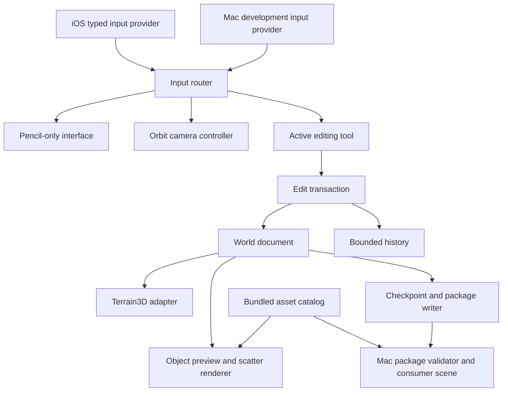
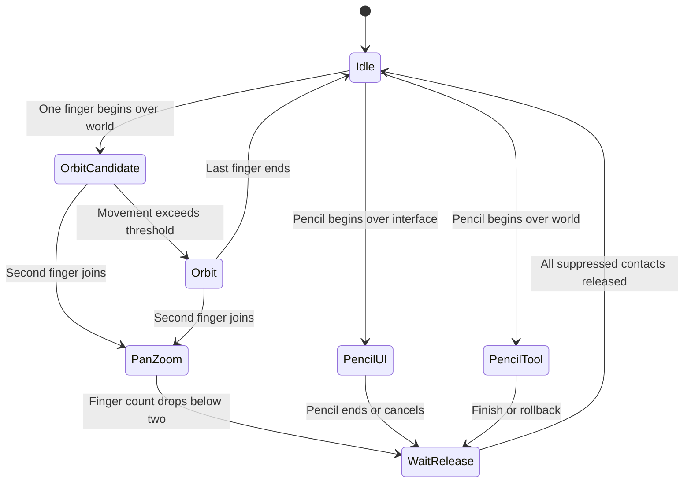

# Godot iPad World Editor
## Initial proof-of-concept implementation specification

**Version:** 0.1  
**Date:** 30 September 2026  
**Owner:** Andrej  
**Working project name:** World Painter PoC  
**Target:** Godot 4.7 on macOS and an actual iPad Air with Apple Pencil  
**Implementation assistant:** Claude Code  
**Status:** Proposed specification. No implementation, device benchmark, or compatibility certification is implied.

> **Proof to obtain:** Using Pencil for editing and fingers only for camera navigation, create a small environment on iPad, undo changes, save it, and reopen the identical authored world in a Mac Godot application.

The proof of concept is not the first release of a complete world-building product. The **Core PoC** proves native input, camera navigation, placement, simple painting/sculpting, undo, and data interchange. **PoC+** sections specify small follow-on experiments for forest scattering and richer path behavior. They must not delay or expand the initial proof. Implement PoC+ only after the Core PoC is accepted.

All numeric budgets and UX defaults below are **proposed engineering targets**, not measured device capabilities. External technical facts are linked to the reference register. API sketches describe application-owned interfaces; they are not claims that those methods already exist in Godot or Terrain3D.

---

## Contents

1. Product decisions and scope
2. Technical uncertainties and evidence gates
3. Reference world, assets, and budgets
4. Architecture and ownership
5. Project structure and build contract
6. Native input and event normalization
7. Input ownership and gesture state machine
8. Camera behavior
9. Touch interface
10. World document and asset catalog
11. Terrain adapter and picking
12. Brush processing and material painting
13. Terrain shaping
14. Precise asset placement
15. Forest scattering and painted paths
16. Transactions, undo, and cancellation
17. Saving, recovery, export, and Mac validation
18. Performance, threading, and diagnostics
19. Implementation work packages
20. Automated and device acceptance tests
21. Final demonstration and go/no-go criteria
22. Risks and explicitly deferred work
23. Instructions for Claude Code
24. Reference register

---

## 1. Product decisions and scope

### 1.1 Confirmed preferences

| Topic | Requirement |
|---|---|
| Device | iPad Air. Exact generation, chip, memory, Pencil model, and iPadOS version must be recorded during setup. |
| Host | Mac development machine and Godot 4.7 game workflow. |
| Camera | Orbit navigation. One-finger drag orbits; two fingers pan; pinch zooms. |
| Editing | Pencil performs world actions and app-interface actions. Fingers never select objects, paint, activate tools, or adjust sliders. |
| Handedness | Right-handed, Pencil in the right hand. |
| Preview | Simple geometry and materials are acceptable. Final rendering remains a Mac concern. |
| World authoring | Start from flat terrain or refine an existing prepared terrain. |
| Important tools | Material painting, precise placement, forest scattering, painted paths, and terrain shaping. |
| Library | Small curated asset library, bundled with the app. |
| Users | One active user. |
| Connectivity | Offline operation is desirable but not required. A live Mac connection is acceptable. |
| Reuse | A separate reusable project, not hard-coded into one game. |

### 1.2 Architecture decision for this proof

Build a **standalone native Godot iPad application with a local low-cost preview**, plus a Mac build and a small Mac validation scene using the same document loader.

The Mac prepares fixtures/assets and receives exported worlds. Do not build live synchronization or video streaming. This is a complexity decision: permitting a live connection does not require adding networking.

The app will necessarily store a local working document, but the PoC does not promise a polished offline product, independent asset downloads, or cloud storage.

Do not modify the existing fantasy-game repository as part of this PoC. Validate integration through a separate Mac consumer scene first.

### 1.3 Mandatory Core PoC scope

| Area | Required PoC behavior |
|---|---|
| Input | Explicit Pencil/finger identity, begin/move/end/cancel, source-aware UI, optional pressure. |
| Camera | Orbit, pan, pinch zoom, focus selected object, reset camera. |
| Terrain | Fixed small world; flat and pre-shaped starter fixtures. |
| Materials | **Two materials: grass and dirt**, with correct blending and byte-safe terrain-control data. |
| Sculpting | Raise and lower. Smooth and flatten are PoC+ extensions. |
| Placement | Choose, place, select, move on terrain, yaw rotate, uniformly scale, adjust height, delete. |
| Paths | A named dirt-paint preset with width control. No separate road/path object or automatic clearing. |
| Reliability | One action per stroke/manipulation; undo/redo; cancellation; checkpoint saving and recovery. |
| Interchange | Export a versioned world package; validate and open it on Mac with the same asset catalog. |
| Evidence | Input traces, automated tests, real-device test records, a recorded end-to-end demonstration. |

Two terrain materials are intentional. They prove material painting without adding arbitrary multi-material replacement rules. An extensive palette belongs after the proof.

**PoC+ only, after explicit acceptance of the Core PoC:** smooth/flatten brushes; one forest scatter preset; scatter erasing and individual promotion; instanced rendering stress tests; atomic path painting plus vegetation clearing. These remain important product features, but they are not necessary to prove the highest-risk native input and world-data workflow. Their contracts are included to prevent incompatible shortcuts in the core.

### 1.4 Explicit exclusions

No multiplayer or collaborative editing; no backend; no custom remote-display protocol; no cloud accounts; no asset marketplace or AssetStudio API integration; no arbitrary Blender/glTF importing on iPad; no runtime scripts from exported world packages.

No streamed multi-kilometre worlds; no editable terrain-region creation/deletion; no voxel terrain, caves, or overhang sculpting; no erosion simulator; no non-destructive terrain-layer stack; no splined roads, intersections, bridges, or terrain grading along paths.

No release-quality lighting, atmosphere, grass rendering, navigation meshes, gameplay collision authoring, game logic, or App Store release work.

Pencil hover, double-tap, squeeze, barrel rotation, haptics, and predicted touch rendering are optional later work. No required function may depend on them.

---

## 2. Technical uncertainties and evidence gates

### 2.1 Verified constraints

**Terrain3D platform support needs actual testing.** The stable platform page documents an older iOS setup and unsigned-binary caveats. The newer page says full Metal support is unclear. Neither page certifies the user's exact Godot/iPad combination. [R01][R02]

**Mobile and Metal are different choices.** Mobile is a rendering method; Metal is a graphics driver. Record both in test reports. [R03]

**Budget for native input integration.** The inspected Godot 4.7 Apple input path constructs touch events and forwards drag pressure/tilt, but its shown touch handlers do not carry an explicit Pencil/finger discriminator. Do not generalize this into a permanent claim about all future Godot versions. Recheck the exact installed source. [R04][R05]

**Do not depend on the desktop terrain editor in an exported app.** The inspected Terrain3D brush history calls the desktop plugin's `EditorUndoRedoManager`. Use runtime data access and application-owned transactions instead. [R06]

**Build tools are part of the proof.** Godot's iOS export uses macOS, Xcode, and matching export templates. Native plugins also need headers compatible with the export template; the plugin documentation currently carries a 4.7 update warning. [R07][R08]

### 2.2 Gate G0 — lock the actual environment

Before tool development, create `docs/evidence/environment.json` and `config/toolchain.lock.json` containing:

```json
{
  "godot_version": "RECORD_EXACT_INSTALLED_VERSION",
  "godot_commit": "RECORD_COMMIT_IF_AVAILABLE",
  "export_template_sha256": "RECORD_ACTUAL_HASH",
  "terrain3d_revision": "RECORD_EXACT_TAG_AND_COMMIT",
  "terrain3d_binary_sha256": "RECORD_ACTUAL_HASH",
  "native_bridge_revision": "RECORD_ACTUAL_COMMIT_OR_NONE",
  "xcode_version": "RECORD_ACTUAL_VERSION",
  "ios_sdk_version": "RECORD_ACTUAL_VERSION",
  "ipados_version": "RECORD_DEVICE_VERSION",
  "ipad_model": "RECORD_EXACT_MODEL",
  "pencil_model": "RECORD_MODEL_OR_UNKNOWN",
  "rendering_method": "mobile",
  "rendering_driver": "RECORD_ACTUAL_ACTIVE_DRIVER"
}
```

These are documentation placeholders, not valid production configuration. The doctor script must flag unfilled required fields. Development on Mac can continue without a device, but device gates remain **NOT RUN**, never PASS.

Choose and pin a Terrain3D revision during G0. Use the inspected 1.0.2 API as a reference, not as proof that this release is the best iOS build. Record any deviation in `docs/decisions/0001-platform-baseline.md`. Do not fetch a floating `latest` dependency in normal builds.

### 2.3 Gate G1 — actual iPad input and rendering

The first iPad build contains an input diagnostic screen, an orbitable terrain patch, one object, and a direct test action that changes a small terrain patch.

It must prove:

- Pencil and finger contacts have explicit identities on **begin**, not only after movement.
- Pencil cancellation can be distinguished from a normal completed stroke.
- Pressure is optional; constant-strength operation works.
- One- and two-finger navigation do not activate editing or interface controls.
- The selected Terrain3D/rendering-driver combination renders and updates correctly on the device.
- A terrain change can be persisted and loaded again without changing the numeric height data.

Start by testing Mobile + Metal. If it fails, test another driver only if supported by the actual export template and device. Record the failure and successful alternative. Do not assume that every driver listed in documentation is available in the selected binary.

If no acceptable native rendering route works, stop the native PoC at this gate and produce the evidence report. A Mac-hosted approach would be a separate approved architecture experiment, not a silent substitution.

### 2.4 Native integration escalation rule

Try an isolated iOS plugin only when it can obtain typed native events through a maintainable integration path. A `.gdip` file alone does not establish that the needed view hooks are available.

If a clean plugin hook cannot deliver the contract, document the smallest required engine/view change and its build implications. Obtain approval before maintaining custom Godot export templates. Do not use method swizzling, private Apple APIs, or fragile reflection into undocumented Godot internals as an unreported workaround.

---

## 3. Reference world, assets, and budgets

### 3.1 Reference terrain

| Setting | PoC default |
|---|---|
| Nominal footprint | 256 × 256 metres |
| Coordinate convention | Godot world coordinates; Y up; X/Z ground plane; metres |
| Sample spacing | 0.5 m |
| Region image size | 256 × 256 samples |
| Loaded layout | Four regions in a 2 × 2 arrangement |
| Region physical span | 128 m at the selected spacing |
| Region locations | `(-1,-1)`, `(0,-1)`, `(-1,0)`, `(0,0)` |
| World origin | Centre of the four-region layout |
| Height storage | 32-bit floating point |
| Authored height limit | -32 m to +64 m for this fixture |
| Materials | Stable ID 0 = grass; stable ID 1 = dirt |
| Region changes | Disabled in the PoC |

The footprint is nominal: derive the exact valid sample and interpolation extents from the pinned Terrain3D implementation. Do not invent an extra duplicated boundary row or assume a region image has `N+1` samples. Include explicit tests at internal seams and outside the loaded area. Terrain3D distinguishes region sample count from vertex spacing. [R09]

The four height maps total 1 MiB of raw samples; four 32-bit control maps total another 1 MiB. These are calculated payload sizes, not total app memory usage.

### 3.2 Fixtures

Bundle two fixtures generated on Mac by repository scripts:

**Flat:** grass surface at Y = 0, no objects.

**Gentle hills:** smooth hills up to approximately 12 m, a flat area for the lodge, one slope approaching the scatter limit, and terrain variation crossing all four region boundaries.

Generate the shaped fixture once and commit its actual bytes. Do not regenerate it on each device using an unspecified random/noise implementation.

Opening either fixture creates a new working-document copy. Bundled fixtures remain read-only. An existing prepared world is opened through the same document loader; arbitrary image import is deferred.

### 3.3 Curated library

For the Core PoC, provide **three lightweight assets: one tree, one rock, and one simple lodge**. At least one must have a deliberately nonzero placement anchor for tests. PoC+ expands the catalog to eight assets: three tree variants, two rocks, one shrub, one log, and one lodge.

Use existing licensed assets when available. Otherwise use generated primitive proxies. Visual finish is not a PoC requirement, but silhouette, dimensions, and placement pivots must be meaningful.

Every asset requires a stable ID, version, local scene/mesh reference, category, thumbnail, bounds, placement anchor, and allowed transform limits. Tree scatter proxies should be single-mesh assets with a simple material. Manually placed assets may use ordinary scene hierarchies.

No externally purchased or downloaded asset is automatically authorized for redistribution. Record provenance and license information in the catalog without making the PoC dependent on a legal review of third-party content.

### 3.4 Proposed workload targets

| Budget | Baseline |
|---|---|
| Individually placed objects | Up to 100 |
| Scattered objects | Up to 1,000 in PoC+; no scatter authoring required for Core PoC |
| Sculpt radius | 2–16 m |
| Paint radius | 1–16 m |
| Forest radius | 3–20 m in PoC+ |
| Path width | 2–6 m; default 3 m |
| History | Up to 20 actions and 64 MiB of retained action payloads |
| Preview | One simple directional light plus ambient lighting; no expensive effects |
| Interaction target | 60 FPS where the device supports it; performance classification in Section 18 |

These caps define the proof, not the eventual reusable editor's limits. The eventual 512 m or 1 km authoring target is outside this PoC's acceptance criteria.

---

## 4. Architecture and ownership



### 4.1 Ownership table

| Component | Owns | Must not own |
|---|---|---|
| `InputProvider` | Platform events, capabilities, coordinate metadata | Editing behavior, terrain changes |
| `InputRouter` | Contact identities, interaction ownership, suppression rules | Asset data or brush mathematics |
| `OrbitCameraController` | Camera pivot, yaw, pitch, distance | Document history |
| `ToolController` | Active tool and operation lifecycle | File IO |
| `WorldDocument` | Canonical terrain bytes, object records, catalog references, revision | UI nodes or platform objects |
| `TerrainAdapter` | Mapping canonical arrays into Terrain3D, terrain picking, map updates | Undo policy or object identity |
| `ObjectPresenter` | Scene nodes and spatial render batches derived from records | Canonical persistent transforms |
| `CommandHistory` | Completed value changes, undo/redo cursor, payload limits | Live platform contacts |
| `WorldStorage` | Validated immutable checkpoints and packages | Mutation of the active terrain |

The canonical terrain buffers belong to the document. Terrain3D `Image` objects and GPU textures are runtime representations. Changes always update the document first, then the relevant adapter region. Avoid two independently editable authoritative copies.

### 4.2 Technology choices

Use typed GDScript for app logic, UI, camera, data ownership, and initial brush kernels. Use Objective-C++ for the narrow iOS integration when necessary. Add a small C++ kernel only after profiling identifies a specific bottleneck.

Use a simple value-based `CommandHistory`, not `EditorUndoRedoManager`. Godot's runtime `UndoRedo` is a valid facility, but this PoC chooses a small deque of explicit before/after changes to make byte-budget eviction and serialization tests straightforward. Do not build a general event-sourcing framework. [R10]

### 4.3 App-owned interfaces

```text
InputProvider
  capabilities() -> InputCapabilities
  drain_samples() -> PointerSample[]
  cancel_all(reason)

TerrainAdapter
  initialize(document)
  raycast_terrain(camera_ray) -> TerrainHit | no_hit
  sample_height(xz) -> height | no_sample
  sample_normal(xz) -> normal | no_sample
  upload_changed_regions(map_kind, region_locations)
  refresh_height_bounds(region_locations)

EditTransaction
  begin(tool_id, settings_snapshot)
  capture_before(region_map_or_object)  # once per affected value
  apply_live(change)
  finish() -> WorldChange | no_change
  rollback()

CommandHistory
  push_already_applied(change)
  undo(document)
  redo(document)
  clear()

WorldStorage
  create_checkpoint(immutable_snapshot) -> SaveResult
  recover_latest_valid(world_id) -> LoadResult
  export_package(checkpoint) -> PackageResult
```

Concrete signatures, Godot types, and error enums must be established in the repository. These sketches are contracts, not copy-paste implementation code.

---

## 5. Project structure and build contract

```text
world-painter-poc/
  README.md
  CLAUDE.md
  config/
    toolchain.lock.json
    poc_defaults.json
  app/
    project.godot
    export_presets.cfg
    scenes/
      editor_main.tscn
      input_lab.tscn
      mac_consumer.tscn
    src/
      input/
      camera/
      tools/
      document/
      terrain/
      objects/
      history/
      storage/
      diagnostics/
      ui/
    assets/
      catalog.json
      terrain/
      models/
      thumbnails/
    fixtures/
    tests/
      unit/
      integration/
      input_traces/
      run_tests.gd
    addons/terrain_3d/
    ios/plugins/
  native/ios_input/
  scripts/
    dev.py
    validate_world.py
    generate_fixtures.py
  docs/
    decisions/
    evidence/
    device-test-checklist.md
    world-format.md
    input-contract.md
  build/                         # ignored
```

This is one project with modules, not multiple services or published packages. Keep native source separate from generated plugin binaries. Do not commit signing secrets, provisioning profiles, personal credentials, or generated app containers.

The implementation must provide these wrapper commands:

```bash
python3 scripts/dev.py doctor
python3 scripts/dev.py test
python3 scripts/dev.py run-mac
python3 scripts/dev.py export-ios
python3 scripts/dev.py validate-world /path/to/example.worldpoc
python3 scripts/dev.py open-consumer /path/to/example.worldpoc
```

These commands are requirements for the future repository. They have not been executed or delivered by this specification.

`doctor` reports the exact tools, dependency hashes, template availability, native library availability, and missing signing configuration. `test` runs GDScript and format tests and returns a nonzero exit code on failure. iOS export failures must not be hidden behind a successful wrapper exit code.

Keep build setup reproducible on the owner's Mac. A CI service is not required for the initial proof.

---

## 6. Native input and event normalization

### 6.1 Required event record

```text
PointerSample
  source: PENCIL | FINGER | MOUSE_DEV | UNKNOWN
  pointer_id: session-local stable integer
  phase: BEGIN | MOVE | END | CANCEL
  timestamp_seconds: monotonic native event time
  position_view_points: Vector2
  position_viewport: Vector2
  pressure_valid: bool
  pressure_normalized: float in [0,1] when valid
  tilt_valid: bool
  tilt: optional Vector2
  is_predicted: bool
  sample_sequence: monotonic provider sequence
  viewport_mapping_generation: integer
```

Obtain Pencil identity from the native input source/type, not pressure, tilt, touch index, contact size, or the fact that only one pointer is down. Validate the exact native API usage against the installed Apple SDK. Apple maintains explicit Pencil-input and touch-type references. [R11]

`UNKNOWN` must never edit. Show a diagnostic rather than guessing that an unknown contact is a Pencil.

Pressure is an optional capability. When unavailable or disabled, use the UI strength directly. Do not interpret unavailable pressure as a zero-strength brush. Never infer the Pencil model from a single all-zero pressure trace.

### 6.2 Routing policy

Use one authoritative input provider on iPad. Avoid processing the same native event again through Godot touch handling or synthetic mouse events.

Disable automatic touch-to-mouse and mouse-to-touch emulation for the iPad editing viewport. If a controlled synthetic mouse path is used to operate standard Godot `Control` widgets, it must be created only from Pencil-owned interface contacts and tagged/isolated so it cannot re-enter world editing.

Mac mouse emulation is a separate development provider. It must visibly label the session `MAC DEVELOPMENT INPUT`, and must not satisfy an iPad input gate.

### 6.3 Coordinate conversion

Native points, render pixels, safe-area offsets, and Godot viewport coordinates must be converted exactly once by a named mapping object. Do not scatter device-scale multiplication throughout UI and tool code.

Keep the app fullscreen and landscape for the PoC. Tablet resizing/multitasking is not a supported workflow. Nevertheless, any actual viewport-size or orientation change must cancel active operations, invalidate the old mapping generation, and recalculate the transform.

Gate test: draw/select at nine known screen positions, including edges and corners. Pointer/UI alignment must remain within 2 logical points in the diagnostic screen. Test with reduced 3D render scale as well as normal scale; UI picking must not move when 3D resolution changes.

### 6.4 Sampling and cancellation

Collect real touch samples in timestamp order. Where coalesced samples are exposed cleanly, include them once and avoid duplicating the primary event. The implementation should consult Apple's coalesced-touch API reference. [R12]

Predicted samples are not needed for the PoC. If an experiment includes them, they may move a preview cursor only. They must never change terrain, placements, history, or save data. [R13]

Explicitly forward native CANCEL. Do not convert interruption into a normal END. The inspected Godot path's cancellation behavior is another reason to test the complete provider rather than relying on a desktop simulation. [R04]

Cancel on application deactivation, input-provider failure, viewport mapping change, or queue overflow. Never silently drop END/CANCEL events. A bounded queue overflow must trigger cancellation and a diagnostic rather than continue with missing input.

---

## 7. Input ownership and gesture state machine

### 7.1 States



The real implementation must additionally handle CANCEL and modal dialogs from every state. Keep this state machine testable without scene rendering.

### 7.2 Ownership rules

**Pencil on interface:** the selected control owns that contact until completion. Moving off the button or slider cannot start a terrain stroke.

**Pencil on world:** the active tool owns it. Entering an interface panel during the stroke pauses world mutation; it does not activate the panel. Re-entry into the viewport starts a new interpolation segment, avoiding a line across the hidden area.

**Fingers on world:** camera gestures only. Finger taps and long presses never select objects or trigger tools.

**Fingers on interface:** ignored. They do not operate controls and do not start camera navigation behind the interface.

**Pencil begins during camera gesture:** freeze the camera at its current pose and give ownership to the Pencil. Mark existing fingers suppressed until they are lifted.

**Finger arrives during Pencil activity:** ignore it for navigation and editing. Require a fresh contact after the Pencil operation before it can navigate.

**Pan transitions from two fingers to one:** freeze until all remaining contacts end. Do not unexpectedly turn the remaining finger into an orbit gesture.

**Three or more fingers:** freeze navigation until all are released. No hidden gesture shortcuts in this proof.

### 7.3 Palm-related behavior

Use the platform's contact classification and the ownership policy above. Do not describe a contact-size heuristic as reliable palm rejection.

A small proposed orbit activation threshold is 5 logical points. No terrain change may result from a palm-like contact, regardless of whether it is suppressed by the operating system.

Device testing must include resting the right palm before Pencil-down and keeping it on the screen after Pencil-up. A passing implementation cannot require the user to constantly lift the palm to avoid camera jumps.

Perfect palm classification is not promised. Repeated unwanted camera motion is a failed interaction gate that requires a focused input correction, not a reason to weaken the user's gesture specification.

---

## 8. Camera behavior

Use an orbit camera with fixed world-up and no roll. Store `pivot`, `yaw`, `pitch`, and `distance` separately.

| Parameter | Proposed default |
|---|---|
| Pitch | 15–80 degrees downward |
| Distance | 3–350 m |
| Initial focus | Centre of the reference world |
| Initial angle | Approximately 45 degrees downward |
| Motion inertia | Off for the initial proof |
| Precision mode | Automatic slower motion at shorter orbit distance |

One-finger movement changes yaw/pitch. Normalize sensitivity to logical viewport dimensions, not render resolution.

Two-finger movement combines centroid translation with distance-ratio zoom. Pan on a stable horizontal plane through the current pivot. Capture the plane and gesture baselines when the second finger arrives. Do not move the camera on the transition frame.

Pinch changes distance multiplicatively. Keep the ground point under the gesture centroid approximately stationary by adjusting the pivot. On a missing terrain hit, use the pivot plane rather than suddenly jumping to the world origin.

`Focus` frames the selected object's bounds or a Pencil-selected ground focus point. It changes only camera state. `Reset Camera` restores the fixture camera. Neither is a document undo action.

Use terrain-aware camera clearance to prevent the camera from passing below the ground. Do not implement navigation collision with every tree or rock in the PoC.

---

## 9. Touch interface

Use a landscape layout with a compact left tool rail, a collapsible bottom asset strip, and a small top status row. Keep the central and lower-right viewport relatively clear for the right hand. These are proposed layout defaults to validate physically.

Always expose: active tool label, Undo, Redo, Save/export access, selected asset/material, brush radius/width, strength, and a save-state indicator.

Frequently used controls should have at least approximately 48 logical points of activation area. Value labels must remain legible without hovering. Color alone must not distinguish Raise from Lower or Saved from Unsaved.

Core tool groups: `Select`, `Place`, `Paint`, `Sculpt`, and `Path`. Add `Forest` only in PoC+. Do not display unfinished tools as functioning controls.

Use buttons/steppers or a large slider for yaw, scale, and vertical offset. Do not require tiny desktop axis gizmos, a keyboard, long-press menus, or Pencil hardware gestures.

For destructive whole-document actions such as opening another fixture, require a visible confirmation and attempt a checkpoint first. Ordinary object deletion remains immediate and undoable.

Show concise errors with a next action, such as `Cannot save: storage write failed. Your last valid save is unchanged.` Never present success merely because a save job was queued.

---

## 10. World document and asset catalog

### 10.1 World document

```text
WorldDocument
  schema_version
  world_id
  document_revision
  catalog_id + catalog_version + catalog_hash
  terrain_settings
  regions: map of RegionCoordinate -> RegionBuffers
  objects: map of ObjectId -> ObjectRecord
```

`document_revision` increments after every committed edit, undo, or redo. It is monotonic within the saved document lineage; undo does not move the revision counter backwards.

Camera position, open panels, and active tool belong to editor settings, not the authored-world hash.

### 10.2 Region buffers

Each region contains a float32 height buffer and a uint32 control buffer, indexed in a documented row-major order: X is the column, Z is the row.

Color/roughness painting is excluded. Initialize the Terrain3D color map to the neutral values required by the pinned adapter, and validate that it does not unintentionally tint the material. The neutral map is reproducible adapter configuration, not separately authored data in this PoC.

Regions and terrain roots use identity transforms. World positioning comes from region coordinates and sample spacing, not a translated/scaled terrain scene node.

### 10.3 Asset record

Illustrative catalog record:

```json
{
  "asset_id": "nature.tree.spruce_a",
  "version": 1,
  "category": "trees",
  "preview_scene": "res://assets/models/spruce_a.tscn",
  "scatter_mesh": "res://assets/models/spruce_a_mesh.tres",
  "thumbnail": "res://assets/thumbnails/spruce_a.png",
  "placement_anchor_local": [0.0, 0.0, 0.0],
  "footprint_radius_m": 1.0,
  "scale_min": 0.5,
  "scale_max": 2.0,
  "default_grounding": "FOLLOW_TERRAIN",
  "scatter_allowed": true
}
```

Only resolve scene and mesh references from the trusted bundled catalog. The world file contains asset IDs, not arbitrary paths to executable scenes or scripts.

The catalog's content hash must cover asset geometry/material inputs and placement metadata, not just its version label. Same ID with a changed pivot is an incompatible asset change for this proof.

### 10.4 Object record

Illustrative object record:

```json
{
  "object_id": "96bd00ee-81a7-4d12-87c0-c2b66c474d77",
  "asset_id": "nature.tree.spruce_a",
  "asset_version": 1,
  "position": [12.5, 4.25, -7.0],
  "rotation_xyzw": [0.0, 0.0, 0.0, 1.0],
  "uniform_scale": 1.0,
  "grounding": "FOLLOW_TERRAIN",
  "height_offset_m": 0.0,
  "origin": "SCATTER",
  "scatter_operation_id": "6d338ef5-df4c-405d-b3ce-b99c1f05e613"
}
```

Use persistent object IDs independent of Node paths, array positions, or MultiMesh indices. ID creation may be nondeterministic; saved placement results and their IDs are authoritative.

For this PoC, rotation editing is yaw-only. Preserve a valid quaternion representation in the file so future formats do not need to assume Euler-angle order. Tilt alignment and arbitrary three-axis rotation controls are deferred.

### 10.5 Grounding semantics

`FOLLOW_TERRAIN` means the object's placement anchor follows the sampled terrain height plus its stored vertical offset. Its X/Z, yaw, and scale do not change when the ground changes.

`WORLD_FIXED` means a terrain edit leaves its world transform unchanged. Use this as the default for the lodge; use follow-terrain for trees, shrubs, and rocks. The selected-object UI must show the mode.

A user explicitly moving an object with surface snapping enabled can reposition either mode onto the ground. Grounding describes subsequent terrain edits, not whether explicit placement may sample the terrain.

All induced follow-terrain transform changes are captured in the **same transaction** as the terrain stroke. Undo restores both heights and object transforms.

---

## 11. Terrain adapter and picking

### 11.1 Adapter responsibilities

Construct the four Terrain3D regions from canonical document buffers. Use the pinned API to upload only changed map kinds and regions. On height edits, refresh affected height bounds.

Do not call `Terrain3DEditor.start_operation()` or instantiate a fake `EditorPlugin` to obtain desktop behavior. No desktop editor object is part of the runtime architecture.

Terrain3D documents direct region-image editing for larger batches and a subsequent map update. Implement those changes in one adapter rather than exposing raw Terrain3D mutation throughout the app. [R14]

The adapter must resolve the pinned revision's exact `modified`/`edited` behavior with an integration test. Do not infer that changing an `Image` automatically refreshes textures. A successful API call is not sufficient evidence; verify the visible and canonical changes.

### 11.2 Typed control data

Terrain3D uses packed uint32 control values in `FORMAT_RF` memory. These bytes are not meaningful float colors. Do not convert the control map to PNG, normalize it, interpolate packed values, or pass it through an image-color operation. [R15]

Provide tested helpers:

```text
decode_control(uint32) -> {base_id, overlay_id, blend, other_bits}
encode_control(existing_uint32, changed_fields) -> uint32
control_bytes_to_image(bytes) -> image with the exact bit pattern
```

Reuse compatible Terrain3D utilities where possible. Otherwise implement the encoding against the pinned source and test known vectors. Bit-reinterpretation is not numeric int-to-float conversion.

The initial material invariant is base = grass, overlay = dirt, and blend = 0…255. Disable terrain auto-material selection for these manually painted areas. Preserve all unrelated/reserved control bits during paint and undo.

### 11.3 Picking

Use a dedicated `TerrainPicker` behind the adapter. The first implementation should use Terrain3D's CPU `get_intersection(..., gpu_mode=false)` and normalize no-hit results into a typed result. Its documented CPU path does not require physics collision. Validate its accuracy against known terrain samples. [R09]

Do not pick terrain from stale physics collision. Do not use GPU readback as the default stroke input path in this PoC.

Object selection uses the curated object bounds or simple picking proxies. Terrain-only placement rays must not land on a tree canopy or a lodge roof. Preview ghosts and brush overlays are excluded from picking.

Handle no-hit, sky, outside-region, and grazing-ray cases explicitly. Invalid hits pause a stroke without writing; subsequent valid input starts a new segment. Never bridge a stroke across an invalid interval or substitute world origin for no-hit.

---

## 12. Brush processing and material painting

### 12.1 Common brush operation

On Pencil BEGIN, capture tool settings, camera pose, document revision, and initial hit. Settings remain fixed for that stroke. The camera is frozen while the Pencil owns editing.

Map real input into world-space samples. Keep a reusable stroke resampler that produces bounded-distance samples along valid segments. Target spacing is at most `min(radius / 4, sample_spacing / 2)`. Track timing separately from sample count.

Every affected region/map is backed up once, immediately before its first modification. For this tiny world, full touched-region map snapshots are acceptable; fine-grained tile diffs are not mandatory.

On END, finish the last segment and commit one action. On CANCEL, restore before-values and create no completed action.

Pressure mapping, when supported and enabled:

```text
p = clamp(reported_pressure, 0, 1)
pressure_factor = 0.2 + 0.8 * p
```

With pressure off or unavailable, `pressure_factor = 1`. Pressure changes strength only, never radius. The minimum factor is a proposed usability choice that avoids near-invisible strokes; it is not an Apple behavior.

### 12.2 Brush falloff

Use a circular brush measured in world metres. Proposed falloff:

```text
q = clamp(distance_from_center / radius, 0, 1)
falloff = (1 - q*q)^2
```

Compute distance in X/Z for this heightfield PoC. The brush ring should be projected onto terrain samples so its visual footprint matches the edited area.

Clip to existing valid regions. Do not auto-create regions at the edge. Smoothing must include neighboring-region samples rather than treating an internal seam as the edge of the world.

### 12.3 Material paint semantics

Expose Grass and Dirt. Grass targets dirt blend 0; Dirt targets dirt blend 1.

Material painting is **coverage-based per stroke**, not continuous accumulation per input event. For each affected sample, track the maximum coverage attained by that stroke:

```text
coverage = max(previous_stroke_coverage,
               strength * pressure_factor * falloff)

blend_final = blend_before_stroke
            + (target_blend - blend_before_stroke) * coverage
```

Quantize the final scalar blend to 0…255 only when encoding the control value. Keep stroke coverage in a separate numeric working buffer, not in unused control bits.

This design makes the same stroke independent of whether UIKit or Godot delivered more movement callbacks. A second physical stroke may further change the blend; merely holding the Pencil still does not repeatedly strengthen material paint.

Do not promise bit-identical results for differently sampled arbitrary curves. Test the fixed resampled fixture traces within the tolerance in Section 20. Undo/redo and file round trips must restore the stored bytes exactly.

### 12.4 Preview feedback

Show the active material, radius ring, centre marker, and stroke state. On unsupported pressure, display constant-strength mode without treating it as an error.

Do not use final-game lighting to indicate paint success. A diagnostic blend view must be available so the agent can distinguish incorrect control values from visual-material problems.

---

## 13. Terrain shaping

### 13.1 Raise and lower

Use time-based integration, not “amount per pointer event.” Proposed default speed is 2 metres per second at full influence.

```text
height_delta = direction * speed_m_per_second
             * pressure_factor * falloff * effective_dt
```

Use a fixed brush processing step, initially 1/60 s. Interpolate movement through the step and distribute its total `effective_dt` across generated spatial samples. Do not apply a full time step to every interpolated point.

A stationary Pencil can raise/lower continuously while the contact remains active. Resolve the final partial interval on END. Handle application stalls by bounding accumulated work; a main-loop gap beyond 250 ms should cancel the stroke with a diagnostic rather than apply a large deferred mound.

### 13.2 Smooth — PoC+ only

Use a small neighborhood average and a bounded blend toward it. Read from a consistent snapshot for each processing step and write results separately, so traversal order does not change the outcome.

Include a one-sample halo across internal region boundaries. At the outer world edge, use the defined valid-neighbor rule. Test flat-surface preservation and seam continuity.

### 13.3 Flatten — PoC+ only

At Pencil BEGIN, sample the target height and keep it fixed for the stroke. Do not continuously resample a moving target.

Blend toward the target using a rate-based factor, for example:

```text
alpha = 1 - exp(-flatten_rate * pressure_factor * falloff * dt)
new_height = old_height + alpha * (target_height - old_height)
```

Expose the captured target height in the interface. No numerical target-height entry is required for the initial proof.

### 13.4 Terrain and object consistency

After a height batch, update the visible terrain and preview affected follow-terrain object anchors. At stroke completion, store their exact final transforms in the transaction.

On rollback or undo, restore the saved transform values rather than regenerating them from random rules. World-fixed objects stay unchanged and may become embedded or floating; that is an explicit consequence of their selected mode, not a hidden correction.

---

## 14. Precise asset placement

### 14.1 Place mode

Select an asset using the Pencil in the catalog. The next Pencil contact in the viewport creates a temporary ghost at a valid terrain hit. Drag adjusts its X/Z position; release commits one object.

No extra hover feature is required. A contact that never obtains a valid hit creates no object. An operation ending outside the valid viewport/terrain is cancelled rather than silently committed at an old position.

After placement, select the new object and return to Select mode. Repeated stamping is not required.

### 14.2 Select and move

Pencil tap selects the nearest valid object along the ray. A small movement threshold separates selection from dragging. Empty-space taps clear selection.

Move the selected object using a dedicated Move action or a clearly highlighted large handle. Preserve the initial grab offset so the object does not jump its pivot to the Pencil on the first movement frame.

During a snapped move, update ground height and placement-anchor correction. A failed hit pauses the preview; cancellation restores the starting transform.

### 14.3 Transform controls

Provide yaw rotation, uniform scale, and vertical offset with visible numeric values. Optional snap defaults: 15-degree yaw and 0.5-metre horizontal steps. Snapping can be turned off with Pencil controls.

One continuous slider drag is one history action. A cancelled slider drag restores its starting value. Clamp scale to the catalog's positive limits; reject zero, negative, or non-finite values.

Apply the placement anchor after scale and rotation. Verify assets with a deliberately nonzero local anchor; a centred-pivot-only fixture is insufficient.

### 14.4 Scattered object promotion — PoC+ only

A scattered tree can be selected without changing its record. Once the user commits a manual move, rotate, scale, or height adjustment, change its origin to `MANUAL` in that same action.

Promotion keeps the same object ID and world appearance. It only changes subsequent bulk-erasure behavior. Undo restores the previous transform and SCATTER status.

Delete works for the selected object regardless of origin, and is undoable.

---

## 15. Forest scattering and painted paths

**Scope:** Sections 15.1–15.4 and 15.6 are PoC+ only. Section 15.5 is the Core PoC dirt-path preset. Preserve these future data contracts, but do not build forest authoring before the core device/round-trip result is accepted.

### 15.1 Forest preset

Use one bundled preset with the three tree assets:

```json
{
  "preset_id": "temperate_forest_poc",
  "asset_weights": {
    "nature.tree.spruce_a": 0.4,
    "nature.tree.spruce_b": 0.35,
    "nature.tree.deciduous_a": 0.25
  },
  "minimum_spacing_m": 3.0,
  "uniform_scale_min": 0.8,
  "uniform_scale_max": 1.2,
  "maximum_slope_degrees": 30.0,
  "random_yaw": true,
  "exclude_dirt_blend_at_or_above": 0.5
}
```

These are test defaults, not an ecological or art-direction specification.

### 15.2 Candidate generation

Generate candidate points from resampled brush movement and a per-operation PRNG seed. Use bounded attempt counts and a spatial hash to enforce spacing against already accepted and existing relevant objects.

For the initial implementation, density is expressed as a candidate rate per metre of stroke travel. A stationary contact may place one initial bounded dab but must not create an unlimited forest merely because more frames occur.

Reject candidates outside the world, on excessive slopes, in excluded painted dirt, or within asset footprint clearances. Use the maximum applicable pair clearance when different asset radii are involved. Do not loop indefinitely to satisfy a density setting in a saturated area.

All accepted trees remain upright with random yaw. Surface-normal tilt is deferred.

Save actual accepted object records and transforms. Redo restores those values; it does not rerun random generation. Deterministic seeded generation is useful for tests, but it is not the storage format.

### 15.3 Rendering and selection

Use ordinary scene nodes for manual objects. Render scatter through spatially grouped MultiMeshes, initially 32 × 32 metre cells grouped by asset ID. This bounds rebuild and culling scope; MultiMesh rendering does not provide independent frustum culling of each instance. [R16]

Maintain a separate ID-to-render-slot map. Rebuilding a cell must not change object IDs or make the selected tree refer to a different instance.

Use CPU bounds/picking proxies and the spatial index to select scattered objects. When a tree is promoted to manual, remove its old render slot and add its scene representation without duplication or a transform jump.

### 15.4 Erase brush

The forest eraser removes only objects with `origin=SCATTER` within the brush footprint. It must not delete the lodge, manually placed rocks, or promoted trees.

One erase stroke is one operation containing the deleted object records. Undo restores the same IDs, transforms, and grounding modes.

### 15.5 Path preset

A path is a named **Dirt paint preset**, not a spline object. Default width is 3 m. Pressure is off for path width and opacity, producing consistent trails.

For the Core PoC, this preset only paints dirt. It has no vegetation clearing, exclusion mask, or automatic terrain shaping. Existing objects remain unchanged.

### 15.6 Path clearing extension — PoC+ only

An explicit `Clear scattered vegetation` toggle is on by default in PoC+. During the stroke, remove only eligible SCATTER-origin vegetation where the newly painted path's blend reaches at least 0.5 at its anchor. Restrict clearing to the current stroke's affected area, not every dirt sample in the world.

Paint changes and removed vegetation form one composite transaction. Undo restores both.

Subsequent forest strokes reject terrain with dirt blend at or above 0.5. This means all sufficiently painted dirt, not only paths, blocks the forest preset. That is an intentional two-material PoC simplification; there is no separate path-exclusion layer.

Repainting grass removes the dirt but does not automatically restore previously erased trees. Undoing the path action restores them. Existing manually placed/promoted objects are always preserved by path clearing.

No terrain flattening, editable centreline, persistent width editing, river generation, road intersections, or mesh road surface is included.

---

## 16. Transactions, undo, and cancellation

### 16.1 Change representation

```text
WorldChange
  operation_id
  label
  tool_id
  before_region_maps[]
  after_region_maps[]
  before_object_records[]
  after_object_records[]
  affected_world_bounds
  payload_bytes
```

A missing before-record means creation; a missing after-record means deletion. The change is a value snapshot, never a reference to mutable live nodes or region images.

Capture before-values only once. After-values are captured when the operation finishes. No-op operations create no history entry and do not increment the authored revision.

### 16.2 History behavior

Use a bounded deque and a cursor. Pushing an already applied action must not execute it again. A new action after undo removes the redo branch.

Evict the oldest retained actions when exceeding 20 actions or 64 MiB, freeing payloads and node-independent references. Show that the undo limit was reached without treating it as data loss. Eviction does not modify the current world.

If a single active operation would exceed the action-memory safety budget, cancel and roll back it rather than retaining an unrecoverable partial change. No unlimited snapshots of the entire scene tree.

Undo and redo are disabled while an operation owns the viewport. A separate Cancel button or native CANCEL rolls it back first. Undo history is session-local and is intentionally not restored after application restart.

### 16.3 Atomic application

Apply terrain bytes and object records as one logical transaction, then rebuild the affected presentation. Do not allow saving between the terrain half and object half of a composite operation.

Rollback restores every captured value. It must also clear ghosts, brush working buffers, suppressed interaction state, and stale selection references.

Cancellation reasons include native cancellation, app deactivation, invalid coordinate mapping, queue overflow, explicit Cancel, and unrecoverable tool error.

A corrupt or incompatible loaded world never replaces the current active document. Validate into a temporary document first.

---

## 17. Saving, recovery, export, and Mac validation

### 17.1 Working storage

Mutable data belongs under `user://`, not bundled `res://` assets. Godot defines `user://` as the writable application-data path. [R17]

```text
user://worlds/<world_id>/
  generations/
    00000001/
      manifest.json
      objects.json
      regions/
        r_-1_-1.height.f32le
        r_-1_-1.control.u32le
        ...
    00000002/
    00000003.tmp/
  exports/
    <world_id>-rev-00000002.worldpoc
```

The `.worldpoc` file is a ZIP package containing one complete validated generation. It is not a ZIP of the whole app sandbox, history, or unrelated asset files.

### 17.2 Manifest

Illustrative manifest shape:

```json
{
  "schema_version": 1,
  "world_id": "19fa325b-cdf5-43d7-b48a-069281e21a72",
  "document_revision": 2,
  "created_with": {
    "godot": "resolved exact version",
    "terrain3d": "resolved exact revision",
    "world_painter": "resolved application commit"
  },
  "catalog": {
    "id": "poc_nature",
    "version": 1,
    "sha256": "computed catalog content hash"
  },
  "terrain": {
    "sample_spacing_m": 0.5,
    "region_samples": 256,
    "region_locations": [[-1, -1], [0, -1], [-1, 0], [0, 0]],
    "height_encoding": "float32-little-endian",
    "control_encoding": "uint32-little-endian",
    "control_schema": "pinned-terrain3d-control-layout",
    "material_slots": {"0": "grass", "1": "dirt"}
  },
  "payload_files": [],
  "authored_content_hash": "computed canonical content hash"
}
```

`payload_files` contains each payload's relative path, exact byte length, and SHA-256. Populate hashes with real values. Missing/placeholder hashes are validation failures.

Persist height and control bytes losslessly. Do not use Terrain3D's optional 16-bit height saving: its documentation explicitly identifies that conversion as lossy. [R18]

For portable encoding, explicitly write little-endian float32/uint32. Verify a known vector in both GDScript and Python. Never assume that serializing a Godot `Color` preserves arbitrary control bits.

Serialize objects sorted by ID and regions sorted by coordinates for deterministic hashing. Define canonical field order/float encoding for the authored hash. A straightforward option is to hash canonical binary transforms produced by one shared encoder, rather than assuming JSON whitespace and float formatting match across languages. Python validates file hashes; the Mac Godot loader validates the authored semantic hash using the shared encoder.

### 17.3 Checkpoint algorithm

After each completed edit, undo, or redo, request a checkpoint of the resulting immutable revision. An active Pencil stroke is never saved as a completed revision.

1. Copy the required canonical bytes/records at a transaction boundary.
2. Write them to a new numbered `.tmp` generation on the same filesystem.
3. Close/flush writes, compute hashes, and write the manifest last.
4. Reopen and verify the generation.
5. Rename the completed temporary generation to its final name.
6. Only then report that exact revision as Saved.

Use a single storage worker. It receives bytes and plain values only, never scene nodes, Terrain3D objects, or GPU resources. Queue coalescing may retain only the newest pending revision, but the UI must accurately show which revision is durable.

On startup, inspect completed generations newest-first and load the newest fully valid one. Ignore unfinished `.tmp` generations. Keep the latest three valid checkpoints; prune older complete generations only after a new valid generation exists.

This protocol protects against the tested application-crash and incomplete-write cases. Do not claim absolute power-loss durability from a rename alone. Record what the platform test actually demonstrates.

### 17.4 Save state and failure behavior

Show `Unsaved`, `Saving revision N`, `Saved revision N`, or `Save failed`. If revision N finishes while the active world is N+1, the interface remains unsaved for the active state.

Storage failure leaves the previous valid checkpoint unchanged. Do not clear the dirty state, erase the current world, or delete older good generations to make a failing save appear successful.

On app deactivation, cancel any active operation and attempt a checkpoint of the most recent completed revision. Do not rely exclusively on this callback; the OS may terminate the app before new writes finish.

The PoC can lose changes newer than the last completed checkpoint after abrupt termination. That limitation must be visible in the status and final report. A transaction journal and persistent undo are deferred.

### 17.5 Package validation

Validate schema version, required fields, expected four regions, sample dimensions, byte lengths, hashes, supported control layout, material-slot mapping, asset catalog identity, unique object IDs, finite transforms/heights, positive scale, and allowed grounding values.

Packed control data must be validated as uint32, not rejected because its float reinterpretation resembles NaN. Numeric height and transform fields must reject NaN/infinity.

Reject absolute archive paths, path traversal, duplicate archive entries, oversized expansion, unknown executable payloads, and missing files. Bound the PoC's uncompressed package size and object count. Extract only to a new temporary directory.

Unknown schemas/catalogs must fail with an explicit diagnostic. No silent material-slot remapping, asset replacement, height rescaling, or best-effort partial load.

### 17.6 Transfer and Mac consumer

The minimum PoC transfer route is an exported `.worldpoc` recovered through Xcode's app-container tooling. Document the actual working procedure on the development Mac. This is a development workflow, not the final user experience.

A native share sheet or Files export may be added if it is straightforward, but it is not necessary to establish terrain/input feasibility. Do not add custom networking solely for transfer.

The Mac consumer validates and opens the package with the same trusted catalog and TerrainAdapter. It displays terrain and asset instances without the editing UI. It must not depend on game code or an iPad-only plugin.

Verify that terrain/control bytes and object IDs are unchanged. Compare positions, scale, and orientation within the serialization tolerances. Do not resnap objects during load; validate their stored grounding consistency separately.

Deliver a tiny integration example showing how another Godot project can load this world and map the same asset IDs. Do not claim production integration with the user's existing game until that repository is separately inspected and tested.

---

## 18. Performance, threading, and diagnostics

### 18.1 Performance targets

Measure on the actual iPad, with device model, OS, active renderer/driver, build type, asset counts, and preview resolution recorded.

| Measurement | Proposed target | Interpretation |
|---|---|---|
| Navigation | Approximately 60 FPS; p95 frame interval no more than 20 ms | Target for the selected baseline scene, not a pre-existing guarantee |
| Active painting/sculpting | p95 frame interval no more than 25 ms; no repeated stalls over 100 ms | Preserve interaction before visual detail |
| Input-to-visible-feedback estimate | p95 below 50 ms | Internal timestamps only; not a measured physical Pencil-to-photon latency |
| Manual checkpoint | Complete within 2 s for the reference world | UI remains responsive; any miss is reported |
| Sustained session | 15 minutes without crash, stuck contacts, or growing queues | Device test required |
| Repeated editing | Memory returns to a stable range after history eviction | No monotonic leak across repeated equivalent cycles |

A stable 30 FPS mode may be recorded as a **conditional result**, not silently presented as meeting the 60 FPS target. Report the reduced-preview settings and obtain an explicit product decision before making that the baseline.

First reduce shadows, effects, 3D render scale, and proxy complexity. Do not reduce terrain-data precision, skip undo capture, discard accepted strokes, or change saved placement density to manufacture a performance pass.

### 18.2 Work scheduling

Keep all scene-tree, UI, and Terrain3D access on the Godot main thread. Background workers may process immutable plain buffers or file IO, returning results with their document revision. Stale results must not overwrite a newer document.

Use one storage worker. Avoid prematurely building a general task scheduler.

Batch terrain uploads to at most once per map kind per render frame, while preserving the full canonical edit result. In PoC+, rebuild only affected scatter cells. Final flushes and height-bound updates must occur at transaction completion.

For this PoC, disable terrain gameplay collision unless a specific debug test needs it. Terrain picking and object placement must not depend on an expensive collision rebuild.

### 18.3 Diagnostics overlay

Provide a development toggle showing:

```text
Build / dependency revisions
Device and active rendering method/driver
Active input provider and source
Contact IDs and ownership state
Raw / mapped Pencil coordinates
Pressure availability and value
Current terrain hit and region coordinate
Tool / operation ID
Document revision / saved revision
History actions / payload bytes
Object count / scatter count
Frame timing / brush processing time
Input queue / save queue state
```

Native and Godot monotonic clocks must be aligned before reporting input latency. Otherwise label them as separate timestamps rather than subtracting unrelated clocks.

Capture short bounded input traces on explicit request. Store source, phase, timestamps, coordinates, and routing decisions. Do not enable unlimited production logging or include credentials/private filesystem details.

### 18.4 Debugging views

Provide a control-blend view, region-boundary overlay, placement-anchor markers, and selected-object IDs. These are diagnostic modes, not final-game visual features.

Maintain one screenshot or short video for every device-gate result. A screenshot proves visual state only; it does not substitute for numeric buffer comparison or input-source logs.

---

## 19. Implementation work packages

Each work package must end with runnable evidence and a short status report. **WP00–WP06 are the initial Core PoC. WP07 is an explicitly optional extension after core acceptance.**

### WP00 — repository and environment baseline

**Build:** project skeleton, dependency lock, doctor command, Mac launch scene, fixture generator, evidence templates, and the three core assets.

**Verify:** exact Godot/templates/extension versions are reported; both reference fixtures are deterministic; required files are present; secrets are excluded.

**Exit:** Gate G0 has a concrete environment record. Device metadata can remain pending only while explicitly marked NOT RUN.

**Do not build yet:** a full asset browser, arbitrary imports, or terrain-layer architecture.

### WP01 — input laboratory and native terrain feasibility

**Build:** iOS input provider, on-screen source diagnostics, coordinate mapper, minimal camera gestures, one Terrain3D fixture, and a small direct terrain-edit/save/load probe.

**Verify:** source identity from first contact; explicit cancellation; pressure-off operation; no duplicate input; no finger-triggered app actions; real terrain rendering/update on the actual iPad.

**Exit:** Gate G1 report, successful driver selection, native integration decision, and a real input trace.

**Blocker policy:** cleanly report a plugin/rendering failure. Do not pivot into streaming or alter the gesture specification without approval.

### WP02 — canonical document, transactions, and storage

**Build:** world schema, catalog validation, object records, region buffers, lossless encoders, simple history deque, checkpoint writer/recovery, package validator.

**Verify:** known binary vectors, byte-exact terrain round trip, undo branch behavior, cancellation, write-failure recovery, malformed package rejection.

**Exit:** headless tests pass and a Mac-only fixture edit/undo/save/reopen workflow preserves canonical content.

The minimal WP01 save probe is replaced by this implementation. Do not keep two competing persistence paths.

### WP03 — complete navigation and precise placement

**Build:** final ownership rules, orbit/pan/zoom controller, minimal Pencil-operated toolbar, three-asset catalog strip, placement ghost, selection, move, yaw, scale, height offset, delete.

**Verify:** palm/contact transition traces; screen-coordinate calibration; nonzero anchor asset; missing-hit rollback; finger-only navigation.

**Exit:** place and adjust the lodge, rock, and tree using only Pencil/fingers on iPad. Reopen on Mac with matching transforms.

### WP04 — simple material painting and sculpting

**Build:** shared stroke sampling, grass/dirt painting, raise/lower, region upload batching, induced follow-terrain transforms, debug blend view, and a named dirt-path preset.

**Verify:** event-rate consistency; internal seam behavior; byte-exact undo; pressure-off operation; terrain/object composite rollback.

**Exit:** a recorded on-device paint/sculpt workflow plus passing core brush and seam tests. No forest authoring, smoothing, flattening, or path-clearing system is required here.

### WP05 — package export and independent Mac consumption

**Build:** export action, actual device-to-Mac transfer procedure, validator command, Mac consumer scene, small integration example.

**Verify:** file hashes, terrain bit patterns, object IDs/transforms, asset catalog matching, clean rejection of incompatible packages.

**Exit:** an actual iPad-authored package opens through the consumer scene without loading the editor UI or iOS plugin.

### WP06 — core interruption, performance, and evidence

**Build:** remaining cancellation/error handling, fault injection, bounded diagnostics, sustained-session benchmark procedure, core final report.

**Verify:** device lock/background, save failure, restart, repeated history eviction, a fixture with up to 100 manually placed proxy objects, and the core acceptance sequence.

**Exit:** final PASS, CONDITIONAL, FAIL, or NOT RUN classification for every mandatory core gate/test. Stop for core acceptance before implementing WP07.

### WP07 — PoC+ forest and brush extensions

**Prerequisite:** Core PoC accepted and the extension explicitly authorized.

**Build:** smooth and flatten; expand to eight assets; one forest preset; spatial hash; bounded candidate generation; scatter MultiMeshes; ID picking; manual promotion; scatter erase; composite path clearing.

**Verify:** smoothing/flattening invariants, minimum spacing, slope/dirt rejection, stable IDs after batch rebuild, exact redo, manual-object preservation, path undo restoring paint and vegetation, and a 1,000-instance fixture.

**Exit:** separate PoC+ report. Failure or non-implementation of this extension does not invalidate an otherwise passing Core PoC, and must not be hidden by marking extension tests PASS.

### Work sequencing


Pure document/format tests may be developed alongside the input spike. Do not invest in broad tool/UI features while the native feasibility gate is still unresolved.

---

## 20. Automated and device acceptance tests

### 20.1 Test layers

**Pure logic tests:** input ownership, coordinate mapping, resampling, brush math, control encoding, grounding, scatter rules, history, package validation.

**Godot integration tests:** adapter initialization, region-map upload, current-data picking, scene/instance reconstruction, Mac consumer loading.

**Native integration tests:** source classification, event ordering, coalesced sample deduplication where used, cancellation, coordinate conversion.

**Physical iPad tests:** actual gestures, palm posture, Pencil contact, visual feedback, thermal/sustained behavior, interruption, and export.

Use the smallest practical test harness. A Godot test runner with meaningful exit codes and Python format tests is sufficient; a particular third-party testing framework is not mandatory.

**Core acceptance excludes TE-06, TE-07, all SC tests, and PA-01 through PA-04; these are PoC+ tests.** PA-00 below is the mandatory simple path-preset test. Mark extension tests NOT RUN when only the core is implemented. Other tests are mandatory unless they explicitly concern an optional capability such as coalesced input.

### 20.2 Input and camera acceptance

| ID | Test | Pass condition |
|---|---|---|
| IN-01 | Pencil tap, finger tap, and drag begin events | Correct source identity from BEGIN; no pressure heuristic |
| IN-02 | Finger on Paint button, slider, asset tile, and object | No UI action or document mutation |
| IN-03 | Pencil on each required control | All required actions work without keyboard/finger activation |
| IN-04 | Duplicate native/Godot input delivery fixture | One physical action produces one logical action |
| IN-05 | Finger joins during Pencil stroke | Camera does not move; editing stays owned by Pencil |
| IN-06 | Pencil begins during orbit/pan | Camera freezes; existing fingers cannot resume until lifted |
| IN-07 | Two fingers reduce to one | No unintended orbit jump |
| IN-08 | Pencil crosses an interface panel during a stroke | No panel activation and no line interpolated across the occluded gap |
| IN-09 | Native CANCEL or app deactivation | Active operation fully rolls back; no stale contact remains |
| IN-10 | Queue overflow/mapping generation change | Safe cancellation, visible diagnostic, no half-applied action |
| IN-11 | No valid pressure samples | All brushes remain usable at constant strength |
| IN-12 | Nine-point coordinate calibration | Pointer-to-target difference within 2 logical points |
| CA-01 | Orbit around selected object and terrain pivot | Stable pivot, no roll, correct clamps |
| CA-02 | Pan with second-finger transition | No transition-frame camera displacement |
| CA-03 | Pinch in/out over a known feature | Focus remains predictable; no jump to origin on no-hit |
| CA-04 | Right palm rests before/after a stroke | No world mutation and no repeated accidental camera motion |

### 20.3 Terrain and painting acceptance

| ID | Test | Pass condition |
|---|---|---|
| TE-01 | Known control uint32 vectors | Decode/encode preserves expected fields and unrelated bits |
| TE-02 | Control values whose float reinterpretation is unusual | Raw bits survive image upload and save/load unchanged |
| TE-03 | Identical straight/curved test stroke delivered at 30/60/120 callback rates | Paint blend differs by no more than one 8-bit level after defined resampling |
| TE-04 | Timed raise/lower replay at different rendering rates | Height difference at measured fixture points below 1 cm |
| TE-05 | Raise then undo/redo | Exact before/after height bytes restored |
| TE-06 | Smooth across X and Z region seams | No seam-specific discontinuity; consistent neighborhood processing |
| TE-07 | Flatten across several elevations | Captured target stays fixed; affected points approach it monotonically |
| TE-08 | Edit negative coordinates | Correct floor-based region/cell mapping; no truncation-to-zero error |
| TE-09 | Brush beyond world boundary or into sky | No new regions, invalid values, or writes outside the document |
| TE-10 | Height edit followed immediately by placement | Placement samples current terrain, not old collision |
| TE-11 | Height edit under follow-terrain and world-fixed objects | Only follow-terrain anchors move; one undo restores all induced changes |
| TE-12 | Cancel stroke after touching all four regions | All affected buffers and transforms match the pre-stroke hash |

The event-rate tests use deliberately defined fixture paths and timings. They do not claim every differently sampled freehand motion must produce identical artwork.

### 20.4 Objects, forest, and path acceptance

| ID | Test | Pass condition |
|---|---|---|
| OB-01 | Place asset with nonzero pivot, scale it, rotate it | Placement anchor stays correctly grounded |
| OB-02 | Drag object from off-centre grab point | No initial pivot jump |
| OB-03 | Cancel move/slider interaction | Exact starting record restored |
| OB-04 | Place while ray overlaps another asset | Terrain-only placement remains on terrain |
| OB-05 | Delete and undo | Same object ID and transform restored |
| SC-01 | Scatter deterministic test trace and seed | Repeatable accepted records apart from independently generated IDs, or deterministic test IDs |
| SC-02 | Scatter near existing trees and lodge footprint | Preset pair spacing and clearances respected |
| SC-03 | Scatter on excluded slope/dirt and outside world | Rejected candidates create no records |
| SC-04 | Undo/redo scatter | Redo restores exact stored IDs/transforms, without rerunning RNG |
| SC-05 | Rebuild scatter cells | Selection still refers to the same object ID |
| SC-06 | Manually move scattered tree | Same ID, manual origin, no duplicate render representation |
| SC-07 | Forest eraser crosses manual assets | Manual objects remain; eligible scatter is removed |
| PA-00 | Draw a path with the core dirt preset | Correct width-controlled paint; no object deletion; one undo restores paint |
| PA-01 | Paint path through forest with clearing on | Dirt appears and only eligible local vegetation is removed |
| PA-02 | Undo/redo path | Paint and removed vegetation restore atomically |
| PA-03 | Draw path through promoted tree and lodge | Both remain unchanged |
| PA-04 | Repaint path with grass | Dirt is removed; erased trees do not magically regenerate |

### 20.5 Persistence and recovery acceptance

| ID | Test | Pass condition |
|---|---|---|
| IO-01 | iPad export -> Mac validate/load | Height/control bytes and object IDs preserved |
| IO-02 | Object transform round trip | Position/scale component error at most 1e-5; orientation comparison treats q and -q as equivalent |
| IO-03 | Kill app during a temporary checkpoint | Previous complete generation still loads |
| IO-04 | Simulated write error or exhausted storage | Save failure reported; last valid generation untouched |
| IO-05 | New edit while older revision finishes saving | UI does not falsely report current revision as Saved |
| IO-06 | Corrupt newest complete generation | Loader falls back to next valid generation and reports recovery |
| IO-07 | Wrong catalog/schema/material layout | Explicit rejection; no partial replacement of active world |
| IO-08 | Traversal/duplicate/oversized ZIP entries | Package safely rejected before extraction/load |
| IO-09 | NaN height, invalid scale, duplicate ID | Validation rejects invalid authored data |
| IO-10 | History reaches cap; create new edit after undo | Correct eviction/redo truncation; no leak or world change from eviction |

### 20.6 Evidence record format

```text
Test ID:
Application commit:
Godot/Terrain3D/native bridge revisions:
Device and OS:
Rendering method/driver:
Fixture/package hash:
Result: PASS | CONDITIONAL | FAIL | NOT RUN
Observed values:
Trace/log/video path:
Known limitation or reproduction steps:
```

Do not invent values for unavailable measurements. Desktop results must be labelled desktop. Simulator input is not equivalent to Apple Pencil hardware input.

---

## 21. Final demonstration and go/no-go criteria

### 21.1 Core demonstration sequence

Perform this sequence on the actual iPad:

1. Open Gentle Hills as a new working document.
2. Orbit with one finger, pan with two, and pinch to approach the lodge area.
3. Place the lodge, a rock, and a tree; move, rotate, scale, and adjust the rock's height.
4. Raise and lower terrain, including a stroke across an internal region boundary.
5. Verify the tree follows a terrain change while the world-fixed lodge does not; undo that change.
6. Paint grass/dirt and draw a short trail with the dirt-path preset.
7. Undo and redo paint and placement operations, preserving the same object IDs.
8. Start a sculpt stroke and interrupt it; confirm complete cancellation.
9. Save, close, reopen, and compare the authored content hash.
10. Export the world, transfer it to Mac, validate it, and open the independent consumer scene.

The demonstration may be recorded in several clips, but each clip must identify the build and world revision. Screenshots alone do not establish gesture correctness or recovery behavior.

**Optional PoC+ demonstration:** add smoothing/flattening, scatter a forest, promote one tree by moving it, paint a clearing path through another section, undo/redo the combined paint/vegetation change, and repeat the Mac round trip. Report this separately.

### 21.2 Required deliverables from implementation

Deliver the repository with reproducible build scripts, the native integration source if used, pinned dependencies, two fixtures, three core catalog assets/proxies, automated tests, a Mac consumer example, one actual iPad-authored `.worldpoc` package, and the device evidence report.

Include `docs/final-poc-report.md` with outcomes against this specification, known failures, measured performance, architecture deviations, and a recommendation for the next phase.

### 21.3 Decision criteria

**PASS:** all mandatory Core PoC functionality and data-integrity tests pass on the actual iPad/Mac path; the prescribed interaction model is usable; performance meets the chosen accepted targets.

**CONDITIONAL:** correctness and real-device input pass, but a clearly reported performance or convenience limitation remains. A reduced frame-rate baseline requires an explicit decision; it is not automatically acceptable.

**FAIL:** input cannot reliably distinguish source, terrain rendering/editing is incorrect, ordinary gestures cause unintended actions, undo loses data, or the Mac round trip changes authored content.

**NOT RUN:** a required device, signed build, test, or transfer result was unavailable. This is not equivalent to PASS or proof of infeasibility.

A visually attractive demo with failed persistence or input tests is a failed PoC. A plain-looking demo with correct interactions and round-trip data is valuable evidence.

---

## 22. Risks and explicitly deferred work

| Risk | Early detection | Containment |
|---|---|---|
| Native typed input not accessible through a clean plugin | WP01 input laboratory | Narrow documented integration proposal; no pressure-based fallback |
| Terrain3D/rendering-driver mismatch | WP01 real-device scene | Pin a tested combination; record alternate driver; no silent engine switch |
| Low-level control bytes accidentally converted | Known-vector and round-trip tests | Single codec boundary; no ordinary color operations |
| Finger/palm contacts move camera while editing | Recorded gesture tests | Exclusive ownership and clean-release suppression |
| Data divergence between document and preview | Adapter hash/debug views | One canonical document; preview rebuildable |
| Undo captures live mutable objects | Cancellation/history tests | Immutable value snapshots and bounded payloads |
| Paint/scatter interaction deletes manual work | Path/promoted-object tests | Explicit object origin; composite transaction |
| Save status lies about durability | Revisioned fault-injection tests | Save-state tied to completed checkpoint revision |
| Agent expands scope before feasibility | Work-package gates | Small commits, evidence reports, no speculative subsystems |

After a successful proof, evaluate a larger authoring area, richer materials, native Files/share workflow, asset-pack transfer, editable path curves, advanced scatter exclusions, better selection, brush stamps, non-destructive layers, and Terrain3D upstream contributions.

Do not introduce streaming or collaboration merely because the project is intended to be reusable. Reuse initially means configurable catalogs and a documented world format across Godot projects.

---

## 23. Instructions for Claude Code

The following text can be used as the starting implementation brief:

> Implement the Core World Painter PoC described in this specification: WP00–WP06. Treat this file as the product contract, not a suggestion to build the eventual full editor. Do not implement WP07 or other PoC+ behavior until the core is accepted and the extension is authorized.
>
> Begin with WP00 and WP01. Inspect the actual Godot 4.7 installation, export templates, selected Terrain3D source, and available iPad build environment. Pin concrete revisions before using version-dependent APIs.
>
> Pencil performs editing and app-interface actions. One finger orbits; two fingers pan and pinch zoom. Fingers do not select objects or activate controls. Preserve this contract during palm contacts and gesture transitions.
>
> Build one native Godot app with a simple local preview and a Mac consumer. Do not add a backend, custom streaming, arbitrary asset import, collaborative editing, terrain layers, or spline roads.
>
> Use an explicit input-provider boundary, canonical world data, a Terrain3D adapter, stable object IDs, and transaction-based edits. Terrain changes and induced object movement must undo together. The initial path is only a dirt-paint preset; forest generation and path clearing are gated PoC+ extensions.
>
> Work in small, runnable increments. Add tests with each behavior. Report commands actually run, observed results, changed files, and unresolved risks. Do not claim an on-device pass from a desktop/simulator test.
>
> Do not infer native APIs from example names in this specification. Check the pinned source and installed SDK. A plugin is not assumed to expose all required view hooks. Propose and seek approval for a custom engine-template change before implementing it.
>
> If hardware or signing is unavailable, complete independent logic/format tests and mark the device gate NOT RUN. Do not fake a successful event source, pressure reading, native build, or benchmark.
>
> Do not change the user's existing game repository. First prove the exported world in the independent Mac consumer scene.

### 23.1 Working rules

At the start of each work package, state the behavior being implemented and its exit tests. At its end, update the evidence report and commit a coherent change.

Keep code comments focused on input ownership, byte formats, coordinate spaces, and other non-obvious invariants. Prefer small typed modules over one large editor controller.

Do not create abstractions for hypothetical engines, users, cloud services, or plugins. Do not rewrite a tested module simply because another design is aesthetically preferable.

When a test fails, preserve the input trace/world fixture and fix the failure. Do not weaken the test or disable a required feature merely to produce a green report.

A human device test remains necessary for ergonomics, palm posture, perceived latency, and comfort. Claude Code should make those tests reproducible, not claim to replace them.

---

## 24. Reference register

References checked on 30 September 2026. Documentation aliases such as `stable`, `latest`, and a Godot release branch can change; implementation must record exact source revisions in its environment lock. References support upstream constraints, not claims that this PoC has already been built.

**R01 — Terrain3D stable platform notes.** iOS build/import caveats and renderer notes; the fetched page identifies Terrain3D 1.0.2.  
https://terrain3d.readthedocs.io/en/stable/docs/platforms.html

**R02 — Terrain3D newer platform notes.** The fetched page identifies documentation version 1.1.0 and describes full Metal support as unclear; this does not itself establish release status or tested compatibility.  
https://terrain3d.readthedocs.io/en/latest/docs/platforms.html

**R03 — Godot renderer overview.** Rendering method versus graphics driver.  
https://docs.godotengine.org/en/stable/tutorials/rendering/renderers.html

**R04 — Godot 4.7 Apple input implementation.** Inspected `touch_press`, `touch_drag`, and `touches_canceled` handlers.  
https://raw.githubusercontent.com/godotengine/godot/4.7/drivers/apple_embedded/display_server_apple_embedded.mm

**R05 — Godot touch-event interfaces.** Public properties available on touch and drag events.  
https://docs.godotengine.org/en/stable/classes/class_inputeventscreentouch.html  
https://docs.godotengine.org/en/stable/classes/class_inputeventscreendrag.html

**R06 — Terrain3D brush/editor implementation.** Inspected `_store_undo()` and its desktop-plugin dependency in the tagged stable source.  
https://raw.githubusercontent.com/TokisanGames/Terrain3D/v1.0.2-stable/src/terrain_3d_editor.cpp

**R07 — Godot iOS export.** macOS/Xcode/export-template setup.  
https://docs.godotengine.org/en/stable/tutorials/export/exporting_for_ios.html

**R08 — Godot native iOS plugins.** `.gdip`, native libraries, matching headers, and plugin loading. The fetched page carries a 4.7 update warning.  
https://docs.godotengine.org/en/stable/tutorials/platform/ios/ios_plugin.html

**R09 — Terrain3D runtime class API.** Region sample sizes, vertex spacing, and CPU/GPU intersection behavior.  
https://terrain3d.readthedocs.io/en/stable/api/class_terrain3d.html

**R10 — Godot runtime UndoRedo.** Runtime action history is distinct from desktop `EditorUndoRedoManager`. The application-owned deque here is a design choice.  
https://docs.godotengine.org/en/stable/classes/class_undoredo.html

**R11 — Apple Pencil input references.** Validate the native event-source API against the installed SDK. The browser returned JavaScript-only shells for these Apple pages during this research; detailed native integration remains a G0/G1 verification task.  
https://developer.apple.com/documentation/uikit/handling-input-from-apple-pencil  
https://developer.apple.com/documentation/uikit/uitouch/touchtype/pencil

**R12 — Apple coalesced-touch reference.** SDK/API verification required as noted for R11.  
https://developer.apple.com/documentation/uikit/getting-high-fidelity-input-with-coalesced-touches

**R13 — Apple predicted-touch reference.** Optional feature only; predictions must not modify authored data. SDK/API verification required as noted for R11.  
https://developer.apple.com/documentation/uikit/incorporating-predicted-touches-into-an-app

**R14 — Terrain3DData API.** Region/map mutation, updates, and loading.  
https://terrain3d.readthedocs.io/en/stable/api/class_terrain3ddata.html

**R15 — Terrain3D control-map format.** Packed uint32 fields stored through RF image memory.  
https://terrain3d.readthedocs.io/en/stable/docs/controlmap_format.html

**R16 — Godot MultiMesh optimization.** Instancing and the need to account for batch-level visibility/culling.  
https://docs.godotengine.org/en/stable/tutorials/performance/using_multimesh.html

**R17 — Godot file paths.** `res://` project resources and writable `user://` data.  
https://docs.godotengine.org/en/stable/tutorials/io/data_paths.html

**R18 — Terrain3DRegion API.** Height/control/color map formats, region state, and lossy optional 16-bit saving.  
https://terrain3d.readthedocs.io/en/stable/api/class_terrain3dregion.html

---

**End of specification.** The first implementation deliverable is evidence from the small native input/terrain probe—not a broad editor interface built before the platform risks are resolved.
