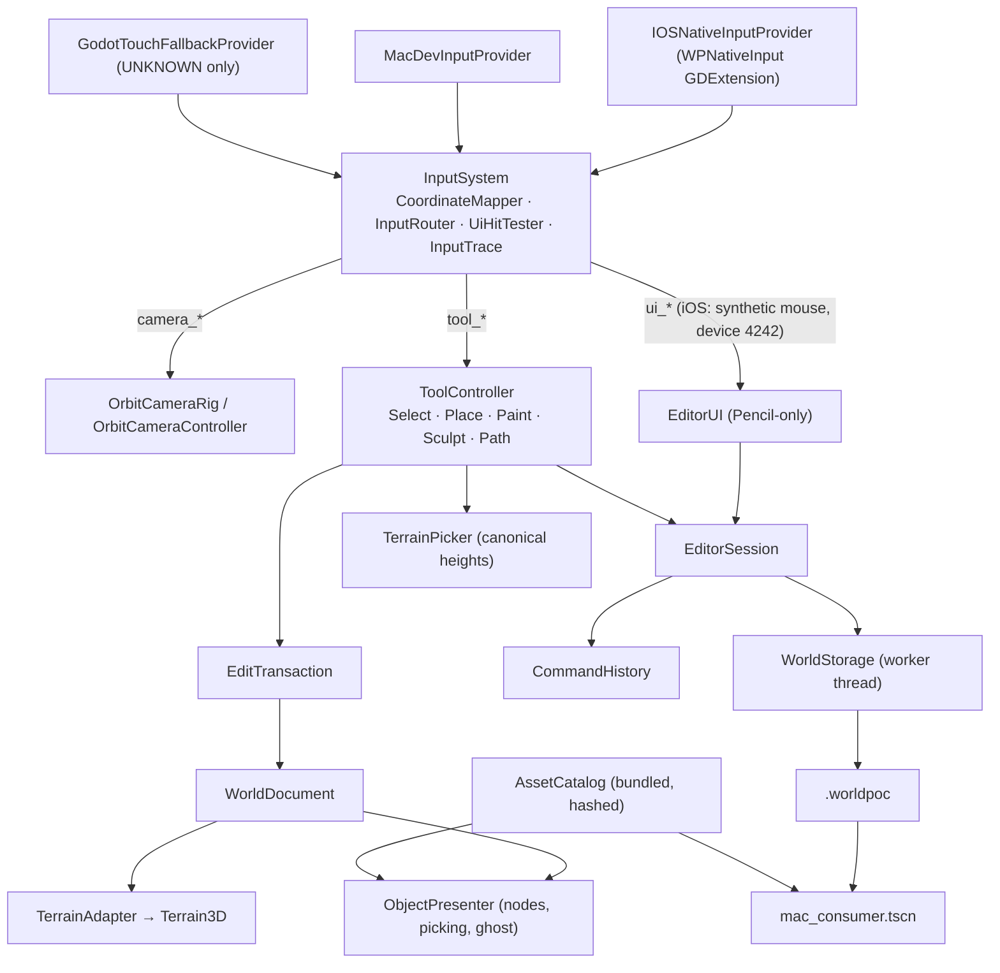

# Architecture

Implements spec §4. One Godot project (`app/`) with small typed modules; one authoritative copy
of authored data (`WorldDocument`); everything visible is a rebuildable projection of it.

## Frame order (main thread)

1. `InputSystem._process`: refresh mapping (cancel on change) → drain provider → map → route →
   emit `camera_action`, `tool_action`, `ui_action`, `diagnostic`.
2. `ToolController` handles tool actions immediately and advances time-based strokes
   (`advance(now)`) once per frame with the provider clock.
3. Tools mutate `WorldDocument` inside an `EditTransaction`, mark terrain regions dirty on the
   adapter and sync affected objects on the presenter.
4. `EditorSession._process` (last): `TerrainAdapter.flush()` — at most one upload per map kind per
   frame — then UI/status refresh.
5. `WorldStorage` finishes checkpoints on its worker and reports on the main thread.

Scene tree, UI and Terrain3D are touched only on the main thread (spec §18.2).

## Module contracts (batch 2)

### ObjectPresenter (`app/src/objects/object_presenter.gd`, Node3D)

- `setup(catalog: AssetCatalog)`; `rebuild(doc: WorldDocument)`; `sync_object(doc, id)` (add,
  update or remove to match the document); `node_for(id) -> Node3D`.
- `pick(origin: Vector3, dir: Vector3) -> Dictionary {id: String ("" if none), distance: float}` —
  ray vs each object's oriented catalog bounds; the ghost and overlays are never pickable.
- `show_ghost(asset_id: String, record: ObjectRecord, valid: bool)`, `hide_ghost()`.
- `set_selected(id: String)` (outline box + anchor marker), `selected_id()`.
- Debug: `set_show_anchors(on)`, `set_show_ids(on)`.
- Node transform always comes from `ObjectRecord.node_transform(asset.anchor_local)`.

### ToolController (`app/src/tools/tool_controller.gd`, Node)

- `setup(ctx: ToolContext)` where `ToolContext` bundles: `doc_provider: Callable -> WorldDocument`,
  `catalog`, `picker: TerrainPicker`, `camera: Camera3D`, `adapter: TerrainAdapter`,
  `presenter: ObjectPresenter`, `commit: Callable(WorldChange)`, `now: Callable -> float`
  (provider clock), `defaults: Dictionary` (poc_defaults), `diagnostic: Callable(String)`.
- `set_active_tool(id)` — `select | place | paint | sculpt | path`; refused while an operation is
  active.
- `handle_tool_action(action: Dictionary)` — router vocabulary (`tool_begin/move/pause/resume/end/cancel`).
- `advance(now: float)` — once per frame.
- `has_active_operation() -> bool`, `cancel_active(reason: String)`.
- Settings: `settings(tool_id) -> Dictionary`, `set_setting(tool_id, key, value)`.
- Selection edits (UI): `begin_object_edit(kind)` / `update_object_edit(value)` /
  `end_object_edit()` / `cancel_object_edit()` for slider drags (one drag = one action), and
  one-shot `nudge_yaw(deg)`, `nudge_scale(delta)`, `nudge_height(delta)`, `set_grounding(mode)`,
  `delete_selected()`.
- Signals: `operation_started(tool_id)`, `operation_finished(change_or_null)`,
  `operation_cancelled(reason)`, `selection_changed(id)`, `tool_changed(id)`, `settings_changed(tool_id)`.

### EditorSession (`app/src/app/editor_session.gd`, Node)

Owns catalog, document, history, storage, adapter, presenter, camera rig, input system, tool
controller. `start()` recovers the latest valid world or opens Gentle Hills as a new working copy.
`commit(change)` bumps the revision, pushes history, requests a checkpoint and presents the change.
`undo()`/`redo()` are refused while an operation owns the viewport. `open_fixture(name)` validates
into a temporary document first, attempts a checkpoint of the current world, then replaces it.
`export_world()` makes sure the current revision is durable, then exports and validates the package.
`status() -> Dictionary` feeds the status row and diagnostics overlay.
