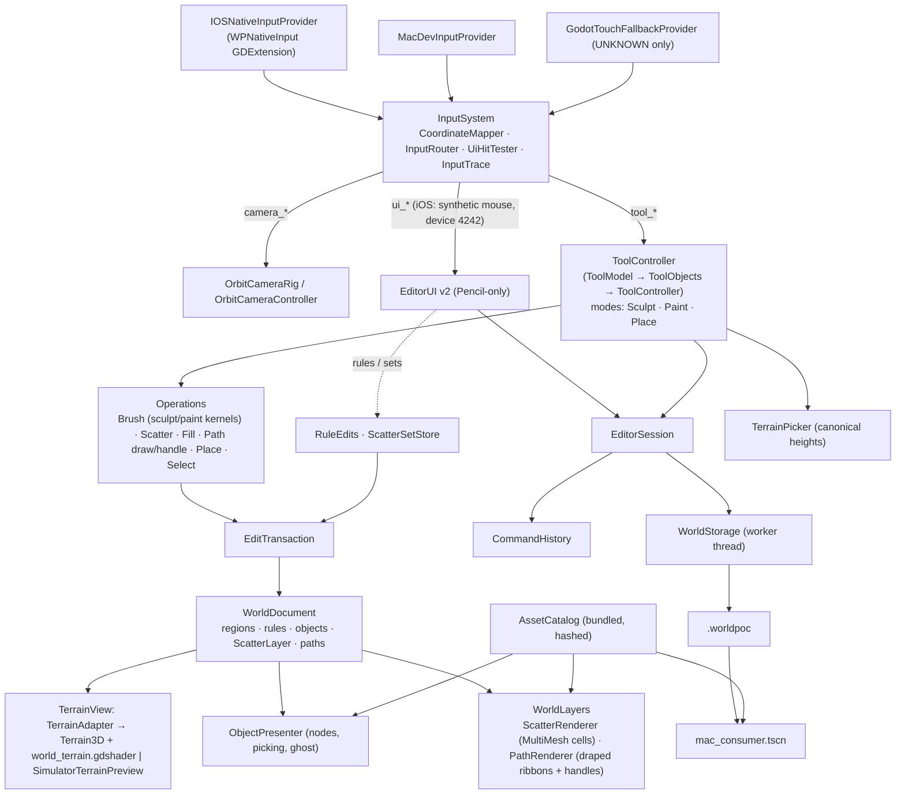

# Architecture

Implements spec §4. One Godot project (`app/`) with small typed modules; one authoritative copy
of authored data (`WorldDocument`); everything visible is a rebuildable projection of it.

## Frame order (main thread)

1. `InputSystem._process`: refresh mapping (cancel on change) → drain provider → map → route →
   emit `camera_action`, `tool_action`, `ui_action`, `diagnostic`.
2. `ToolController` handles tool actions immediately and advances time-based strokes
   (`advance(now)`) once per frame with the provider clock.
3. Tools mutate `WorldDocument` inside an `EditTransaction`, mark terrain regions dirty on the
   adapter and sync affected objects on the presenter.
4. `EditorSession._process` (last): `TerrainAdapter.flush()` — at most one upload per map kind per
   frame — then UI/status refresh.
5. `WorldStorage` finishes checkpoints on its worker and reports on the main thread.

Scene tree, UI and Terrain3D are touched only on the main thread (spec §18.2).

## Editor modules (implemented)

World Editor v2 (ADR 0009, behaviour contract `docs/editor-v2.md`). Paths are under `app/src/`.

| Module | Files | Role |
|---|---|---|
| `EditorSession` | `app/editor_session.gd` (+ `session_world_ops.gd`) | Composition root of `editor_main.tscn`: boot/recovery, commit (history, `WorldLayers.present_change`, terrain rules), undo/redo, checkpoints, open fixture, verified export, deactivation save, stall cancel, status, fault injection |
| `WorldLayers` | `app/world_layers.gd` | Scene layers drawn from document data on top of the terrain (scatter, paths); never mutates the document |
| `TerrainView` | `terrain/terrain_view.gd` | Projection interface: `TerrainAdapter` (Terrain3D) or `SimulatorTerrainPreview` (GLES mesh, Simulator only) |
| Project shader | `terrain/world_terrain.gdshader` | Terrain3D's generated shader plus `// WP:` patches: 4 material slots, auto-paint rules (live uniforms), tint map, rule highlight, debug views (`debug_view` 0-3, region grid) driven by `TerrainAdapter.set_debug_view` / `set_region_grid` |
| `ObjectPresenter` | `objects/object_presenter.gd` | Nodes from records, oriented-bounds picking, ghost, selection, anchor/ID markers |
| Tool model | `tools/tool_model.gd` (`ToolModel`), `tool_objects.gd` (`ToolObjects`), `tool_controller.gd` (`ToolController`) | `ToolModel`: modes (Sculpt/Paint/Place), per-mode tool, invert, settings namespaces (`ToolSettings`), armed Library asset, height pick, scatter source/quick mix. `ToolObjects`: selection, object and path edits. `ToolController`: pointer operations, one per contact |
| `ToolCommands`, `ToolContext`, `Regrounder` | `tools/` | One-shot edits (duplicate, delete), commit/report plumbing, FOLLOW_TERRAIN re-grounding shared by sculpt and path drawing |
| Brush / paint / sculpt kernels | `tools/brush_operation.gd`, `brush_alpha.gd`, `brush_dabs.gd`, `brush_math.gd`, `brush_kernels.gd`, `paint_kernels.gd`, `sculpt_kernels.gd`, `paint_stroke.gd`, `sculpt_stroke.gd`, `stroke_timeline.gd`, `brush_ring.gd` | Alpha shapes and modes, 4-layer paint/erase, spray, tint, flatten/noise/smooth; continuous kernels for soft+circle, dab kernels otherwise; pure functions on `ControlCodec` / `TintCodec` |
| Other operations | `tools/place_operation.gd`, `select_operation.gd`, `pick_operation.gd`, `object_edits.gd` | Placement ghost and armed drop, tap-select and move, texture pick, transform edits |
| `RuleEdits` | `tools/rule_edits.gd` | Auto-paint rule toggle and scrub, one history action each |
| `ScatterSetStore` | `tools/scatter_set_store.gd` | App-level scatter sets in `user://scatter_sets.json` (defaults forest, meadow, scree) |
| Scatter | `scatter/` | `ScatterOperation` (scatter and erase brush), `FillOperation` (lasso fill/clear), `ScatterPlacer`/`ScatterIndex` (candidate test, spatial hash), `ScatterRenderer` (MultiMesh per 32 m cell and asset), `LassoPreview` |
| Paths | `paths/` | `PathSpline` (Catmull-Rom), `PathDrawOperation` (draw + flatten in one action), `PathHandleOperation` (control-point drag), `PathRenderer`/`PathRibbon` (draped ribbon), `PathOverlay` (dashed centreline and handles, minimum 22 pt on screen) |
| `EditorUI` v2 | `ui/` | `WorldPill`+`WorldMenu`, `HistoryTiles`, `ActionPill`, `ModeRail`, `ToolPopover` (+`BrushAlphaSection`, `RulesSection`, `HeightTargetRow`, `SourceCard`, `SwatchRow`, `ScrubField`), `ToolChip`, `AssetLibrary` (+`LibraryTile`, `SetCard`), `SetEditor` (+`SetPreview`), `ObjectInspector`, `GhostLabel`, `GestureHints`, `Toast`, `ConfirmDialog`, `DiagnosticsOverlay`; tokens and icons in `UiKit` |
| `MacConsumer` / `WorldLoader` | `consumer/` | Read-only consumer scene and `--verify-only` report |
| Self-test | `app/editor_selftest.gd`, `selftest_v2_steps.gd`, `selftest_driver.gd`, `scripted_input_provider.gd` | `--editor-selftest`: synthetic §21.1 sequence plus v2 steps (tint, flatten, scatter/fill/erase with exact undo, rules), report + screenshots (never device evidence) |

Contracts in code: `ToolContext` carries document, catalog, camera, terrain view, presenter, defaults,
`commit` (session bumps revision, pushes history, requests a checkpoint), `request_cancel` (routes to
`InputSystem.cancel_all`, which synchronously delivers `tool_cancel`), `diagnostic`, `units_per_point`.
Operations mutate the document only inside an `EditTransaction`; the placement ghost is presentation
only, so a placement inserts its record at release. One slider drag is one action; a cancelled drag
restores the exact starting record. Undo/redo, save, export and open are refused while an operation
owns the viewport. The Input Lab stays available through `--input-lab` (`dev.py run-mac --input-lab`).

Document layers (schema 2, `docs/world-format.md`): terrain regions (height, control, tint maps), rules
(manifest integers), manual objects, `ScatterLayer` (compact instances, Y follows the terrain) and
paths (spline records). Rule edits, scatter and path edits are `EditTransaction` captures like terrain
strokes, so every action is one history entry with an exact undo. `WorldLayers` and the project shader
are projections; changing a rule only updates shader uniforms.
