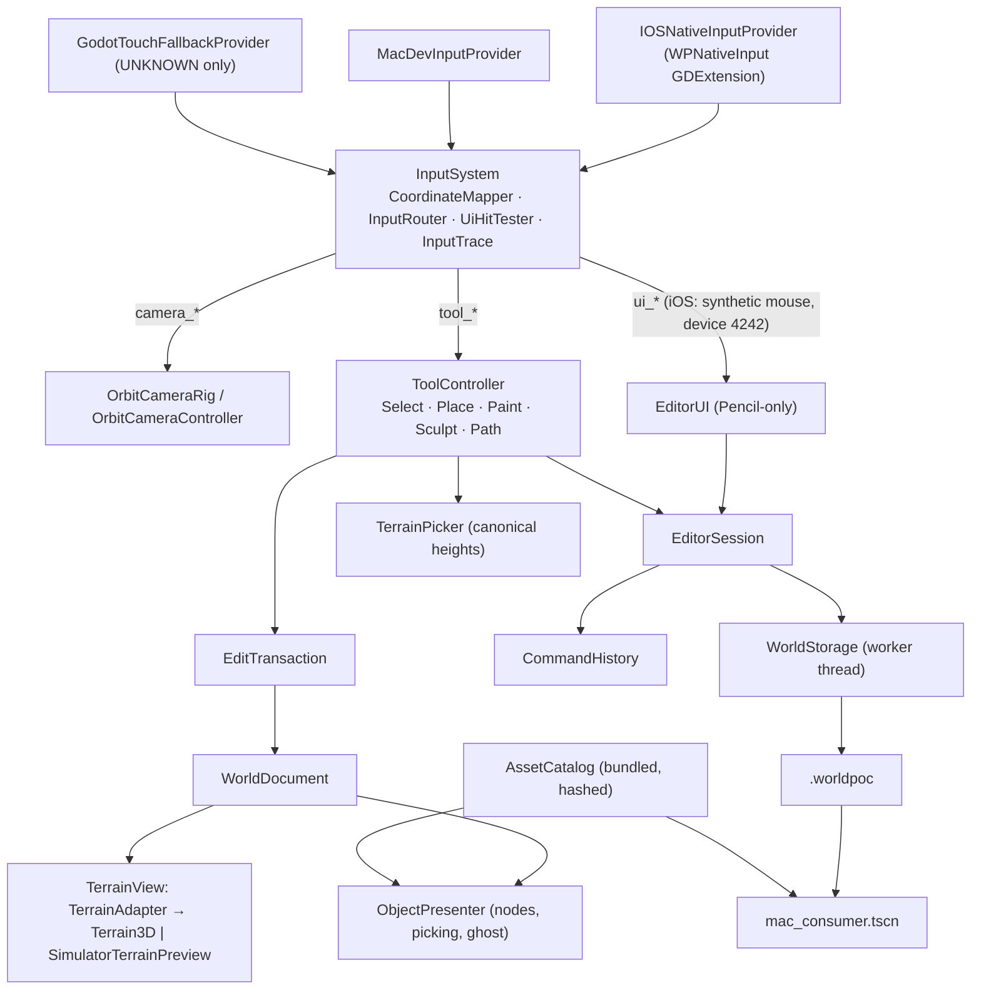

# Architecture

Implements spec §4. One Godot project (`app/`) with small typed modules; one authoritative copy
of authored data (`WorldDocument`); everything visible is a rebuildable projection of it.

## Frame order (main thread)

1. `InputSystem._process`: refresh mapping (cancel on change) → drain provider → map → route →
   emit `camera_action`, `tool_action`, `ui_action`, `diagnostic`.
2. `ToolController` handles tool actions immediately and advances time-based strokes
   (`advance(now)`) once per frame with the provider clock.
3. Tools mutate `WorldDocument` inside an `EditTransaction`, mark terrain regions dirty on the
   adapter and sync affected objects on the presenter.
4. `EditorSession._process` (last): `TerrainAdapter.flush()` — at most one upload per map kind per
   frame — then UI/status refresh.
5. `WorldStorage` finishes checkpoints on its worker and reports on the main thread.

Scene tree, UI and Terrain3D are touched only on the main thread (spec §18.2).

## Editor modules (implemented)

| Module | File | Role |
|---|---|---|
| `EditorSession` | `app/src/app/editor_session.gd` (+ `session_world_ops.gd`) | Composition root of `editor_main.tscn`: boot/recovery, commit, undo/redo, checkpoints, open fixture, verified export, deactivation save, stall cancel, status, fault injection |
| `TerrainView` | `app/src/terrain/terrain_view.gd` | Projection interface: `TerrainAdapter` (Terrain3D) or `SimulatorTerrainPreview` (GLES mesh, Simulator only) |
| `ObjectPresenter` | `app/src/objects/object_presenter.gd` | Nodes from records, oriented-bounds picking, ghost, selection, anchor/ID markers |
| `ToolController` | `app/src/tools/tool_controller.gd` | Active tool, settings, selection, object edits; one operation per contact |
| Operations | `brush_operation.gd`, `place_operation.gd`, `select_operation.gd`, `object_edits.gd`, `brush_ring.gd` | Paint/sculpt/path strokes (sculpt re-grounds FOLLOW_TERRAIN objects in the same transaction), placement ghost, tap-select and move, transform edits |
| `EditorUI` | `app/src/ui/` | Status row, tool rail, tool panel, asset strip, open/confirm dialog, diagnostics overlay |
| `MacConsumer` / `WorldLoader` | `app/src/consumer/` | Read-only consumer scene and `--verify-only` report |
| Self-test | `app/src/app/editor_selftest.gd`, `scripted_input_provider.gd` | `--editor-selftest`: synthetic §21.1 sequence, report + screenshots (never device evidence) |

Contracts in code: `ToolContext` carries document, catalog, camera, terrain view, presenter, defaults,
`commit` (session bumps revision, pushes history, requests a checkpoint), `request_cancel` (routes to
`InputSystem.cancel_all`, which synchronously delivers `tool_cancel`), `diagnostic`, `units_per_point`.
Operations mutate the document only inside an `EditTransaction`; the placement ghost is presentation
only, so a placement inserts its record at release. One slider drag is one action; a cancelled drag
restores the exact starting record. Undo/redo, save, export and open are refused while an operation
owns the viewport. The Input Lab stays available through `--input-lab` (`dev.py run-mac --input-lab`).
