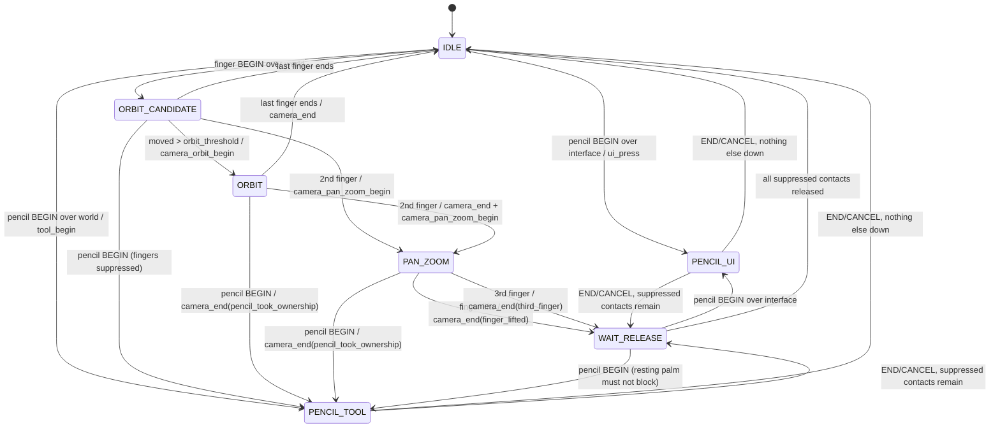

# Input contract

Normative contract for the input path (spec §6, §7, §9 touch rules, §16.3, §18.3, §20.2).
Code: `app/src/input/`. Tests: `app/tests/unit/test_input_router.gd`,
`test_coordinate_mapper.gd`, `test_input_trace.gd`, `test_mac_dev_provider.gd`,
`app/tests/integration/test_input_system.gd`, fixtures in `app/tests/input_traces/`.

## 1. Single authoritative path

```text
InputProvider --drain_samples()--> InputSystem --map once--> InputRouter --actions--> signals
 (iOS native | Mac dev | Godot-touch fallback)   (CoordinateMapper)   (UiHitTester)   camera_action
                                                                                    tool_action
                                                                                    ui_action
                                                                                    diagnostic
```

- Exactly one provider per session, chosen in `InputSystem._ready`:
  - iOS: `IOSNativeInputProvider` (loaded dynamically from
    `res://src/input/ios_native_input_provider.gd`) when its `is_available()` is true; otherwise
    `GodotTouchFallbackProvider` plus the banner **"Native Pencil input unavailable — editing
    disabled"** and diagnostic `native_input_unavailable`.
  - Any other OS: `MacDevInputProvider`, labelled **MAC DEVELOPMENT INPUT**. It never satisfies an
    iPad gate.
- **iOS single-path rule.** Every `InputEventScreenTouch`, `InputEventScreenDrag` and every mouse
  event whose `device` is not `InputSystem.SYNTHETIC_DEVICE_ID` (4242) is swallowed
  (`set_input_as_handled`) before any node or control sees it. The fallback provider receives the
  touch events via `ingest_event()` (in root-viewport coordinates) *before* they are swallowed.
  No other node may consume raw touch/mouse events for world or UI behaviour; tools, camera and
  UI react only to router actions.
  - Godot forwards raw input to embedded Windows (dialogs, `OptionButton`/`MenuButton` popups)
    *before* the root's `_input` phase, and calls `_input` in reverse tree order. So on iOS
    `InputSystem` installs a `RawInputGuard` as the last internal child (`INTERNAL_MODE_BACK`) of
    the root and of every Window (existing ones at startup, new ones via `SceneTree.node_added`,
    attached deferred). Each guard runs first in its viewport, whatever is added later and wherever
    `InputSystem` sits in the tree. `InputSystem._input` covers the frame before the root guard
    exists.
  - `InputSystem` and the guards use `PROCESS_MODE_ALWAYS`: a paused tree neither reopens the raw
    path nor stops routing.
  - `Input.emulate_mouse_from_touch` is forced off on iOS, and Godot's iOS view emits no mouse
    events, so raw mouse events do not occur there. Residual engine limit (desktop-only in
    practice): `PopupMenu` reacts to mouse buttons in C++ (`_input_from_window`) before any
    script hook, so a raw *mouse* click on an open popup cannot be blocked.
- Pencil-owned `ui_*` actions are re-injected on iOS as `InputEventMouseMotion` /
  `InputEventMouseButton` (left button, correct `button_mask`) via
  `get_tree().root.push_input(ev, true)` in viewport coordinates, `device = 4242`. Fingers can never
  produce them. On desktop nothing is injected (the real mouse already drives the GUI) and nothing is
  swallowed (the Mac provider only observes). UI code must therefore never act on the `ui_action`
  signal itself (it is for diagnostics); controls are operated only by (real or synthetic) GUI events.
- Fatal provider failure first cancels all operations, stops the failed observer, discards its
  remaining drain and contact IDs, then selects UNKNOWN-only fallback with editing disabled and
  a visible banner. Queue overflow cancels operations but retains the healthy native provider.
- `ui_cancelled(reason)` fires before synthetic release. Application slider owners must roll back
  their active transaction in this signal and ignore the release as a commit.
- Synthetic events not consumed by a control continue to `_unhandled_input`; world nodes must not
  read pointer events there.
- `ui_cancel` injection: when the pressed control is a `BaseButton`, the synthetic press is dragged
  off-screen and released there so the button does not fire; other controls (sliders) are released
  in place and keep their current value. The pressed control is looked up in the viewport under
  the press (an embedded window or the root).
- **Library drops** (ADR 0007). A Pencil contact that begins on a Library tile remains owned by
  that tile; the router stays in `PENCIL_UI` and emits no tool actions. After a short drag the tile
  opens `ToolController.begin_drop(asset_id)` and forwards each root-viewport position through
  `update_drop(pos, over_ui)`. On release it calls `finish_drop(pos, over_ui)`. `over_ui` comes from
  `UiHitTester.is_over_ui`. Only a valid terrain hit outside every registered panel commits one
  `Place` transaction; anything else places nothing. `ui_cancelled` cancels the drop before the
  in-place synthetic release, and that release then does nothing. While a drop is open, the
  controller ignores router tool actions except `tool_cancel`.
- Window-based UI (dialogs, popups) is interface without registration (`UiHitTester.root`): a
  visible exclusive or popup window covers the whole screen (a Pencil tap outside it dismisses it
  and never paints; fingers never navigate behind it); any other visible window covers its rect
  (title bar included); mouse-passthrough windows (tooltips) never count. `UiHitTester.screen_rect`
  returns root-viewport rects for controls inside embedded windows too.
- **Listener pairing.** Handlers may call `InputSystem.cancel_all()` while actions are being
  dispatched (e.g. a tool failing in its `tool_resume` handler). The rest of that batch was
  computed before the cancel and is dropped, and every operation the listeners still see as open
  is closed with the cancel reason (`tool_cancel`, `ui_cancel`, `camera_end`). A tool that asked
  for a cancel therefore never receives `tool_end`, and no `*_begin` is left open. (A trace of
  such a session records what listeners saw; replaying it through a bare router can differ.)

Frame order: `InputSystem` runs first (`process_priority = -1000`): refresh mapping (cancel on
change) → drain → map (`position_viewport`, `mapping_generation`) → trace → route → dispatch.

## 2. Ownership table

| Contact | Begins over | Owner | Actions | Ends with |
|---|---|---|---|---|
| Pencil / MOUSE_DEV | interface (`UiHitTester`) | the pressed control | `ui_press`, `ui_move`… | `ui_release` / `ui_cancel` |
| Pencil / MOUSE_DEV | world | active tool | `tool_begin`, `tool_move`, `tool_pause`, `tool_resume` | `tool_end{over_ui}` / `tool_cancel` |
| Pencil / MOUSE_DEV | anywhere, while another pencil is active | nobody (suppressed) | `diagnostic second_pencil` | — |
| Pencil / MOUSE_DEV | world, while a modal is open | nobody (suppressed) | `diagnostic modal_active` | — |
| Finger | interface | nobody (inert) | none | — |
| Finger | world, machine IDLE | camera | orbit / pan-zoom | `camera_end` |
| Finger | world, pencil active or WAIT_RELEASE or modal | nobody (suppressed until lifted) | none | — |
| UNKNOWN | anywhere | nobody (inert) | `diagnostic unknown_source` once | — |
| any, `is_predicted` | — | ignored entirely | none | — |

Inert contacts (UNKNOWN, fingers that began over interface) never change the state and never hold
the machine in WAIT_RELEASE. Suppressed contacts stay suppressed until they physically end or
cancel. Pressure is optional: samples without pressure route identically (IN-11).

## 3. State machine



(The camera states also go to `PENCIL_UI` when the pencil lands on interface.) From every state,
`cancel_all(reason)` and `set_modal(true)` end the active operation and suppress all contacts
(→ WAIT_RELEASE, or IDLE when nothing is down). `set_modal(true)` leaves an active `PENCIL_UI`
press alone.

Rules the tests pin down:
- Orbit begins only when a finger moves **strictly more** than `orbit_threshold` (5 logical points,
  converted with `CoordinateMapper.points_to_viewport`) from its start; deltas are measured from
  the crossing position (no jump). Zero deltas are not emitted.
- The transition to PAN_ZOOM emits no camera motion; `camera_pan_zoom_begin` carries the baseline
  centroid and span, each later move carries the current centroid and span.
- Two → one finger freezes (WAIT_RELEASE); the remaining finger never becomes an orbit.
- A stroke entering interface emits `tool_pause` once; occluded samples are dropped; the next world
  sample emits `tool_resume` = start of a **new segment** (tools must not interpolate across the
  gap). A paused stroke lifted over the world emits `tool_resume` then `tool_end`.
- Orphan MOVE/END/CANCEL → `diagnostic orphan_sample`; duplicate BEGIN → `diagnostic
  duplicate_begin`; neither changes state.

## 4. Action vocabulary

Every action is a `Dictionary` with `type`:

| type | fields | pairing |
|---|---|---|
| `camera_orbit_begin` | `pos: Vector2` | closed by `camera_end` |
| `camera_orbit` | `delta: Vector2` (viewport units) | |
| `camera_pan_zoom_begin` | `centroid: Vector2`, `span: float` | closed by `camera_end` |
| `camera_pan_zoom` | `centroid`, `span` (current) | |
| `camera_end` | `reason` | only after a begin |
| `ui_press` | `pos`, `pointer_id` | closed by `ui_release` / `ui_cancel` |
| `ui_move` | `pos` | |
| `ui_release` | `pos` | |
| `ui_cancel` | `reason` | |
| `tool_begin` / `tool_move` | `sample: PointerSample` (apply) | closed by `tool_end` / `tool_cancel` |
| `tool_pause` | `sample`: the first sample **over interface** (occluded). **Do not apply it**; it only marks where the stroke left the world. The current segment ends at the previous applied sample. | |
| `tool_resume` | `sample`: first sample back over the world; start a **new segment** here, never interpolate from the pre-pause sample | |
| `tool_end` | `sample`, `over_ui: bool` (END position occluded; do not apply it) | |
| `tool_cancel` | `reason` | tool must roll back fully |
| `diagnostic` | `code`, `message`, `pointer_id` (−1 if none) | |

`camera_end` reasons: `released`, `second_finger`, `third_finger`, `finger_lifted`,
`pencil_took_ownership`, or a cancellation reason. Diagnostic codes: `unknown_source`,
`second_pencil`, `modal_active`, `orphan_sample`, `duplicate_begin`, `invalid_phase`,
`invalid_position`, `input_cancelled`, `provider_failed`, `native_input_unavailable`,
`mapping_invalid`; `invalid_trace_entry` (trace replay only).

Non-finite positions (`NAN` = no sample) never reach hit-testing, tools, UI or camera: a BEGIN or
MOVE with one is dropped with diagnostic `invalid_position`; an END/CANCEL with one still ends the
contact, as a cancel with reason `invalid_position` (a garbage end point is never applied).

## 5. Cancellation (spec §6.4, §16.3)

`InputRouter.CANCEL_REASONS`: `native_cancel`, `app_deactivated`, `mapping_changed`,
`queue_overflow`, `explicit`, `provider_failed`, `modal`, `tool_error`, `view_changed`,
`invalid_phase`, `invalid_position`, `godot_ambiguous_release`. Unknown native cancellation
codes decode as `provider_failed`; `view_changed` remains distinct from mapping changes. A sample CANCEL uses its
`cancel_reason` (default `native_cancel`); a CANCEL is never converted to END.

| Trigger | Handling |
|---|---|
| Provider CANCEL sample | `tool_cancel` / `ui_cancel` / `camera_end` with the sample's reason |
| `APPLICATION_FOCUS_OUT`, `APPLICATION_PAUSED`, `WM_WINDOW_FOCUS_OUT` | `InputSystem.cancel_all("app_deactivated")` |
| Mapping generation changes while contacts are active | `cancel_all("mapping_changed")` |
| `provider_failed(reason)` | diagnostic `provider_failed`; the reason is normalized (trimmed, lower-case, spaces → `_`, so the native provider's `"queue overflow"` becomes `queue_overflow`); `cancel_all(that)` if it is a known reason, else `cancel_all("provider_failed")` |
| Escape (Mac) | `cancel_all("explicit")` |
| `set_modal(true)` | `tool_cancel("modal")` / `camera_end("modal")` |

`InputSystem.cancel_all` calls `provider.cancel_all(reason)` (provider emits CANCEL for live
contacts on the next drain and ignores them until they physically end) and `router.cancel_all`,
and emits diagnostic `input_cancelled` when contacts were active. Other cancellation sources
(e.g. `godot_ambiguous_release` from the fallback provider) pass through as sample reasons.

## 6. Coordinate spaces (spec §6.3)

`CoordinateMapper` is the only place device scale is applied.

| Space | Meaning | Mapping to root-viewport coordinates |
|---|---|---|
| `viewport` | already root-viewport canvas coordinates (Mac, fallback: Godot applied it) | identity |
| `uikit_points` | UIKit points in the Godot view | `root.get_final_transform().affine_inverse() * (raw * content_scale)` |

Root-viewport coordinates are what `Control.get_global_rect()` and `push_input(ev, true)` use
(base 1180×820, stretch `canvas_items` + `expand`). `viewport_units_per_point() = content_scale ×
inverse final scale`, used for the 5-point orbit threshold and the 2-point calibration tolerance.
`scaling_3d_scale` is not part of the transform, so 3D render scale never moves UI picking.
Any change to space, content scale, final transform or viewport size bumps `generation`.
A singular or non-finite root transform (zero-size window) makes the mapping invalid
(`is_valid()` false): `uikit_points` positions map to `NAN` (routed as `invalid_position`, never
as (0, 0) over the tool rail), point conversions return `NAN`, the router keeps its last usable
orbit threshold, and `InputSystem` emits diagnostic `mapping_invalid` once.

Examples: 11" (1180×820 pt @2x) → 1 viewport unit per point. 13" (1366×1024 pt @2x) → scale
`min(2732/1180, 2048/820) = 2.3153`, viewport 1180×884.6, 0.8638 units per point.

## 7. Mac development mapping

| Mac input | Synthesized contacts |
|---|---|
| Left button drag | `MOUSE_DEV` id 1 (pencil-like: tools and UI) |
| Right drag | `FINGER` id 101 (orbit) |
| Middle drag, or Shift + right drag | `FINGER` 201/202 at cursor ∓(40,0), moving together (pan) |
| Wheel up / down | pinch `FINGER` 301/302 at ∓(60,0) → ∓(60·f,0), f = 1.1 / 1/1.1 |
| Trackpad magnify | same pinch with the gesture factor |
| Trackpad pan gesture | `FINGER` 401/402 at ∓(40,0), shifted by −delta × 8 |
| Escape | `cancel_all("explicit")` |

Synthetic gestures BEGIN in one drain and MOVE+END in the next, so the router sees a real
two-finger transition; further wheel notches before the second drain accumulate. The provider
never consumes events. Capabilities: no source identity, no pressure, no tilt, no native cancel.

## 8. Trace recorder (spec §18.3)

`InputTrace`: bounded ring (default 10 000 entries, oldest overwritten, `dropped` counted),
recording only between `start()` and `stop()`. Entries: `{kind: "sample", data:
PointerSample.to_dict()}`, `{kind: "action", data: normalize_action()}`, `{kind: "event", data:
{op: "cancel_all", reason} | {op: "set_modal", on}}`. `save(name)` writes JSON to
`user://traces/<name>` (plain names only); `load_file(path)` reads traces and fixtures;
`replay(router, entries)` re-feeds samples and events for deterministic comparison. Traces contain
no filesystem paths or credentials. Loaded files are untrusted: `load_file` validates every entry
(kind, source/phase names, integral ids, `[x, y]` vectors, field types, event ops) and returns
`"entry N: <reason>"` instead of defaulting; `sample_from_dict` returns `null` for an invalid
record; `replay` skips invalid entries with a `diagnostic invalid_trace_entry` action.

Fixtures (`app/tests/input_traces/*.json`) add `router {orbit_threshold, ui_rects}`,
`expected_actions` (only the listed fields are compared, numbers within 1e-4) and
`expected_final_state`: `palm_rest_then_pencil` (CA-04), `finger_joins_pencil_stroke` (IN-05),
`pencil_during_orbit` (IN-06), `two_to_one_finger` (IN-07, CA-02), `stroke_crosses_ui` (IN-08),
`native_cancel_mid_stroke` (IN-09).

## 9. What the device test must show

Automated tests prove the routing logic only. On a physical iPad (all NOT RUN until measured,
see `docs/device-test-checklist.md`), with the trace recorder on:

- IN-01: every contact's BEGIN row shows the native source (PENCIL vs FINGER), no source changes
  mid-contact, no pressure heuristic.
- IN-02/IN-03: fingers on buttons, sliders, asset tiles, the confirmation dialog and option
  popups do nothing; the Pencil operates every required control, including those in dialogs.
- IN-04: Godot touch events are counted as swallowed; verify exactly one operation begin/terminal pair per editing contact; coalesced samples and
  suppressed contacts do not imply a one-to-one sample/action count.
- IN-05..IN-08, CA-02, CA-04: the behaviours above with real hands, including resting the palm
  before Pencil-down and keeping it down after Pencil-up without camera jumps.
- IN-09: Control Center / Home mid-stroke shows `CANCEL (native_cancel / app_deactivated)`, never
  END, and no stuck contact.
- IN-10: forced overflow / orientation change → cancellation plus visible diagnostic.
- IN-12: nine-point calibration within 2 logical points at normal and 50 % 3D scale.
