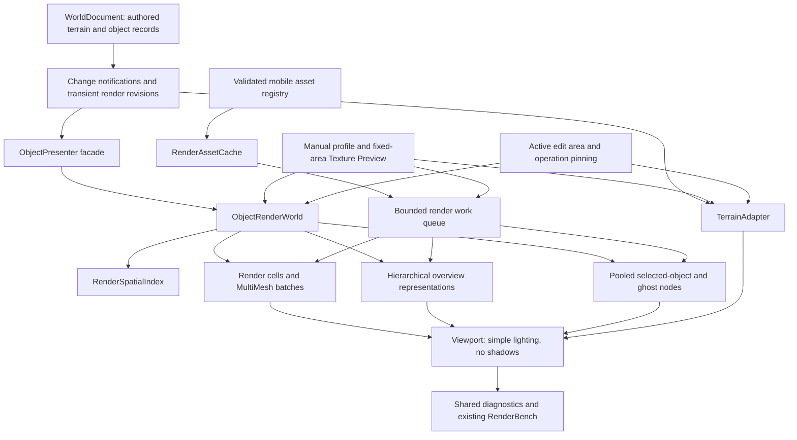
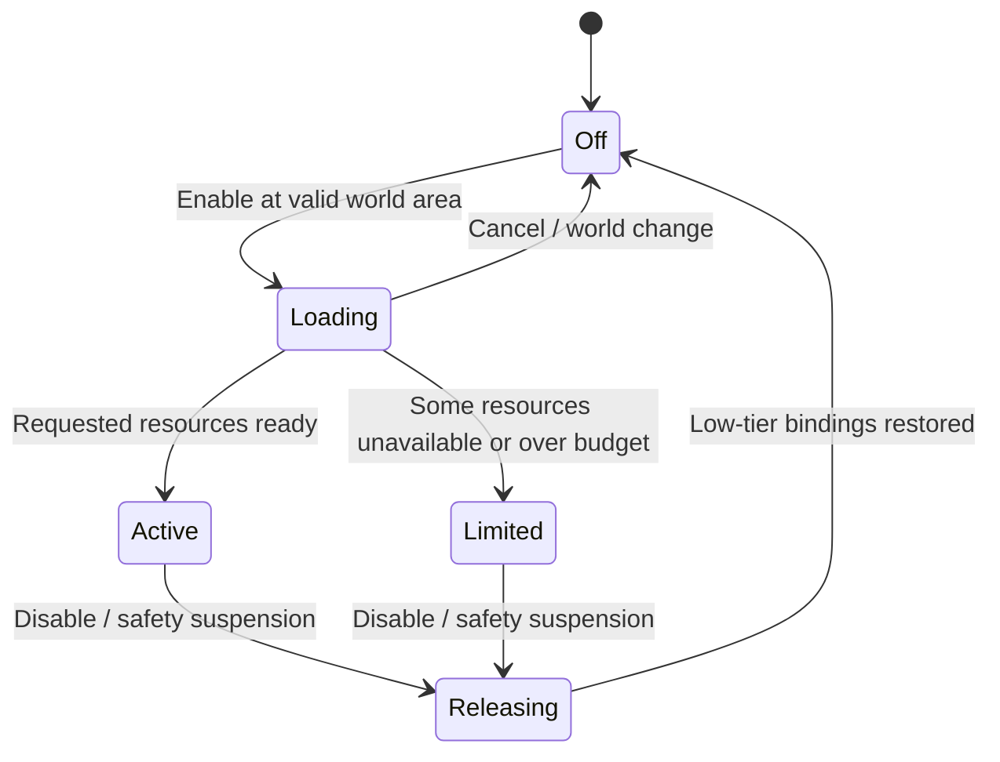

# Godot iPad World Editor — Rendering Performance Implementation Specification

**Target device:** Apple iPad Air, 4th generation  
**Repository:** <https://github.com/andrejvysny/godot-ipad>  
**Specification date:** 2026-10-01  
**Status:** Approved product preferences; implementation design and initial tuning values specified below  
**Deliverable:** A performant, predictable terrain/world-building viewport, not a final game renderer

> Repository copy of the specification handed over on 2026-10-01. Implementation notes, the
> mapping to the repository state at `191b2da` and the approved deviations live in
> `docs/decisions/0010-rendering-performance.md` and the Plane GODOTIPAD project. GODOTIPAD-35
> amends size-aware visibility and extreme overview as recorded in ADR 0013.

---

## 0. Instructions to the coding agent

Implement this specification in `godot-ipad`. It is the consolidated handoff from the rendering review and the user's subsequent preference decisions. No earlier conversation is needed to understand the requirements.

**Read this entire document before implementation.** Then inspect `AGENTS.md`, the repository's current state, the pinned toolchain, and existing tests. Implement in the work-package order in Section 23. Keep changes reviewable and update the implementation checklist as work proceeds.

### 0.1 Authority and interpretation

- **MUST / MUST NOT:** mandatory behavior or correctness constraint.
- **SHOULD:** the default implementation unless measurements or a concrete compatibility issue justify an alternative. Record the reason and evidence.
- **INITIAL:** a starting engineering value to calibrate on the physical device, not a measured hardware limit or immutable user preference.
- **DEFERRED:** not required for this delivery; do not implement it ahead of mandatory work.

The approved preferences in Section 2 take precedence over older repository planning documents where rendering scope conflicts. Preserve unrelated input, persistence, and safety requirements.

**Superseded earlier proposals:** automatic performance-driven profile switching, dynamic shadows, shadow proxies, complex lighting, and final-game visual fidelity. Do not reintroduce these through a “Detailed” profile.

The user approved the product behavior. The architecture and numeric defaults in this document are implementation prescriptions, not claims that the iPad has already achieved the proposed capacity.

### 0.2 Scope boundaries

Focus on rendering, rendering-related frame costs, mobile asset preparation/validation, and the minimum world-size integration needed to use the renderer in the real editor.

Do not redesign the editor's gesture language, build gameplay, add networking/cloud services, or modify other repositories. Prepare an integration-ready asset contract locally. A future AssetStudio/asset-library producer can supply the same contract without becoming a dependency of this implementation.

Use existing GDScript and Godot infrastructure first. Move a proven CPU hotspot to a small native helper only after profiling. Do not begin with a new engine fork, custom GPU-driven renderer, or Terrain3D fork.

### 0.3 Source baseline and drift handling

The original review examined:

```text
02fd8b7803b9d0dfd015e02389cfb2f42cfcf48b
```

This specification also checks the subsequent `master` commit:

```text
762f079860f76dcf8b71e01d65406e6598fe2e0d
feat: add render counters and in-app render benchmark
```

That newer commit already introduces `RenderCounters`, `RenderBench`, `BenchPlan`, and `SceneLighting`. **Extend those components; do not create duplicate profiling or lighting systems.** [R-COMMIT]

Before coding, record the actual starting commit. If the repository has advanced, map existing equivalent functionality to this specification, preserve useful new work, and implement the remaining delta. Never reset the user's branch to the reviewed revision.

No new physical-device benchmark was run while writing this specification. Report all unexecuted tests as `NOT_RUN`, not as passes.

---

## 1. Product objective

Build an iPad viewport for shaping terrain and composing large outdoor worlds with many trees, plants, rocks, and structures.

The source assets may be expensive: dense modeled leaves and branches, overlapping textured cards, many surfaces, and large textures. The device does **not** need to render every original at full quality.

> Preserve the authored world and recognizable composition. Render bounded, mobile-friendly representations of the current view.

### 1.1 Workload targets

| Dimension | Target |
|---|---|
| Device | Physical iPad Air 4; repository device evidence identifies `iPad13,1` |
| World | Approximately 1 × 1 km |
| Meaningful placements | 10,000–50,000 trees, rocks, shrubs, structures, and props |
| Decorative vegetation | Additional grass/small-plant scatter; count clumps separately from meaningful objects |
| Session duration | 30–60 minutes of sustained editing |
| Overview | Entire world visible using simplified terrain and grouped vegetation |
| Interaction | Terrain editing, precise placement, selection, moving/scaling/rotating, and undo/cancel remain responsive |
| Fidelity | Recognizable silhouettes, accurate size/placement, low-resolution textures by default |
| Final rendering | Remains outside the iPad editor's fidelity requirements |

The count is the **authored population**, not a requirement to render 50,000 detailed models simultaneously. Test and report authored, resident, represented, and individually drawn populations separately.

The tile-aligned implementation default in Section 16 is **1,024 × 1,024 m nominal extent**, explicitly labeled approximately 1 km. Do not silently change sample spacing to reach that size.

---

## 2. Approved preferences and requirements

This table is the authoritative record of the user's decisions.

| ID | Topic | Required behavior |
|---|---|---|
| PREF-01 | Normal object appearance | Recognizable shape, size, and silhouette are sufficient. Fine branches/leaves may be heavily simplified. |
| PREF-02 | Selection | Show a more detailed **mobile-friendly** representation of the selected object. Do not automatically load the unrestricted original. |
| PREF-03 | Normal textures | Use low-resolution textures; preserve distinguishable terrain and material categories. |
| PREF-04 | Texture Preview | Provide on-demand higher-resolution texture inspection, independently of geometry quality and lighting. |
| PREF-05 | Plant input types | Support derivatives of both geometry-heavy vegetation and overlapping leaf-card vegetation. |
| PREF-06 | Overview | Show the whole world using simplified terrain and grouped forest representations. |
| PREF-07 | Distant composition | Keep recognizable silhouettes/groups of trees, large rocks, and structures. Do not make planted areas look empty. |
| PREF-08 | Grass density | Representative density while navigating; increase fidelity locally when practical. Never change saved density. |
| PREF-09 | World scale | Approximately 1 km square. |
| PREF-10 | Object count | Target 10,000–50,000 meaningful placements, with separate decorative-scatter workloads. |
| PREF-11 | Quality control | Explicit **Performance / Balanced / Detailed** profiles. No automatic performance-driven switching. |
| PREF-12 | Startup | Start each application session in **Performance**. Do not silently restore a previous Detailed session. |
| PREF-13 | Detail transitions | Visible transitions during navigation are acceptable. Stabilize the active editing area during an operation. |
| PREF-14 | Loading | Show coarse representations immediately; progressively improve them as resources become ready. |
| PREF-15 | Asset readiness | Require prepared mobile representations before an asset becomes placeable. Preserve source assets separately. |
| PREF-16 | Sustained use | Validate 30–60-minute physical-device sessions. |
| PREF-17 | Lighting | Simple fixed illumination for readable terrain slopes and object forms. |
| PREF-18 | Shadows | Cast shadows are not required and MUST remain disabled in all production profiles. |
| PREF-19 | Preview area | Texture Preview covers a bounded area around the selection, including terrain and nearby objects. |
| PREF-20 | Preview navigation | Preview remains anchored to that world-space area until disabled; orbit/zoom are allowed. It does not follow the camera. |
| PREF-21 | Overview selection | Tap a group/area to focus into it; select individual objects after their individual representations are visible. |
| PREF-22 | Required aids | Temporary hide-vegetation view, selected-object bounds/footprint, and a small performance/profile indicator. |
| PREF-23 | Optional aids | Height coloring, slope coloring, contours/grid, and density/coverage overlay are nice to have. |
| PREF-24 | Separate detail tool | No separate “more detail here” control initially. Selection, profiles, and Texture Preview cover this need. |

### 2.1 Explicit exclusions

Do not implement dynamic cast shadows, shadow proxies, real-time global illumination, lightmap baking workflows, reflection probes, animated foliage/wind, foliage physics, time-of-day transitions, volumetric atmosphere, cinematic post-processing, or final-game visual matching.

No motion blur, depth of field, screen-space ambient occlusion, screen-space reflections, or expensive transparency effects are needed. A simple background is sufficient. Do not use fog as a mandatory way to conceal missing distant objects.

Do not build a general vegetation-painting or asset-generation service as part of rendering. Consume existing placements/scatter data and provide render adapters and fixtures. Static snapshots of otherwise animated source assets may be prepared offline; animation playback is excluded.

### 2.2 Non-negotiable data invariants

Changing a profile, LOD, texture tier, render scale, preview region, visibility aid, or residency state MUST NOT change:

- Object IDs, asset IDs/versions, transforms, placement anchors, grounding modes, or authored scatter density.
- Terrain height/control data, undo history, document revision, or saved/exported content.
- The identity or geometry of original source assets.

Rendering caches and mobile resource choices are derived state. They MUST NOT enter authored hashes or become hidden authoritative world data.

A renderer replacement may change its internal node structure. It MUST preserve existing selection, grounding, cancel, undo/redo, and export semantics.

---

## 3. Verified starting state and implementation implications

The following findings refer to the pinned source baseline, not speculative missing functionality.

| Existing area | Observed behavior | Required action |
|---|---|---|
| `app/project.godot` | Mobile renderer; Vulkan on iOS; Metal on macOS; ETC2/ASTC import enabled | Retain the tested renderer/driver defaults. Add explicit rendering profiles. [R-PROJECT] |
| `config/toolchain.lock.json` | Pins Godot `4.7.2.stable.official`, Terrain3D `v1.0.2-stable`, and device/build evidence | Verify APIs against this toolchain; do not opportunistically upgrade it. [R-LOCK] |
| `app/addons/world_painter/presentation/objects/object_presenter.gd` | Complete preview scene per object; full rebuild frees/recreates nodes | Replace population rendering with spatial batches and bounded construction. [R-OBJECT] |
| Presenter picking | Iterates all transforms and calculates inverse transforms in the query | Add a spatial broad phase and cached transforms/bounds. [R-OBJECT] |
| Selection decoration | Rebuilds overlay geometry during selected-object synchronization | Reuse overlay resources and update transforms. [R-OBJECT] |
| Placement ghost | Full scene with a shared alpha-blended material override | Use a cheap prepared ghost/footprint; do not alpha-blend the original complex plant. [R-OBJECT] |
| `app/src/ui/editor_ui.gd` | Inspector avoidance obtains sorted IDs and projects other objects each frame | Replace with invalidated, bounded visible-neighbor queries. [R-UI] |
| `app/addons/world_painter/core/document/asset_catalog.gd` | Trusted catalog with synchronous preview instantiation and strict self-contained geometry rules | Preserve existing validation; add a separate versioned render-derivative registry. [R-CATALOG] |
| `app/assets/models/spruce_a.tscn` | Primitive trunk/crown with different local translations | Preserve multipart hierarchy transforms; add genuinely complex benchmark fixtures. [R-SPRUCE] |
| `app/addons/world_painter/terrain/terrain_adapter.gd` | Canonical-data projection; dirty region-layer uploads; collision disabled | Extend its budgeting; do not replace it or re-add collision. [R-TERRAIN] |
| `WorldConstants` / `WorldDocument` | Fixed four-region extent and fixed sampling boundaries | Minimal bounded world-layout integration is necessary for the 1 km target. [R-CONSTANTS] [R-DOCUMENT] |
| Config | Specifies 2,000 objects and an 8 MiB package limit | Audit actual enforcement in both languages; add deliberate target-size limits rather than disabling checks. [R-CONFIG] |
| `app/src/app/scene_lighting.gd` | New shared lighting setup still enables shadows | Turn production shadows off here and in every relevant presenter/material path. [R-COMMIT] |
| `app/src/diagnostics/render_counters.gd` | Already measures render timings, visible/shadow draws, primitives, resource counters, pipelines | Extend measurement validity, process-memory attribution, and shared snapshots. [R-COUNTERS] |
| `app/src/diagnostics/render_bench.gd` / `bench_plan.gd` | Existing count × settings × camera benchmark | Harden isolation, deterministic populations, cancellation/restoration, and representative workloads. [R-BENCH] |
| Export | Shader baker disabled; helper exports headlessly; Terrain3D `extras/*` excluded | Keep export deterministic; explicitly include any selected application-owned terrain shader. [R-EXPORT] [R-EXPORT-SCRIPT] |

### 3.1 Existing evidence is not the new acceptance result

A prior Debug editor self-test recorded approximately **28.0 ms p50**, **46.6 ms p95** frame intervals, and **12.9 ms p95 brush time**. It used synthetic input and primitive content. It was not a sustained Release test of this specification. [R-EVIDENCE]

The native Metal path previously produced magenta terrain and fence timeouts on the tested device. The repository adopted Mobile/Vulkan after the same installed application rendered successfully through that path. Keep it unless a separately documented physical-device validation proves an alternative. Do not assert a specific shader root cause from those symptoms. [R-VULKAN]

### 3.2 Engine constraints to design around

Godot already performs frustum culling. The missing application work is spatial organization, representation selection, and residency—not “turning on culling.” Automatic instancing is documented for Forward+ only, not Mobile. [G-PERFORMANCE]

MultiMeshes are culled as whole objects. Their internal instances do not receive independent frustum culling. Use spatial subdivision. [G-MULTIMESH-GUIDE]

Imported mesh LOD can work with MultiMesh, but **all instances in a MultiMesh use the same selected mesh LOD**. Explicit mobile representation tiers and small spatial batches are therefore still necessary. [G-LOD]

---

## 4. Quality profiles and initial budgets

### 4.1 Manual policy

Implement one `RenderProfileController` as the owner of production rendering settings.

Profiles MUST be explicit user choices. Normal camera-based LOD selection, coarse-first loading, and fixed resource-admission budgets are allowed **within** a profile. Measured low FPS MUST NOT silently change the selected profile, density target, resolution, or frame-rate target.

On startup choose Performance. Store profile definitions in versioned configuration, not scattered conditionals. Profile requests during an active operation are deferred until the operation completes/cancels and reported as pending. Do not cancel a user's edit merely to switch a profile.

### 4.2 Initial profile definitions

These values are implementation starting points. Calibrate them through the benchmark and record changes. They are not proven hardware limits.

| Setting | Performance | Balanced | Detailed |
|---|---:|---:|---:|
| Active frame-rate target | 60 fps | 60 fps | 30 fps |
| 3D resolution scale | 0.65 | 0.75 | 1.00 |
| Upscaling | Bilinear | Bilinear | Bilinear/native |
| MSAA | Off initially | Off initially | Off initially |
| Default texture tier | Low | Low | Low; up to 1,024 px only where budgeted |
| Typical low-tier maximum texture edge | 512 px | 512 px | 1,024 px |
| Minimum discrete tier for unselected near objects | `mid` | `near` | `near` |
| Selected tier | `selected` | `selected` | `selected` |
| Full individual-tree target radius | 80 m | 120 m | 160 m |
| Ground-cover target radius | 25 m | 40 m | 60 m |
| Decorative density outside active area | 0.25 | 0.50 | 0.75 |
| Decorative density target inside active area | 0.75 | 1.00 | 1.00 |
| Normal active-area radius | 20 m | 25 m | 30 m |
| Initial mesh-error threshold, when imported mesh LOD is used | 4 px | 2 px | 1 px |
| Shadows | Off | Off | Off |
| Complex effects | Off | Off | Off |

Distances are detail targets, **not world disappearance distances**. Meaningful objects outside the individual-detail radius remain represented by coarse meshes or HLOD groups. Screen size, scale, frustum, and active-area needs also affect selection.

Do not interpret `selected` as “original.” Its budget is independently bounded.

If explicit asset tiers are authored separately, disable redundant imported LOD generation for those tiers by default. Import-generated LOD may be used inside a tier only after verifying it does not undermine active-edit stability. Do not apply two competing LOD policies accidentally.

Bilinear scaling is supported on Mobile; the documented FSR options require Forward+. Keep UI rendering at its normal resolution. Scale is per axis: 0.5 produces one-quarter of the pixel count. [G-SCALE]

### 4.3 Shared initial resource budgets

| Budget | INITIAL value / interpretation |
|---|---|
| Managed render-resource soft target | 384 MiB |
| Managed render-resource admission ceiling | 512 MiB, including Texture Preview and managed upload reservations |
| Texture Preview sub-budget | 128 MiB inside the shared ceiling, not additional memory |
| Main-thread scheduled render preparation | 1 ms/frame normally; at most 2 ms when safe and measured |
| Upload scheduling estimate | 2 MiB/frame soft target; expose per-type accounting |
| In-flight resource decode/load requests | 2; allow a separately budgeted coarse-priority request |
| Smallest fallback assets | Pinned small shared resources with a separately reported byte total |
| LOD hysteresis | 20% initial threshold margin |
| Navigation settled delay | 250 ms initially |
| Expensive UI/diagnostic refresh | At most 4 Hz unless visible interaction requires an update |
| Inspector avoidance candidates | 64 initially, spatially filtered |
| Individual debug labels | At most 64 visible labels; selected objects take priority |

These are not the iOS process limit. Canonical terrain, object records, undo, storage snapshots, UI, engine allocations, unmanaged plugin allocations, and duplicated staging data also consume memory. Maintain a **total-process view** separately. Never infer a safe app footprint from an assumed amount of physical RAM or add overlapping memory counters together.

An API call is not necessarily preemptible. An oversized upload can exceed a time/byte budget by itself. Split data where the API permits, admit only bounded resources, and measure indivisible work. Do not claim that a scheduling loop guarantees a GPU-time maximum.

### 4.4 Initial performance gates

For the calibrated Performance target scene, aim for 60 Hz delivery with CPU/GPU headroom. Start with approximately 11–12 ms GPU p95 and 7–8 ms CPU critical-path p95 as diagnostic goals. Those stages overlap and MUST NOT be added as if they were sequential.

Record p50/p95/p99, long hitches, deadline misses, phase attribution, and thermal state. A 30 fps Detailed run must be judged against its own target. Never declare success from average FPS alone.

Initially warn around 0.5–1 million estimated main-view triangles or 200–350 main-view draws. These are workload warnings, not universal pass/fail limits. Foliage overlap and material work may dominate below both.

If a profile misses its target, improve its fixed configuration and document the tested operating range. Do not conceal the failure through automatic profile changes or by removing meaningful authored content.

---

## 5. Architecture and ownership

### 5.1 Data flow



There is no arrow from rendering settings back into authored data. Selection itself may remain editor state; committing a transform remains a normal authored operation.

### 5.2 Modules

Create an `app/addons/world_painter/presentation/rendering/` area where no equivalent exists. These are logical responsibilities; small tightly coupled helpers may share a file. Avoid a Node per record, a service locator, or a separate event bus for every helper.

| Component | Responsibility |
|---|---|
| `ObjectRenderWorld` | Render lifecycle, change application, representation ownership, and presenter-facing queries |
| `RenderSpatialIndex` | Cached bounds/inverses, spatial queries, ownership cells, overview-area candidates |
| `RenderCell` / `InstanceBatch` | Dense instance storage, dirty updates, capacity, batch-local AABBs |
| `RenderAssetDescriptor` / `RenderAssetRegistry` | Strict validated mobile derivative contracts and ready/not-ready status |
| `RenderAssetCache` | Deduplicated shared resources, reservations, references, eviction |
| `RenderWorkQueue` | Priority, bounded preparation/uploads/retirement, cancellation and stale-result rejection |
| `RenderProfileController` | Manual profile state and deferred application |
| `ActiveEditArea` | Operation-scoped representation pins and local-density stability |
| `TexturePreviewController` | Fixed-area preview state, budget, resource requests, and restoration |
| `OverviewClusterCache` | Derived HLOD construction, invalidation, and hierarchy selection |
| `RenderPlatformTelemetry` | Optional public platform thermal/memory signals behind a small interface |

Continue using existing `FrameStats`, `RenderCounters`, `BenchPlan`, `RenderBench`, `SceneLighting`, `TerrainAdapter`, `EditorSession`, and tool transactions.

### 5.3 Threading rules

Workers may process immutable numeric snapshots, decoded metadata, CPU mesh/instance arrays, and derived cluster data. The main thread owns scene-tree changes and applies engine resources through documented APIs.

Do not give a worker the mutable live `WorldDocument`, `ObjectRecord`, UI, or live scene nodes. Do not mutate shared mesh/material resources in place while they are visible.

Every asynchronous request/result MUST include enough identity to reject stale work:

```text
world_epoch
object/cell/cluster identity
presentation_revision
asset_version + derivative_hash
profile_generation where relevant
preview_generation where relevant
```

`presentation_revision` is not just `document_revision`: live drag/sculpt operations can change the presented state before their final authored commit. Cancellation is another change, not a return to an old valid asynchronous token.

### 5.4 Frame sequencing

Preserve the existing input-before-tools contract. Integrate rendering work at a deliberate point after tool changes and camera state are known:

1. Route input and update tools according to the existing order.
2. Collect changed object IDs, dirty terrain regions, and the active operation state.
3. Update cached transforms/bounds and invalidate affected derived representations.
4. Apply the latest camera/view state and determine visible hierarchy/cell candidates.
5. Service critical selected/brush work first; apply bounded ready work.
6. Flush the terrain presentation according to its policy.
7. Submit coherent render state; publish a cached diagnostic snapshot when due.

Do not introduce two independent terrain flush loops in the session and adapter. Preserve the existing single-owner arrangement when the adapter is driven by `EditorSession`.

---

## 6. Mobile asset contract and offline preparation

### 6.1 Representation roles

Each placeable asset MUST provide a validated descriptor and safe mobile resources. A role may explicitly alias another role for already-simple objects; it must not silently fall back to the original.

| Role | Purpose |
|---|---|
| `selected` | Highest permitted local mobile detail for the selected object |
| `near` | Better nearby geometry, used by Balanced/Detailed |
| `mid` | Normal economical representation; Performance near-field default |
| `far` | Cheap three-dimensional silhouette or a validated multi-view representation |
| `ghost` | Cheap placement representation or accurate footprint/bounds |
| `overview` metadata | Information for grouped distant silhouettes; never source-model residency |
| `textures.low` | Normal low-resolution material textures |
| `textures.preview` | Optional higher-resolution textures for fixed-area inspection |

For vegetation, start testing selected trees at 8,000–20,000 triangles, near trees at 2,000–5,000, mid trees at 500–2,000, far trees at 200–800, and ghosts below roughly 500. These are content targets, not rules that force a simple rock to acquire extra geometry.

Texture Preview does not increase these geometry targets. No shadow representation is required.

### 6.2 Registry separation

Keep logical asset identity separate from rendering derivatives:

```text
(asset_id, asset_version, logical_content_hash)
    -> mobile render descriptor
    -> representation resources and dependency hashes
```

The existing catalog's strict trusted/self-contained validation MUST NOT simply be removed to allow textured derivatives. Add a separately validated registry, for example `app/assets/render_assets/index.json`, and a versioned descriptor schema.

The derivative index references logical catalog entries. The registry must verify that the declared source identity matches. Render-cache revisions may change without changing the authored world or forcing an asset-version upgrade.

If new logical assets require catalog-format support beyond the current bundled proxies, introduce an explicit versioned catalog extension and update validation in both GDScript and Python. Keep immutable logical asset identity/content validation; do not make the logical catalog hash depend on which device profile or cache happens to be loaded.

For this delivery, local bundled/imported render resources and local derivative packages are sufficient. No cloud connection, downloading service, or new cross-repository integration is required.

### 6.3 Descriptor fields

Implement a strict JSON schema or equivalently strict versioned parser. Unknown schema versions fail clearly. Validate required/unknown keys consistently.

| Field | Requirement |
|---|---|
| `schema_version` | Positive supported version; start at 1 |
| `asset_id`, `asset_version` | Existing compatible logical identity |
| `source_content_hash` | Immutable source identity used by preparation |
| `derivative_hash` | Hash of normalized descriptor and declared resource content/dependencies |
| `prepared_for` | Godot/Terrain3D compatibility where relevant, renderer family, target platform/resource format |
| `category` | Tree, shrub, rock, structure, ground cover, or prop |
| `anchor_local_m` | Exact logical catalog anchor in canonical asset coordinates |
| `bounds_min_m`, `bounds_max_m` | Finite conservative logical/interaction bounds |
| `footprint` | Logical footprint data reused by placement and overlays |
| `representations` | Explicit roles, aliases, resource keys, parts, bounds, and measured content counts |
| `materials` | Whitelisted simple material parameters, alpha mode, and texture bindings |
| `textures` | Low/preview resources, dimensions, format, mip information, estimated resident/staging bytes |
| `overview` | Canopy/solid silhouette descriptors and grouping compatibility |
| `dependencies` | Allowed relative paths, byte lengths, hashes, resource type, decoded cost estimates |
| `provenance`, `license` | Source and redistribution information for fixtures/derivatives |

Use symbolic resource keys to deduplicate shared dependencies. Prefer canonical JSON or a documented hash encoding; never hash nondeterministic Dictionary iteration.

A compact logical example, **illustrative rather than a real asset manifest**:

```json
{
  "schema_version": 1,
  "asset_id": "nature.tree.example",
  "asset_version": 1,
  "source_content_hash": "<verified-source-sha256>",
  "derivative_hash": "<verified-derivative-sha256>",
  "category": "tree",
  "anchor_local_m": [0.0, 0.0, 0.0],
  "bounds_min_m": [-2.0, 0.0, -2.0],
  "bounds_max_m": [2.0, 9.0, 2.0],
  "representations": {
    "selected": {"resource_key": "tree_selected", "parts_baked_to_asset_space": true},
    "near": {"resource_key": "tree_near", "parts_baked_to_asset_space": true},
    "mid": {"resource_key": "tree_mid", "parts_baked_to_asset_space": true},
    "far": {"resource_key": "tree_far", "parts_baked_to_asset_space": true},
    "ghost": {"resource_key": "tree_ghost", "parts_baked_to_asset_space": true}
  },
  "texture_tiers": {
    "low": ["bark_low", "foliage_low"],
    "preview": ["bark_preview", "foliage_preview"]
  }
}
```

The implemented full schema MUST include dependency/integrity/cost fields omitted from this abbreviated example. Literal placeholder hashes are invalid in real packages.

### 6.4 Multipart transform correctness

A tree may contain trunk, leaves, branches, and nested transformed nodes. Extract **all** permitted parts, not the first mesh.

Recommended preparation: bake each part's complete transform relative to the logical asset root into its vertex data, preserving normals/tangents/material surfaces. Correct inverse-transpose normal handling and winding for mirrored transforms are required. Reject singular/nonfinite transforms.

Keep the original logical anchor. Do not independently recenter each LOD or normalize every part to its own bounding box.

The required placement identity is:

```text
world_from_asset = record.node_transform(logical_anchor)
world_from_asset * logical_anchor == record.position
world_from_part = world_from_asset * asset_from_part
```

When transforms are baked to asset space, `asset_from_part` is identity. A descriptor must not claim baked parts while retaining hidden scene transforms.

Render bound reduction is allowed, but selection/footprint semantics remain based on consistent logical bounds. Do not change the user's placement anchor to compensate for a rendering bug.

### 6.5 Material and foliage preparation

Build a small allowed material set: opaque simple surfaces and alpha-cutout foliage. Keep terrain/object textures relightable; do not bake directional sunlight or cast shadows into new mobile textures.

For modeled foliage, reduce internal/occluded layers and branches as well as triangle count. For leaf cards, tighten geometry around coverage, reduce redundant overlapping cards, preserve mask coverage across mip levels, and add atlas padding. A low triangle count does not guarantee a cheap leaf-card asset.

Use shared materials and per-instance tint/custom data for compatible variation. Do not clone a material per placement. Keep actual material-surface count low; joining parts does not erase their material draw costs.

Disable cast shadows on every generated geometry node/batch. Disable skins, blend shapes, scripts, AnimationPlayers, particles, lights, cameras, collision bodies, and unrelated scene nodes in mobile derivatives. Use a whitelisted static mesh/material extraction path rather than instantiating arbitrary source scenes in the runtime editor.

Alpha blending is not the default plant material. Do not turn the full plant into a translucent ghost by replacing its leaf mask. Alpha-to-coverage with a fixed MSAA configuration is an optional measured material alternative, not a required feature.

### 6.6 Preparation workflow and readiness

Provide local preparation/validation tooling that:

1. Accepts source identity and artist/prepared LOD inputs; can import/normalize supported static source meshes on the Mac.
2. Applies hierarchy transforms and produces bounded mobile tiers and texture derivatives.
3. Produces measured mesh/surface/texture statistics and dependency hashes.
4. Runs silhouette/anchor/bounds/material validation.
5. Emits a target-compatible descriptor/package and machine-readable report.

Automatic decimation alone does not certify an acceptable plant. The first complete delivery may use prepared/art-authored tiers for difficult foliage, but it MUST include end-to-end examples of both heavy geometry and leaf cards. Do not promise automatic high-quality reconstruction of every possible asset.

Missing derivatives produce `NOT_READY` and disable new placement. Existing worlds whose resources are missing retain object records and use bounded placeholders/footprints with a clear warning. Missing optional preview textures disable or partially limit Texture Preview, not ordinary editing.

No on-iPad expensive decimation, original-scene import, or automatic original-texture fallback in the interaction path.

---

## 7. Spatial instance rendering

### 7.1 ObjectPresenter compatibility facade

Retain the presenter-facing tool API where useful, but delegate rendering to `ObjectRenderWorld`.

`rebuild(document)` becomes a controlled world attachment/index initialization plus scheduled visual construction. It MUST NOT synchronously instantiate an entire scene for every record.

`sync_object(s)` updates exact logical transforms, cached inverses/bounds, spatial ownership, and affected render slots. It does not rebuild unrelated cells.

Introduce queries that do not assume a node exists:

```text
applied_transform(object_id) -> Transform3D / explicit not-found
logical_world_bounds(object_id) -> AABB / explicit not-found
render_handle(object_id) -> lightweight handle/state
query_pick(ray, mode) -> object hit OR overview-area hit
```

Distinguish `authored_object_count`, `represented_object_count`, `individual_instance_count`, and `node_count`. Do not keep the old node-count meaning hidden behind `object_count()`.

`node_for()` may remain a debug/editable-node query temporarily. Tests and production code MUST NOT require it for every static record.

### 7.2 Cell layout and batch keys

INITIAL ownership cells:

- Trees/rocks/structures/props: 32 × 32 m in XZ.
- Dense ground-cover scatter: 16 × 16 m.
- Benchmark neighboring sizes before final tuning.

Use mathematical floor for negative coordinates. Rendering cells are independent of Terrain3D's 128 m world-space data regions.

A batch key contains:

```text
cell_id
asset_id + asset_version + derivative_hash
representation_role
mesh_part/resource_key
material_configuration_key
texture_tier / preview binding set
render flags
```

Create only occupied batches. Sparse unique objects may use ordinary pooled MeshInstance3D nodes. Keep a clear ownership rule; never render the same placement through both paths.

### 7.3 Dense storage and capacity

Each batch maintains CPU-side transforms and bidirectional identity maps:

```text
object_id -> one or more (batch_id, slot)
batch_id -> slot_to_object_id[]
```

Use dense active prefixes. Remove by swapping the last active slot into the removed slot and fixing both mappings. Coordinate multipart membership atomically.

Set transform format and required color/custom-data flags before allocating. `instance_count` reallocates/clears buffers; `visible_instance_count` limits the drawn prefix without resizing. Do not use it as an arbitrary visibility bitmask. [G-MULTIMESH]

Grow capacity geometrically within configured limits. Refill from CPU-owned arrays after a resize. Schedule large growth/replacement operations and retain the old valid batch until the new one is ready.

Dirty transforms may use individual setters for small changes and a prepared full buffer for bulk changes. Measure the actual backend upload behavior. Do not assume individual setters imply individual GPU subrange uploads, and do not read GPU/engine instance arrays back to rebuild CPU state.

An unchanged scene MUST produce zero unnecessary instance-buffer rebuilds after settling.

### 7.4 Conservative bounds

Place cell nodes at a stable cell origin and store instance transforms relative to it. Compute `custom_aabb` in that batch's local space from all active transformed part bounds.

Bounds MUST include crowns crossing a cell boundary, large scales, and height changes. Update/grow bounds immediately on movement. Expensive shrinking can be deferred; stale undersized bounds cannot.

Separate ownership from query coverage. A tree whose anchor belongs to one cell may overlap several query cells. Picking must find its overhanging crown even when the ray never crosses the anchor's cell. Use overlap references, a BVH, or equivalent correct broad-phase coverage with result deduplication.

Do not assign world-sized AABBs to every batch. Empty batches are retired or hidden with zero active count.

### 7.5 Geometry and draw accounting

Instancing reduces submission overhead; it does not remove per-instance vertex/fragment cost. A multipart/two-surface tree can require several draws/passes despite being instanced.

Report estimated triangles for the actual representation and active instance count. Keep measured renderer primitives separate from triangle estimates, since overlays and other primitive types may be included in engine counters.

---

## 8. LOD, distant representation, and active editing

### 8.1 Representation selection

Select from prepared tiers using projected size/error, object scale, cell depth range, and the chosen profile. Distance is a secondary constraint. Compute using the actual viewport/FOV; do not hardcode only horizontal distance from the orbit target.

Use camera/transform invalidation and bounded cell scheduling rather than scanning all 50,000 records every frame. Prioritize newly visible cells and the active editing neighborhood.

Use hysteresis and stable tie-breaking. Keep unchanged cells unchanged. Missing better detail means the last valid coarse representation remains visible, not that the object disappears.

Default explicit tiers do not require smooth crossfades. Atomic switches after navigation settles are acceptable. Do not add alpha-blended double-render transitions across an entire forest.

### 8.2 ActiveEditArea contract

Begin a local render pin when a sculpt/paint stroke, placement operation, or object manipulation begins. Its center and radius are determined from the brush extent/selected bounds plus a bounded safety margin.

Pin representation role, texture tier, and chosen decorative subset for affected individual cells and the selected object. Continue applying authored transform/terrain changes; “stable representation” must not freeze the edit itself.

For long moving strokes, extend/slide pins in bounded chunks along the stroke. Do not pin every area ever touched for an unbounded session. Release old safe areas after the tool no longer depends on them, without changing the immediate editing neighborhood.

Defer nonessential LOD swaps, profile application, HLOD replacement, and completed texture upgrades in pinned cells. On finish/cancel, publish the exact latest state and release pins after a short settling interval.

### 8.3 Selected-object promotion

Selected objects use a small reusable editable-node pool. Promotion removes the object's batched representation and displays the more detailed mobile tier at the exact same logical transform.

Prepare the replacement first, then switch ownership before one frame is submitted. Do not show two copies, an origin flash, or a frame with no object. If the selected tier is still loading, keep the valid coarse object plus accurate overlay; prioritize its request.

When selection changes, demote to the appropriate current cell/representation and return nodes to the bounded pool. No arbitrary high-poly source loading is permitted.

On live movement, update cached transforms and query coverage immediately. On cancel/undo, restore the authored transform and invalidate stale asynchronous results. Asset/tier changes must preserve material slots, anchors, and cell origin conversion.

### 8.4 Ghosts and overlays

Use the prepared ghost tier, or a low-cost silhouette plus footprint. A fallback bounds/footprint is acceptable. Reuse resources across repeated placement of the same asset.

Reuse one selected wireframe and anchor marker. Update transforms, not meshes, during dragging. Instantiate no Label3D per world object; labels and anchor debug aids are visible-only, bounded, and disabled by default.

---

## 9. Whole-world overview and HLOD

### 9.1 Required result

At overview scale the user must see the terrain, forest distribution, clearings, routes/open areas, large rocks, and structures. Individual leaf/branch shapes are not required.

Use a shallow spatial hierarchy over object cells. Start with 32 m individual cells and derived 128 m / 256 m overview groups, with smaller children where necessary to preserve openings and edit locality. Benchmark these sizes.

Choose a non-overlapping hierarchy cut: a parent proxy and its represented children MUST NOT be visible simultaneously. An authored object is represented either individually or through exactly one active group.

### 9.2 Proxy construction

Prefer simple three-dimensional canopy/solid meshes for the first implementation. The editor's steep/top-down views make a single upright ground-view billboard insufficient.

Generate cluster proxies from prepared low-cost shape descriptors, not the original dense geometry. Preserve major canopy height variation and empty gaps. Do not replace a sparse forest with one filled rectangular bounding box.

Use a bounded occupancy/subcluster algorithm with deterministic output and a fixed proxy triangle/surface budget. For example, aggregate compatible canopy lobes in a local grid while retaining deliberately empty cells and large openings. Separate meaningful structures and prominent rock silhouettes where combining would destroy readability.

Far proxies may use shared vertex colors/simple materials. This is acceptable for distant composition and avoids a material-per-species draw explosion.

Multi-view/elevation-aware impostors may be evaluated later. They are not a dependency of the first whole-world overview.

### 9.3 Invalidation and live edits

Cluster cache keys include member IDs, relevant presentation revisions, asset derivative versions, and generation parameters. Moving/deleting/adding objects and terrain-following height changes invalidate only affected branches.

Do not display an old group that still contains a moved/deleted tree while also showing its new individual representation.

Before editing a grouped area, reveal its relevant individual/coarse child representations and retire the overlapping parent. Keep distant siblings grouped. Maintain ready low-cost fallback resources so this does not require original-asset loading.

If regeneration is pending, show correct individual far representations for the affected branch. Never retain stale geometry merely to avoid a temporary draw-count increase. Schedule that fallback within the same fixed resource budgets.

### 9.4 Overview interaction

A tap in a grouped area produces an **area-focus action**, not an arbitrary hidden-tree ID. Focus/zoom into that area using the existing orbit interaction model. Once individual representations are ready and visible, exact object selection is available.

Existing selected IDs can remain selected during zoom-out, with a bounded selection marker. Do not fake individual hit testing against a forest-group silhouette.

Keep all authored records accessible to undo, save, and queries even when represented by one proxy. HLOD is a cache, not a document edit or a file-format replacement.

### 9.5 Size-aware visibility and terrain-only overview (GODOTIPAD-35)

Individual objects and scatter use one captured camera projection and conservative transformed asset
bounds. Project all eight AABB corners without clipping the projected footprint to the viewport. Invalid
bounds/projections and near-plane intersections must retain useful geometry conservatively. Normalize
display-pixel size to an 820 px reference viewport height; internal 3D size is reported separately and
changing render scale alone must not change authored-object visibility.

Initial ordinary-object hide/show thresholds are 2/3 reference px; decorative thresholds are 3/4 px.
Initial far/mid and mid/near thresholds are 32 and 160 reference px, with 20% tier hysteresis.
The configured fraction spans both sides: upgrades require size above 1.10 times the boundary;
downgrades require size below 0.90 times the boundary. Exact boundary ties retain the current tier.
Ready
downgrades and hiding progress during movement; upgrades wait for 250 ms navigation settling and
bounded work. Selected and actively edited content use local exemptions rather than exempting the world.

Extreme overview deliberately amends PREF-06, PREF-07 and PREF-21: terrain and painted appearance
remain visible while ordinary objects, decorative scatter and 3D overview proxies are suppressed.
Enter when the unclipped world footprint is at most 1.10 viewport extent and downward pitch is at
least 45 degrees; exit above 1.30 extent or below 35 degrees. These are initial tuning values, not
established iPad limits. Derive the world footprint from actual layout and height bounds. Do not
activate terrain-only merely because distance is large in an oblique view.

Publish the composed view mask before scheduled renderer work. Clearing size, HLOD or vegetation
suppression must not clear another reason. Keep document identity, selection and undo state intact;
ordinary picking must not hit hidden geometry. First contact in terrain-only focuses an area, while a
later local action performs placement. Suspend object Texture Preview work while retaining its request.
See ADR 0013 and the GODOTIPAD-35 matrix in the rendering report for tested scope and open gates.

---

## 10. Decorative vegetation density

Density reduction is permitted only for **decorative scatter**. It MUST NOT silently remove manually placed meaningful shrubs, trees, rocks, or props from the composition.

Classify display semantics using both placement data and validated asset metadata. `scatter_allowed` alone is not proof that a placement is disposable decoration. Default uncertain/manual placements to meaningful.

For decorative clumps, use a deterministic subset based on stable authored IDs or stable scatter sample keys and a world seed. Higher density thresholds must form a nested superset of lower thresholds. Never regenerate random subsets per frame.

Keep the active-area subset stable for the duration of an operation. Show more local clumps when resources permit, with current preview density available in diagnostics. The saved distribution/density remains untouched.

Do not implement a new scatter-authoring tool for this renderer. Provide an adapter for existing materialized transforms or existing seeded data, plus deterministic benchmark fixtures. Never reinterpret an authored scatter algorithm merely to make rendering cheaper.

Use the custom batch path as the baseline for a single coherent budget/identity system. Terrain3D's instancer may be reused for compatible decorative data only if it stays a projection of that same authority and passes lifecycle/identity/budget tests. Its documented first-mesh extraction and ignored scene transforms are unsuitable for arbitrary multipart scenes without preparation. [T-INSTANCER]

Do not render the same scatter through Terrain3D and ObjectRenderWorld simultaneously. No foliage collision, CPU-per-blade update loop, or wind animation is required.

---

## 11. Fixed-area Texture Preview

### 11.1 User-visible behavior

Provide one explicit **Texture Preview** toggle with loading/active/limited/error state and an obvious off action.

Enabling it captures a fixed world-space center from the selected object's anchor. For terrain inspection with no selected object, use the current valid terrain focus/hit. If neither exists, ask the user to select an area through the existing UI; do not invent an origin-centered preview.

INITIAL radius: **20 m**. Cover nearby objects whose logical bounds intersect that area and terrain inside it. Clamp to world bounds. A developer setting may tune the radius; do not add a separate “more detail here” tool.

Orbiting and zooming do not move the preview region. Changing selection or moving the selected object does not silently retarget it. Toggle off/on to inspect a new region. Show that the preview belongs to the captured area, not necessarily the current selection.

If navigation takes the camera elsewhere, the anchored preview may retain resources within its sub-budget, but it MUST NOT begin fetching high-resolution textures along the new camera path. World replacement and application shutdown disable it.

Preview geometry, profile, resolution scale, shadow state, and lighting remain unchanged. If preview activation requires loading, the original view remains usable.

### 11.2 State machine



Maintain a `preview_generation` token. Late completion from a canceled/replaced preview MUST be discarded. An error or missing texture cannot replace a valid low-tier binding with null/black.

Prioritize selected-object textures, terrain materials used in the area, then neighboring objects. INITIAL preview texture maximum edge is **2,048 px**. Do not automatically load 4K originals. Prefer a 1,024 px prepared preview tier when the 2,048 px representation does not fit.

Partial preview is acceptable and must be labeled. Do not disable normal editing because an optional texture is unavailable.

### 11.3 Object material bindings

Cache shared material variants by logical material configuration and texture tier. Rebatch only affected object memberships, or use a bounded local preview representation set. Do not mutate a shared low-tier material and thereby upgrade the same species everywhere in the world.

Maintain the single-visible-owner invariant during changes. Preview enable/disable must not duplicate objects, change their transforms, or promote their geometry tier.

Updates that would change pinned active-edit cells are applied after the operation ends. The user may cancel loading immediately; binding restoration follows the same safe boundary unless memory safety requires earlier suspension.

### 11.4 Terrain texture preview is an explicit shader integration

Terrain3D's material texture arrays are shared across regions. A fixed-area preview is **not** achieved by assuming a built-in per-region high-resolution texture tier. Its shader exposes the terrain/material arrays and supports an override shader. [T-SHADER]

Implement local preview in an application-owned lightweight terrain shader using these principles:

1. Preserve the existing low-tier arrays and the canonical control/material IDs.
2. Bind a separate, compact preview texture array and an explicit material-ID-to-preview-layer mapping.
3. Use a world-XZ area mask to select the preview color/detail sampling only inside the fixed preview area; outside it, retain normal low-tier sampling.
4. Use a narrow feathered border if needed for readability; do not add a second overlapping terrain mesh.
5. Missing preview material mappings fall back to their low-tier textures.

INITIAL maximum: four high-resolution terrain materials concurrently, prioritizing materials actually used in the inspected area. All layers within each array must satisfy the pinned Terrain3D/Godot format, dimension, and mip requirements. Low and preview arrays may have different resolutions because they are separate arrays.

Texture Preview improves texture detail; it must not change terrain geometry, control values, material IDs, or the interpretation of painted coverage. Keep the ordinary height-blend weighting consistent. In particular, do not change paint coverage merely because a high-resolution albedo texture has a different height channel. Use the established low-tier blend weights or a verified equivalent aligned channel policy.

Do not introduce extra normal/specular effects solely because preview is on. If a normal/roughness channel is already part of the chosen simple material path, its higher-resolution replacement must remain within the same effect policy.

Preserve the base shader's derivative handling. Compute needed UV derivatives before any non-uniform area-dependent branch and use explicit gradients where required by discontinuous mapping. Do not introduce mip/edge artifacts through the preview mask.

The array allocations are shared resources even though sampling is local. Account for their full memory and staging cost. Build only the bounded preview set. Do not allocate high-resolution layers for the entire asset library or every world material.

### 11.5 Deactivation and release

On disable, restore low-tier bindings, drop preview-specific references, cancel obsolete queued requests, and retire unreferenced resources in bounded work. A shared resource still used elsewhere may remain resident; report the actual released bytes rather than promising an immediate OS footprint reduction.

Do not retain both texture tiers forever through scene/material references, hidden preview nodes, or unbounded caches.

---

## 12. Resource cache, scheduling, and memory safety

### 12.1 Cache ownership

`RenderAssetCache` owns deduplicated mesh, material, texture, and derivative-resource references. Instance transforms are separate CPU-owned data. Resource keys include version/content hashes and platform compatibility, not just filenames.

Track at least:

```text
resource identity and type
load/decode/upload/ready/retire/error state
known or estimated CPU-resident bytes
known or estimated GPU-resident bytes
in-flight staging reservation
reference count / pin owners
last-used generation/frame
low-tier or overview fallback availability
```

Do not count a shared texture once per object. Conversely, do not ignore a separately allocated high-tier array simply because its source image was deduplicated.

The managed ceiling must include known instance buffers, overview meshes, preview arrays, and reasonable reservations for Terrain3D render resources. Keep canonical document/storage memory outside that cache total but visible in whole-process diagnostics.

Measure actual total-process footprint when a platform adapter is available. `OS.get_static_memory_usage()` is an engine allocation counter, not a complete process footprint. GPU counters on a unified-memory device are not independent totals to add blindly to process memory.

### 12.2 Admission and eviction

Reserve cost before starting work. If the cost is unknown, use a conservative bound from validated dimensions/counts; reject unreasonable inputs before decoding.

Evict least-recently-used **unreferenced/unpinned** detail resources first. Preserve cheap coarse fallbacks and current active-edit needs. Preview detail has lower priority than terrain correctness and normal editing.

Each visible binding, promoted node, in-flight result, and worker snapshot must have explicit ownership. Do not assume hiding a Node releases its textures.

Use a hysteresis margin between admission and eviction targets to avoid thrashing. Repeatedly moving between two adjacent cells must not decode the same asset every few frames.

### 12.3 Work priority

Service queues in this order, with bounded fairness:

1. Correctness-critical active edit updates and selected-object transform/bounds state.
2. Coarse representation of newly visible areas.
3. Selected mobile detail and ordinary nearby low-tier resources.
4. Ready terrain updates and affected HLOD replacement, scheduled to keep editing feedback timely.
5. Texture Preview requests.
6. Nonvisible prefetch and speculative higher detail.
7. Resource retirement, with enough guaranteed service to prevent memory buildup.

Do not let endless streaming starve retirement or active terrain presentation. Use latest-state coalescing per object/cell/region and cap both queue length and reserved bytes.

### 12.4 Threaded resource loading

Use `ResourceLoader.load_threaded_request()` and poll completion before calling `load_threaded_get()`. Calling the latter before completion can block. [G-LOADING]

ResourceLoader may not provide cancellation of every underlying request. Implement **logical cancellation**: stop admitting dependent work, discard stale results, and release completed unused resources safely. Do not advertise a canceled request as freed while its allocation is still in flight.

Threading does not remove scene-instantiation or GPU-upload costs. Build only bounded main-thread batches, avoid worker scene-tree access, and follow the pinned thread-safety rules. [G-THREADS]

### 12.5 Texture formats and dependency packaging

For normal imported 3D textures, explicitly prepare mipmaps and mobile-compatible VRAM compression. Godot's documented low/high-quality import paths use ETC2/ASTC respectively on mobile, depending on settings. A project flag alone does not prove that arbitrary runtime images were compressed. [G-TEXTURES]

Do not assume a raw `.glb`, PNG, or Mac-generated import cache is already an iOS-ready derivative. Record the target/import settings and validate the exported resource. No heavy on-device compression or source-format conversion belongs in the interaction path.

A 4,096 × 4,096 RGBA8 full mip chain is approximately 85.3 MiB uncompressed. Use actual encoded format, mip dimensions, block sizes, and duplicate staging allocations in estimates rather than download size. This is a calculation, not a universal size for every 4K texture.

Do not confuse selecting a coarse mip with unloading higher-resolution memory. For deterministic memory release use separately prepared resource tiers unless the pinned engine exposes and validates a suitable residency API.

### 12.6 Failure behavior

Malformed descriptors, invalid transforms/bounds, mismatched versions, missing dependencies, and over-budget resources produce structured errors and safe placeholders. Never delete the corresponding authored records.

Whitelisted resources only; no arbitrary scripts or executable packed scenes from derivative packages. Reject path traversal, absolute paths, unknown resource types, suspicious dimensions/counts, hash mismatches, and decompression-size overflows.

World replacement increments the world epoch before retiring old work. An old preview/cell/asset result can never attach itself to the newly opened world.

---

## 13. Lighting and terrain rendering

### 13.1 Simple production lighting

Modify existing `SceneLighting` rather than creating a second lighting owner.

Use one fixed directional light and simple ambient illumination to reveal slopes and object shapes. Keep the background simple. Disable shadow rendering for the light, terrain, object batches, selected nodes, and ghosts.

Validate that all production profiles report no shadow draw workload attributable to these components. Benchmark-only legacy shadow experiments may remain explicitly labeled diagnostic modes, but cannot become user profile defaults.

Do not change light direction/energy while navigating or previewing textures. No baking workflow is required. Do not add reflection probes, GI, or cinematic effects to improve a screenshot.

### 13.2 Lightweight terrain shader

Evaluate the pinned Terrain3D lightweight shader as the production base. Upstream documents fewer texture lookups and removal of advanced mapping features; it still provides basic texture/height blending. [T-TIPS]

Copy/adapt it to an application-owned exported shader, retain its license and upstream commit reference, and make local modifications reviewable. Do not patch vendored C++ internals.

Before enabling it, verify every authored feature currently supported by this app: height projection, holes/no-sample behavior, material IDs, control blending, region boundaries, and paint/path visibility. If a removed shader feature is used by a supported world, implement the needed subset or retain a documented fallback; do not silently misrender it.

The existing export excludes `addons/terrain_3d/extras/*`. Explicitly include the chosen application shader and all includes/resources. A shader available in the Mac editor but missing from the iOS package is a failure. [R-EXPORT]

### 13.3 Mesh geometry tuning

Benchmark mesh sizes 24 and 32 where supported by the pinned Terrain3D API, alongside the existing configuration. Reduce terrain mesh size/LOD ring count only after verifying coverage at every allowed overview distance and camera pitch.

Do not change the canonical 0.5 m sample spacing, height encoding, world elevations, or edit resolution to reduce render cost. Do not hide the far part of the 1 km terrain because the original PoC camera never reached it.

Disable costly generated world-noise backgrounds and unnecessary advanced material features. Use correct height bounds rather than oversized cull margins.

Keep collision disabled. Keep the current `free_editor_textures=false` behavior for the procedural-resource arrangement unless a replacement is validated; the adapter documents why the default otherwise clears its generated textures. [R-TERRAIN]

### 13.3.1 GODOTIPAD-35 finite bounds and material experiment

The app-owned shader's `overview_experiment` mode is a developer benchmark intervention, not an
adopted production default. It branches before lighting-only normal/roughness samples, but retains base
normal samples when they contribute to an overlay's height-blend weight. Albedo alpha, control, rules,
tint, terrain normals and preview-area sampling keep their established semantics. Full mode remains
the default until controlled device A/B and visual evidence support adoption.

Finite world bounds are the layout's actual minimum and maximum sample coordinates. Coarse clipmap
vertices outside those bounds clamp their height/control sample coordinates without clamping their
geometry; fragments outside the authored bounds are discarded before region lookups. This preserves
edge-crossing triangles without adding an infinite ground plane or changing canonical terrain bytes.
Default mesh size 48 and seven LOD rings remain unchanged; increasing to 64/10 alone did not fix the
observed maximum-zoom corner clipping.

No terrain appearance cache was added. Its evidence prerequisite remains unmeasured after object
suppression on the target device; this is not a measured `NOT_NEEDED` finding.

### 13.4 Terrain resources versus object streaming

For the approximately 1 km target, keep the 64 canonical terrain regions available for sampling initially. Their raw height/control pair is approximately 32 MiB in total at the existing encoding. This is much simpler than adding canonical terrain streaming prematurely.

Account separately for Terrain3D CPU image copies, GPU arrays, color maps, staging, and storage snapshots. Profile total memory before choosing an additional terrain-residency system. Do not infer that 32 MiB is the full terrain cost.

Terrain clipmap/LOD coverage supplies a simplified world overview. A second full overlapping terrain renderer is unnecessary.

---

## 14. Terrain updates and edit-path frame costs

### 14.1 Preserve the current correct upload path

The adapter already marks dirty region/map pairs, copies canonical bytes, updates height ranges, and coalesces per-frame uploads. Extend it rather than replacing those guarantees. [R-TERRAIN]

A 256 × 256 32-bit region layer is 256 KiB. The current supported operation is a region-layer upload, not an arbitrary brush-rectangle upload.

Add accounting for:

```text
bytes prepared and uploaded per map kind
regions pending / oldest pending age
copy time / height-range time / update_maps time
coalesced updates
last visually committed presentation revision
```

### 14.2 Budget and coalescing

Maintain independent dirty queues for height and control. Coalesce to the latest canonical state; do not enqueue one complete upload for every input sample.

Update only selected dirty layers through the pinned public API. Ensure shared region `edited` flags do not accidentally flush another map kind or lose pending work. Clear a dirty item only after its intended update is submitted successfully for the correct world/revision.

Prioritize the active brush area and nearby terrain-following objects. Start by attempting presentation at the normal frame cadence. A lower terrain-upload cadence may be introduced as a **fixed profile setting**, only after measurement and with clear latency bounds—not as an unannounced reaction to a slow frame.

INITIAL visual-feedback goal: latest active terrain changes presented within roughly 33–50 ms under the calibrated workload. Measure actual edit-to-presentation age separately from brush simulation time. Keep final finish/cancel/undo flushes high priority.

Do not change the canonical brush's fixed-step simulation, pressure response, or transaction capture to save rendering work. Existing frame-stall cancellation behavior must remain correct. If render backlog occurs, it must not alter the sculpted result.

### 14.3 Grounding and affected objects

Terrain-following updates should query only objects whose relevant anchors/footprints overlap the changed area. Do not scan every tree on every sculpt step.

Keep FOLLOW_TERRAIN object changes in the same existing edit transaction as the terrain change. Render-derived HLOD, bounds, and placement overlays must follow those updates; cancel/undo restores both terrain and objects.

A coarse visual mesh must never become the authority for terrain picking or grounding. Continue sampling the canonical terrain data.

### 14.4 Verification is not routine rendering

GPU texture readback, full byte comparisons, screenshots, and image saves remain explicit debug/test operations. Do not run them automatically during a stroke, profile switch, or benchmark timing window.

No undocumented private texture-array subrectangle patching or synchronous GPU readback is permitted as an optimization shortcut.

### 14.5 Data-texture and channel integrity

Height/control maps are data, not ordinary color textures. Preserve the existing float32 height and uint32 control encoding exactly. The control map's `Image.FORMAT_RF` transport carries encoded bits; do not sanitize it as ordinary floating-point color, quantize it, apply sRGB conversion, generate filtered control mipmaps, or use lossy/VRAM color compression on it. Preserve the existing codec rather than inventing a different bit layout.

Terrain material channels also have defined meanings: the current albedo alpha participates in height blending, and normal alpha stores roughness. Preparation must preserve those packed channels. A generic normal-map importer that discards channels is not automatically compatible. Keep color textures in the correct color space and masks/roughness/data channels linear. [R-TERRAIN] [R-TERRAIN-MATERIALS]

---

## 15. Spatial picking and UI frame hardening

### 15.1 Picking

Implement a grid/BVH broad phase using cached conservative world bounds. Perform the existing oriented-bounds exact test only on candidates. Cache inverse transforms and invalidate them only on a transform/asset change.

Preserve behavior for non-unit rays, origins inside bounds, stacked objects, positive scales, missing objects, and invalid/nonfinite input. Preserve deterministic nearest-hit behavior; add a stable ID tie-break for equivalent hits if needed.

No physics body or detailed triangle collider per tree is required. Bounds-based picking matches the existing approach and remains suitable for the simplified editor.

At overview scale, use the group/area-focus contract. Do not select invisible individual trees through a proxy. Hidden vegetation is not pickable in the temporary hide-vegetation view; existing selection may retain only its bounds/footprint.

### 15.2 Inspector placement

Replace `_other_object_points()`'s world-wide sorted scan with a bounded query of relevant visible neighbors near the selection/screen-space inspector candidates.

Cache results and invalidate on camera changes, selected transform/bounds changes, nearby object changes, or panel/viewport layout changes. Distinguish moving the selected panel anchor from recomputing the entire avoidance candidate set.

Keep the current “avoid covering neighboring objects” behavior and anti-flicker policy. Do not fix performance by removing the feature or allowing arbitrary panel jumps.

### 15.3 Diagnostics/UI allocations

Share a single periodically computed session/renderer snapshot among UI panels. Do not repeatedly sort frame arrays and rebuild large Dictionaries for every consumer of `status()`.

Only relayout panels whose inputs changed. Keep the performance indicator readable but small. When full diagnostics are closed, do not perform their string formatting or large allocation work every frame.

### 15.4 Required visibility aids

Implement:

- **Hide vegetation:** presentation-only toggle for trees/shrubs/grass, including their overview proxies. Preserve document, selection ID, and undo state. Restore via existing coarse-first rendering.
- **Selected bounds/footprint:** accurate, reusable, cheap, and independent of LOD shape.
- **Performance indicator:** current profile, approximate FPS/frame target, preview/loading state, and a warning when resource safety intervenes. Detailed counters are available on expansion.

Height/slope coloring, contour/grid, and density overlays are deferred nice-to-haves. If implemented, use existing CPU data or bounded shader work, not GPU readback or geometry rebuilding per sample. They are not release blockers.

---

## 16. Minimum world-size and persistence integration

### 16.1 Why this is included

The renderer must operate in the real editor at the selected target scale. The baseline is fixed to four terrain regions and hardcoded sample extents. Merely bypassing validation in a synthetic benchmark would not deliver the requested world editor. [R-CONSTANTS] [R-DOCUMENT]

Limit this work to a bounded layout/limits extension. Do not build an infinite-world system, floating origin, new storage service, or a new authoring model.

### 16.2 WorldLayout

Introduce a small canonical layout description with:

```text
region_samples = 256
sample_spacing_m = 0.5
min_region_x, min_region_z
region_count_x, region_count_z
explicit supported height range and material/control encoding compatibility
```

Keep the legacy 2 × 2 layout readable and byte-stable. Add the approximately 1 km preset:

```text
min_region = (-4, -4)
region_count = (8, 8)
regions = all integer coordinates in [-4, 3] × [-4, 3]
nominal extent = 1,024 × 1,024 m
sample coordinates = [-1,024, 1,023] per axis
sampled world extent = [-512.0, 511.5] m per axis
```

There is no duplicated seam row. Derive sampling bounds from the layout; preserve exact maximum-edge interpolation behavior. Do not treat a missing neighbor/hole as zero height.

Use explicit schema versioning for serialized layout metadata and update canonical hashing for the new format. Read old v1 worlds under their original fixed layout and preserve existing fixture hashes/encoding. Do not rewrite existing files merely by opening them.

### 16.3 Integration inventory

Audit and update all consumers of fixed world constants, including:

- `WorldDocument.create_flat`, bounds checks, sample interpolation, region membership, and duplication.
- TerrainAdapter validation/loading, terrain picking bounds, brush clipping, paths, and grounding candidate queries.
- `ObjectRecord` validation and any assumed placement limits.
- `app/addons/world_painter/core/storage/world_codec.gd`, package validation/extraction, manifest encoding, and export verification.
- Python `worldpoc_format.py`, `validate_world.py`, `generate_fixtures.py`, and associated tests.
- Config source and synchronized `app/config/` copy.
- Benchmark scene generation and the Mac consumer's loading/validation path.

Keep sample format, control-bit encoding, and edit precision unchanged. Do not alter unrelated height limits without a separate documented requirement.

### 16.4 Counts and package limits

Replace the PoC-only 2,000-object / 8 MiB assumptions through versioned, centralized limits. INITIAL target-format limits:

| Limit | INITIAL value |
|---|---:|
| Terrain regions | 64 |
| Meaningful object records | 50,000 |
| Additional materialized decorative records, if stored in the same collection | 50,000 |
| Total object records | 100,000 with both category and byte limits enforced |
| Raw height/control bytes | Exactly derived from region count and encoding; 32 MiB for this preset |
| Serialized object-data bytes | 128 MiB maximum |
| Total expanded world-package bytes | 256 MiB maximum |
| Archive entry count and per-entry bounds | Derived from schema; reject arbitrary extra entries |

These are parser/admission limits, not proof that every worst-case package will fit memory. Validate actual predicted footprint before opening. Reject excessive fields/strings and malformed numbers. Do not trust claimed archive sizes; enforce streaming expanded-byte limits and path validation.

Renderer-only decorative stress fixtures may exceed the production authored-record limits, but must be explicitly labeled and never silently saved as valid worlds. If a seeded scatter format already exists, preserve it and enforce its own bounded decode/generation rules rather than flattening unlimited samples into object records.

### 16.5 Camera extent without gesture redesign

The old camera distance range cannot be assumed sufficient to fit the larger world. Add layout-aware overview framing and far-plane coverage using the existing orbit model, viewport aspect, FOV, and actual terrain bounds.

Preserve one-finger orbit, two-finger pan, Pencil editing, handedness, and the current tool-freeze contract. Do not redesign navigation. Only extend framing/clipping bounds needed to view the requested world.

Input rays, screen anchors, and UI hit testing use the logical viewport coordinate system, not scaled internal 3D pixel dimensions. Test all new profile scales so they do not shift Pencil placement or selection.

### 16.6 Persistence frame impact

Rendering resources must never enter snapshots. At 50,000 records, profile snapshot construction, canonical hashing, checkpoint scheduling, and world-open validation because these can stall the rendering thread even when the GPU is fast.

Keep worker snapshots immutable and queues bounded. Avoid deep-copying the full world every rendered frame or each input sample. Use existing checkpoint semantics, with coalescing/immutable snapshot staging where necessary. Never share mutable document objects with storage workers to avoid a copy.

Update export/consumer validation for the target format. Round-trip tests must verify exact object data and terrain bytes under every rendering profile. A renderer-only benchmark does not replace that test.

---

## 17. Pipeline compilation and export hardening

Use Godot's existing pipeline preparation and counters. Preload representative permitted combinations: instanced opaque materials, instanced cutout foliage, selected-node variants, the cheap ghost, terrain shader, preview texture bindings, and required UI.

Do not add a separate shader compiler or enable unsupported renderer features. Keep antialiasing fixed during ordinary operation. A future validated AA change is applied at a controlled profile/settings boundary, never repeatedly while dragging.

Track pipeline-counter deltas and correlate first-use spikes with frame hitches. A warm run alone cannot establish cold-load behavior. Do not promise absolutely zero driver compilation on all devices. [G-PIPELINES]

The shader baker is optional. It bakes intermediate shader data, not final device-specific pipelines, and Godot documents that it cannot run in a headless export. The current export helper uses `--headless`, so enabling a preset flag alone is insufficient. Preserve the normal export path unless a separately tested GPU-capable baking path is intentionally added. [G-PIPELINES] [R-EXPORT-SCRIPT]

Record engine/template hashes, app commit, derivative manifest hashes, profile/config hash, platform/driver, and build mode in benchmark evidence. Verify the shipped iOS package contains every required shader, include, low-tier asset, and registry entry.

No change to the pinned toolchain or rendering backend is required by this specification.

---

## 18. Thermal, memory-pressure, and lifecycle behavior

### 18.1 Resource safety is not automatic quality switching

The user chose manual profiles. Distinguish:

- **Ordinary resource budgeting:** fixed rules of the selected profile, including coarse-first loading and admission limits.
- **A performance warning:** measured frame rate below the selected profile target; the user decides whether to change profiles.
- **A resource-safety event:** memory pressure, platform critical thermal state, or allocation failure requiring optional work to stop.

Under safety pressure, first stop speculative loading, cancel optional preview requests, restore low-tier preview bindings, and evict unreferenced detail. Report the intervention. Keep the selected profile name unchanged; expose a separate `safety_state` rather than pretending nothing changed.

Do not evict the document, unsaved edits, or undo data as a rendering optimization. If safety cannot be restored, pause optional viewport work and show an actionable message while preserving the normal save/cancel lifecycle. Do not implement recovery as an unbounded retry loop.

### 18.2 Telemetry interface

Provide a small optional platform interface for thermal state and memory-pressure notifications, using public APIs. Apple exposes discrete ProcessInfo thermal states. [A-THERMAL]

Keep this separate from native Pencil event processing. Do not alter the input bridge's ordering or queue contract merely to add telemetry. Non-iOS/headless implementations return explicit unavailable status and support injected test events.

Total-process footprint sampling, when supported, should be low frequency and labeled by measurement source. Do not treat an unavailable metric as zero.

### 18.3 Lifecycle

On application background/deactivation, preserve existing operation-cancel/save behavior, cancel or suspend optional render work, and prevent stale completion from publishing while the session is being replaced.

On resume, restore coarse valid content first, then warm only necessary resources. Do not immediately reload the entire former detailed working set or automatically re-enable a canceled Texture Preview.

Idle rendering reduction is permitted as a fixed documented policy when nothing changes. Any input, pending visual update, or active edit restores the selected active cadence. It must not add noticeable first-touch latency or miss Pencil events. Benchmark runs disable idle pacing unless that is the measured scenario.

Run the sustained tests without relying on external cooling. Record charging/debugger/thermal conditions so results are comparable; do not claim that a cold plugged-in Debug trace certifies sustained Release use.

---

## 19. Diagnostics and existing benchmark hardening

### 19.1 Extend, do not replace, existing counters

Keep `RenderCounters` and `FrameStats`. Add p99, validity/status, shared snapshot caching, and explicit subsystem timings.

The current counter wrapper returns engine values, including zeros before measurement or headless execution. Preserve raw values when useful but add a validity layer: `AVAILABLE`, `WARMING_UP`, `UNSUPPORTED`, or `NOT_RUN`. Do not average unavailable zero GPU timings into percentiles. A legitimately measured zero is not automatically invalid. [R-COUNTERS]

Render CPU timing is not the complete application CPU frame time. Engine memory counters are not a full OS process footprint. Renderer `objects` are not necessarily logical placements or MultiMesh instances. Label each correctly.

### 19.2 Required report dimensions

| Category | Metrics |
|---|---|
| Build | Commit/fingerprint, toolchain/template, derivative/config hashes, Debug/Release |
| Device | Model, OS, renderer, actual driver, measurement source/validity, thermal state |
| Resolution | Logical viewport, actual drawable where available, internal 3D dimensions or explicitly labeled estimate, scale, AA |
| Frame pacing | Count, duration, p50/p95/p99/max, missed target intervals, >50/>100/>250 ms hitches |
| CPU | Tool, picking, inspector, spatial index, batch preparation, terrain copy/upload scheduling, snapshot/save staging |
| GPU | Measured GPU frame/render time and validity |
| Draw workload | Visible/shadow draws and primitives, estimated triangles, active batches, mesh parts/material variants |
| Logical workload | Authored meaningful/decorative counts, individual draws, represented-by-HLOD count, selected tier |
| Streaming | Queue counts/bytes, oldest age, canceled/stale jobs, preparation/upload/retire work |
| Memory | Managed residency, reservations, staging, texture/mesh/instance/cluster/terrain estimates, engine counters, process footprint when available |
| Editing stability | Active pins, deferred transitions, terrain feedback age, promotion/demotion counts |
| Preview | Fixed center/radius, requested/ready/limited assets, preview sub-budget usage |
| Pipelines | Counter deltas by category; cold/warm annotation |
| Correctness | Authored hash before/after, restoration success, errors/warnings, disturbance/abort reason |

Use bounded ring buffers in interactive mode. For long benchmarks, aggregate streaming histograms/statistics or write buffered samples without unbounded in-memory arrays. Avoid synchronous per-frame JSON writes.

### 19.3 Existing benchmark issues to address

The baseline runner is useful but needs hardening before serving as acceptance evidence. [R-BENCH]

1. **Session-level exclusivity:** `_running` belongs to an individual runner. Add a session-owned guard so two runner instances cannot compete.
2. **Real input isolation:** a “do not touch” message is not protection. While running synthetic presentation, block authored edit commands and production profile/preview changes, while preserving a visible abort control and lifecycle handling.
3. **Exact populations:** the existing `_present_count()` deep-copies the current world and adds N records. Build a dedicated benchmark document/source with exactly the requested counts, or label additions and totals explicitly. Do not allow the user's current world to change the test population.
4. **Deterministic identities:** generate stable benchmark IDs from seed/index. Seeded transforms with random UUIDs are insufficient once LOD/density policies depend on IDs.
5. **Full restoration:** capture and restore terrain visibility/shadow probe state, camera pose, profile, render scale, preview state, selection, vegetation hiding, and presenter/document attachment. Do not restore assumed constants such as terrain visibility always true.
6. **All exit paths:** completion, abort, focus loss, world replacement, report-write failure, node destruction, and shutdown must stop stale coroutines and release ownership safely. A completed runner should not accumulate indefinitely in the scene tree.
7. **Async settling:** after introducing scheduled rendering, a synchronous `rebuild_ms` no longer measures readiness. Record index/prepare time, first-coarse-frame latency, full requested residency latency, and timed steady-state separately.
8. **Valid sampling:** respect delayed render metrics and warm-up; compare aligned/steady workloads instead of pretending a same-callback metric belongs to the current frame.
9. **Workload/config isolation:** production profiles never enable shadows. Keep legacy shadow ablations explicitly diagnostic and restore production settings afterward.
10. **Evidence identity:** DEVICE means a physical platform, not necessarily the target iPad, Release build, or a successful acceptance run. Store all of those fields separately.

Authoring hashes before/after must match for a rendering-only benchmark. Abort safely rather than continuing to measure a disturbed run as if nothing happened.

---

## 20. Representative benchmark fixtures

### 20.1 Fixture categories

Keep the existing primitive baseline, but it is insufficient for vegetation acceptance. Add deterministic, licensed/generated fixtures with explicit geometry/material/texture statistics.

| Fixture | Purpose |
|---|---|
| `terrain_only_legacy` | Compare against the original four-region path without object work |
| `terrain_only_1km` | Isolate 64-region coverage, simple shader, and terrain upload cost |
| `primitive_repeat_1k_5k` | Compare old/new submission overhead using the same cheap mesh |
| `geometry_forest_10k` | Dense modeled-plant source derivatives; verify geometry-tier savings |
| `card_forest_10k` | Leaf-card derivatives with overlapping coverage; expose fill/overdraw cost |
| `mixed_world_10k` | Trees, shrubs, rocks, structures, ground cover; normal editing target |
| `mixed_world_50k` | Upper meaningful-population target with multiple species and HLOD overview |
| `grass_50k` | Decorative clumps, nesting/stability of displayed density |
| `grass_200k_render_only` | Optional stress fixture, explicitly outside initial materialized document limits |
| `asset_diversity` | Compare 1, 8, 16, and 32 resource/material families; expose species-related draw/residency growth |
| `large_source_not_ready` | Heavy source without derivatives; verify placement gating rather than loading it |
| `missing_preview` | Normal editing works while optional high-resolution resources are absent |
| `budget_failure` | Invalid/oversized texture, allocation reservation failure, canceled decode, and corrupt dependency |
| `cell_and_region_seams` | Crowns, selected transforms, terrain edits, and HLOD boundaries across negative/positive seams |

Geometry-heavy source samples should actually be much more expensive than their mobile tiers. Leaf-card samples need real masks/mipmaps and representative overlap, not opaque placeholder rectangles. At least one multipart sample must contain nested nonidentity transforms and distinct materials.

Generated stress meshes are useful but do not prove that production assets have acceptable silhouette derivatives. Include representative production-like mobile assets when available, with license/provenance. Never fabricate a measured production-asset result from proxy fixtures.

### 20.2 Camera paths

Use deterministic world-relative paths:

- Whole-world overview at steep pitch, then focus into an area.
- Shallow-angle forest view exposing overlapping canopies.
- Camera inside/near a canopy with high screen coverage.
- Rapid orbit, pan, and zoom across LOD/cell boundaries.
- Repeated travel between the same areas to exercise cache retention/eviction.

Record pose sequences and actual viewport properties. Preserve existing gesture semantics. Do not tune exclusively for a top-down camera that hides the worst foliage overlap.

### 20.3 Interaction workloads

Run selection/inspector open, object movement across cells, scale/rotation changes, placement ghost movement, sculpt/paint/path strokes crossing terrain seams, terrain-following updates, cancel, undo/redo, hide/show vegetation, and profile switches at safe boundaries.

Include Texture Preview enable, partial loading, orbit within the fixed area, navigation away, disable/re-enable at another area, selection deletion, and world replacement with work in flight.

### 20.4 Cold, warm, and sustained runs

Separate:

1. **Cold/startup:** first ready coarse frame, first representative material use, resource/pipeline work.
2. **Warm/static:** known-resident scene, stable camera, diagnostics overhead quantified.
3. **Warm/navigation:** camera paths and representation changes.
4. **Editing:** tool/input/terrain/render scheduling under representative load.
5. **Sustained:** 30-minute and 60-minute physical-device sessions, including repeated preview/cache cycles.

For steady-state short steps, keep explicit warm-up and a sufficiently long measurement window; the existing 90/300-frame defaults may remain smoke-test defaults but are not sustained evidence. Full acceptance runs should measure at least 60 seconds per relevant scenario, with repeated ordering or a repeated baseline to expose thermal drift.

Do not hide stalls by excluding transitions from all reports. Report startup/transitions separately from steady-state rather than discarding them.

### 20.5 Controlled ablations

To diagnose a regression, change one dimension at a time: render scale, representation geometry, cutout material/coverage, instancing strategy, terrain shader, or active material-family count.

A shadow-on comparison is optional legacy diagnostics only. Shadows must be off for production-profile acceptance. Disable screenshots/GPU readback during timed windows.

---

## 21. Automated tests and acceptance criteria

### 21.1 Test layers

- **Pure/unit:** schemas, math, spatial indexing, dense slot management, budgets, selection policies, generation tokens.
- **Headless integration:** document lifecycle, change application, profile invariants, preview state, cache scheduling, export/consumer round trips.
- **Rendered host:** actual material/mesh/terrain bindings, hierarchy transitions, bounds, missing-resource fallback, shader packaging checks where applicable.
- **Physical iPad:** rendering correctness, input alignment at each scale, resource behavior, GPU timing, and sustained frame pacing.

Headless, Simulator, and Mac results cannot establish the target iPad's rendering performance. Keep evidence classes explicit.

### 21.2 Required automated cases

| Test ID | Required assertion |
|---|---|
| ASSET-01 | Missing/unsupported descriptor cannot trigger original-source loading. |
| ASSET-02 | Every representation preserves logical anchor and world transform. |
| ASSET-03 | Nested translations/rotations/scales, mirrored source transforms, and multipart materials are prepared correctly. |
| ASSET-04 | Invalid bounds, NaN/infinity, singular transforms, missing/hash-mismatched dependencies are rejected safely. |
| ASSET-05 | Low-tier/preview dependency aliases are deduplicated without losing version identity. |
| ASSET-06 | Source scripts, physics, lights, and animations are not instantiated by the rendering package. |
| BATCH-01 | Add/update/delete/swap-removal keep both ID-slot directions consistent. |
| BATCH-02 | Capacity growth restores all transforms; inactive capacity never renders as origin objects. |
| BATCH-03 | Multipart members change ownership together. |
| BATCH-04 | Cell-local conversion reproduces exact logical world transforms. |
| BATCH-05 | Positive and negative cell-boundary movement preserves identity and coverage. |
| BATCH-06 | Crowns extending outside ownership cells remain visible and pickable. |
| BATCH-07 | Unchanged settled world schedules no transform-buffer reconstruction. |
| BATCH-08 | Same occupied batch/parts do not gain one draw per additional placement. |
| PICK-01 | Broad-phase results match reference exhaustive OBB picking for randomized rays/placements. |
| PICK-02 | Non-unit rays, origins inside bounds, scaled/rotated objects, stacked hits, invalid inputs retain semantics. |
| PICK-03 | Overview groups produce area-focus results, not arbitrary object IDs. |
| EDIT-01 | Promotion/demotion has one visible owner and preserves anchor/material configuration. |
| EDIT-02 | Selected transform, overlay, and spatial index update during dragging without mesh allocation. |
| EDIT-03 | Cancel, undo, redo, delete, and asset replacement invalidate stale jobs. |
| EDIT-04 | Active representation pins defer nonessential quality changes without freezing authored edits. |
| EDIT-05 | FOLLOW_TERRAIN changes and terrain cancel/undo remain one correct transaction. |
| EDIT-06 | Long strokes cannot create unbounded active-area pins. |
| LOD-01 | Hysteresis prevents repetitive tier toggling near a threshold. |
| LOD-02 | Missing near detail retains the valid coarse representation. |
| LOD-03 | Parent/child hierarchy cut represents every included object once without overlap. |
| LOD-04 | Move/delete/sculpt invalidates only affected cluster branches and never leaves stale duplicates. |
| LOD-05 | Steep/top-down views retain recognizable group geometry. |
| DENSITY-01 | Decorative subsets are deterministic and nested between density thresholds. |
| DENSITY-02 | Manually placed meaningful plants are never removed by decorative thinning. |
| DENSITY-03 | Density/profile/visibility changes leave authored hashes and revisions unchanged. |
| PREVIEW-01 | Enabling preview captures a fixed center/radius and changes textures only. |
| PREVIEW-02 | Camera movement, selection changes, and selected-object movement do not silently retarget. |
| PREVIEW-03 | High-tier bindings stay local; shared low materials elsewhere remain unchanged. |
| PREVIEW-04 | Missing/over-budget textures retain low-tier output and report Limited. |
| PREVIEW-05 | Late results after cancel/world replacement cannot publish. |
| PREVIEW-06 | Terrain preview preserves heights, material IDs, holes, and painted blend coverage. |
| PREVIEW-07 | Disable restores bindings and releases unreferenced resources without permanent duplicate residency. |
| PROFILE-01 | Every application launch starts in Performance. |
| PROFILE-02 | Slow frames alone do not switch profile/scale/density targets. |
| PROFILE-03 | A requested profile change is deferred during an operation and applied once afterward. |
| PROFILE-04 | All production profiles disable cast shadows and excluded effects. |
| PROFILE-05 | Input mapping/picking stays aligned at 0.65, 0.75, and 1.0 scales. |
| MEMORY-01 | Shared resources count once; staging and separate arrays are not omitted. |
| MEMORY-02 | Reservations prevent unbounded in-flight work, even before loads finish. |
| MEMORY-03 | Camera jumps cancel/coalesce obsolete work and prioritize coarse visibility. |
| MEMORY-04 | Resource pressure cancels optional preview/work without changing authored state or silently switching profiles. |
| MEMORY-05 | Repeated traversal/preview cycles converge to a bounded resource set. |
| TERRAIN-01 | Dirty layer/map scheduling does not lose edits or upload the wrong world/map kind. |
| TERRAIN-02 | Final stroke/cancel/undo presentation matches canonical bytes. |
| TERRAIN-03 | Lightweight shader covers seams, holes, paint/path blends, and full overview extent. |
| WORLD-01 | Legacy fixed-layout worlds/fixture hashes remain compatible and unchanged on read. |
| WORLD-02 | 64-region layout samples correctly at all region seams and maximum/minimum edges. |
| WORLD-03 | Target-format limits match between GDScript/Python; malformed/oversized archives fail safely. |
| WORLD-04 | A 50,000-meaningful-object target world round-trips exactly through save/export/consumer. |
| UI-01 | Inspector candidate work is bounded and avoids the full-world sort/projection path. |
| UI-02 | Hide vegetation affects individual and group visuals/picking, not authored data. |
| BENCH-01 | A second runner cannot start in the same session. |
| BENCH-02 | Exactly requested deterministic populations are used; actual user edits are blocked during synthetic presentation. |
| BENCH-03 | All exit paths restore captured state and release the runner/session guard. |
| BENCH-04 | Missing GPU metrics remain unavailable rather than successful zero-time measurements. |
| BENCH-05 | Before/after authored hash, revision, and history remain unchanged in rendering-only runs. |

Use existing integration tests as regression anchors. In particular, migrate `test_object_presenter.gd`, object-tool tests, and `editor_selftest.gd` away from universal `node_for()` assumptions without weakening anchor/identity checks.

### 21.3 Visual correctness gates

Capture visual checks outside benchmark timing windows. Verify:

- No missing crowns/objects at frustum, cell, LOD, or terrain boundaries.
- No duplicated parent/child proxies, selected objects, or preview representations.
- No origin flashes, stale deleted objects, or objects left at old terrain heights.
- Recognizable forest coverage with preserved major clearings at overview scale.
- No leaf-mask disappearance/halos caused by invalid mip preparation.
- No changed painted coverage when Texture Preview toggles.
- Simple lighting remains readable; no shadows or excluded effects appear.

A faster screenshot that misrepresents object positions or terrain data is not an acceptable optimization.

### 21.4 Quantitative acceptance methodology

For each profile/scenario, report target budget `B = 1000 / target_fps` milliseconds and the complete configuration/content fingerprint.

INITIAL warm-run frame-pacing goals:

```text
p95 frame interval <= 1.10 * B
p99 frame interval <= 2.00 * B
no unexplained >100 ms interactive hitches in the calibrated warm scenario
no GPU error/timeouts or resource-allocation failure in the accepted scenario
```

Use actual presentation/deadline data where available; otherwise label wall-clock intervals as a proxy. Record the >50/>100/>250 ms counts even when the run fails. Do not round 46 ms p95 into a successful 30 or 60 fps claim.

Mandatory workload gates:

1. 10,000-object representative mixed world: warm Performance navigation and local editing.
2. 50,000-object representative mixed world: whole-world overview and focused-area editing with HLOD/budgets active.
3. Dense leaf-card and modeled-canopy views: evidence for both asset types, not only primitives.
4. Texture Preview cycles within its fixed sub-budget.
5. Sustained 30-minute run, followed by a 60-minute validation run before calling sustained support complete.

The target for Performance/Balanced is 60 fps; Detailed starts at a deliberate 30 fps target. If a target is not met, mark `NOT_MET`, identify the measured bottleneck, and tune the fixed implementation/configuration. Do not substitute a renderer-only count or lower object population without recording the changed workload.

A documented supported content envelope is required: species/material families, visible individual density, derivative costs, texture format, overview policy, and actual tested counts. This does not imply arbitrary worst-case user assets will meet the same result.

### 21.5 Memory/lifecycle acceptance

After repeated traversal and at least 20 preview enable/disable cycles, managed residency must settle within its configured bounds. Queued bytes, references, node counts, and resource counts must not grow monotonically with each cycle.

Allow legitimate engine/driver caches to stabilize; measure trends after settling and explain any persistent growth. Never declare “no leak” solely because one total-memory reading happened to be smaller.

Test deactivation during loading, active editing cancellation, preview release, world replacement, failed asset preparation, and report-write failure. No path may corrupt the document or publish an obsolete world-generation result.

---

## 22. Configuration, API, and developer tooling

### 22.1 Configuration ownership

Add a versioned rendering configuration, for example `config/rendering_profiles.json`, with an exported synchronized copy under `app/config/`. Follow the repository's existing source/sync pattern; do not let two hand-edited copies drift.

Keep per-asset representations in the render registry, world layout in the document/schema, and transient preview/profile/pins in editor state. Do not serialize session render state into the world.

Validate numeric ranges and dependencies at load time. Invalid rendering configuration falls back to a known safe Performance configuration and reports an error, rather than disabling resource limits.

Schema 2 high-level structure (abbreviated; the synchronized files contain the full validated fields):

```json
{
  "schema_version": 2,
  "startup_profile": "performance",
  "profiles": {
    "performance": {"target_fps": 60, "scale_3d": 0.65, "shadows": false},
    "balanced": {"target_fps": 60, "scale_3d": 0.75, "shadows": false},
    "detailed": {"target_fps": 30, "scale_3d": 1.0, "shadows": false}
  },
  "cells": {"objects_m": 32, "ground_cover_m": 16, "overview_levels_m": [128, 256]},
  "budgets": {
    "managed_soft_mib": 384,
    "managed_ceiling_mib": 512,
    "preview_mib": 128,
    "main_thread_soft_ms": 1.0,
    "main_thread_max_scheduled_ms": 2.0,
    "upload_soft_mib_per_frame": 2,
    "inflight_loads": 2
  },
  "texture_preview": {"radius_m": 20, "max_texture_edge_px": 2048, "fallback_texture_edge_px": 1024, "max_terrain_materials": 4},
  "size_visibility": {"enabled": true, "reference_height_px": 820, "object_hide_px": 2, "object_show_px": 3,
    "decorative_hide_px": 3, "decorative_show_px": 4, "far_mid_px": 32, "mid_near_px": 160},
  "overview_view": {"enter_extent_ratio": 1.10, "exit_extent_ratio": 1.30, "enter_pitch_deg": 45, "exit_pitch_deg": 35},
  "stability": {"lod_hysteresis_fraction": 0.2, "settle_ms": 250}
}
```

The full configuration must also expose the per-profile settings in Section 4. This excerpt is not permission to omit those fields or their validation. Budgets include their units in names.

### 22.2 Suggested API boundaries

The following are contracts to implement, not guaranteed existing function names or drop-in code:

```text
ObjectRenderWorld.attach_world(document, catalog, render_registry) -> attach result
ObjectRenderWorld.apply_object_changes(ids, presentation_revision) -> void
ObjectRenderWorld.notify_terrain_changed(regions_or_bounds, presentation_revision) -> void
ObjectRenderWorld.set_camera_state(view_state) -> void
ObjectRenderWorld.set_selected_id(id) -> void
ObjectRenderWorld.applied_transform(id) -> transform result
ObjectRenderWorld.logical_world_bounds(id) -> bounds result
ObjectRenderWorld.pick(ray, selection_mode) -> object-or-area result
ObjectRenderWorld.set_vegetation_hidden(hidden) -> void
ObjectRenderWorld.service_frame(budget) -> work statistics
ObjectRenderWorld.detach_world() -> void

RenderProfileController.request_profile(name) -> applied-or-pending result
RenderProfileController.active_profile() -> profile descriptor
ActiveEditArea.begin(operation_id, world_area) -> pin token
ActiveEditArea.update(operation_id, world_area) -> void
ActiveEditArea.end(operation_id, outcome) -> void

TexturePreviewController.enable_at(world_center, radius) -> status
TexturePreviewController.disable(reason) -> void
TexturePreviewController.status() -> immutable snapshot

RenderAssetRegistry.validate_entry(identity) -> validation result
RenderAssetCache.request(resource_key, priority, reservation, tokens) -> request handle
RenderAssetCache.release(owner_token) -> void
RenderWorkQueue.cancel_generation(tokens) -> void
```

Results should use typed objects/enums where practical and explicit states/errors. Do not overload empty strings or null resources to mean loading, missing, over-budget, canceled, and invalid simultaneously.

Production tools keep using the existing presenter facade; avoid a broad public tool API rewrite unless required to remove the node-per-object assumption.

### 22.3 Developer commands

Extend `scripts/dev.py`; preserve existing commands. Add clearly documented commands/options for:

```text
validate-render-assets
prepare-render-assets <local manifest/input>
render-bench --scenario <name> --profile <name> --output <path>
render-bench --suite air4 --sustained-minutes 30
render-bench --suite air4 --sustained-minutes 60
```

These are **new planned interfaces**, not claims that they currently exist. Reuse the existing `--render-bench`, `--bench-counts`, `--bench-frames`, and `--bench-quit` runtime entry point where appropriate, extending parsing/validation rather than adding an unrelated runner.

The host wrapper may launch the existing app or prepare a device run, but must distinguish Mac execution from installed physical-iPad execution. A headless validation command must not manufacture GPU evidence.

Add deterministic fixture generation and `--check` behavior for committed metadata. Large generated benchmark assets/results may remain generated/ignored with reproducible inputs and content hashes. Never commit signing credentials, device-private exports, or local caches.

---

## 23. Ordered work packages

Implement sequentially where dependencies require it. Every work package includes tests and a short evidence note. Do not mark an entire package complete merely because its classes exist.

### WP00 — Baseline, source drift, and trustworthy benchmark

**Dependencies:** none.

- [ ] Record current commit/toolchain and map existing code to this specification.
- [ ] Reuse the new SceneLighting/counter/benchmark components.
- [ ] Fix session-level benchmark exclusivity, synthetic-input isolation, exact deterministic populations, all-exit restoration, and runner cleanup.
- [ ] Add metric validity and build/content fingerprints.
- [ ] Capture the unmodified/initial baseline where physical hardware is available; otherwise mark device runs NOT_RUN.
- [ ] Separate primitive, terrain-only, and meaningful future vegetation workloads in report schema.

**Done when:** benchmark isolation/restoration tests pass and the measurement report cannot confuse host/headless/Debug/Release evidence.

### WP01 — Manual profiles, simple lighting, and immediate frame-path fixes

**Dependencies:** WP00.

- [ ] Implement validated profiles and Performance startup.
- [ ] Disable cast shadows and excluded effects in production paths.
- [ ] Replace the two-value render-scale control with profile-owned values.
- [ ] Add deferred profile switching at safe operation boundaries.
- [ ] Cache diagnostics and remove unnecessary inspector full-world sorting/projection.
- [ ] Reuse selection overlays and bound debug decoration.
- [ ] Implement the required hide-vegetation and small performance controls.
- [ ] Add input-alignment regression tests for new scales.

**Done when:** product defaults match the approved decisions and ordinary selection/dragging does not allocate new overlay geometry or scan/sort the world every frame.

### WP02 — Mobile asset registry, preparation, and minimal shared cache

**Dependencies:** WP01.

- [ ] Define/validate the derivative descriptor and separate registry.
- [ ] Add preparation/import normalization and target-compatible resource validation.
- [ ] Support multipart transforms, shared materials, low/optional preview textures, and all required representation roles.
- [ ] Gate placement on readiness; use placeholders for missing existing-world derivatives.
- [ ] Implement shared resource identity, reservations, and simple bounded cache ownership.
- [ ] Add representative geometry-heavy and leaf-card fixtures.
- [ ] Replace full-source placement ghosts with cheap prepared representations.

**Done when:** prepared complex plants work end to end without loading original scenes in the interactive runtime, and anchor/material/validation tests pass.

### WP03 — Spatial batches, indexed queries, and editable-object promotion

**Dependencies:** WP02.

- [ ] Implement ObjectRenderWorld behind ObjectPresenter.
- [ ] Implement ownership/query spatial index with negative-coordinate and overhanging-bound correctness.
- [ ] Implement dense slots, growth, dirty updates, and conservative batch-local bounds.
- [ ] Add a bounded work queue for visual construction/update/retirement.
- [ ] Replace exhaustive picking with broad phase plus existing OBB narrow phase.
- [ ] Implement selected-object promotion/demotion and active-edit pins.
- [ ] Migrate node-based tests without weakening behavior assertions.

**Done when:** the 1k/5k primitive benchmark shows batching behavior, unchanged frames do no unnecessary uploads, and edit/undo/cancel identity tests pass.

### WP04 — Bounded 1 km world integration

**Dependencies:** WP03; may prepare pure layout/schema tests alongside earlier work.

- [ ] Add WorldLayout with legacy and 8 × 8 region support.
- [ ] Update all fixed-bound sampling/validation/tool paths in GDScript and Python.
- [ ] Add versioned layout hashing/encoding while preserving legacy fixtures.
- [ ] Add explicit count/expanded-byte admission limits and safe parsing.
- [ ] Extend overview fit/far coverage without gesture redesign.
- [ ] Profile and bound snapshot/checkpoint work relevant to frame stalls.
- [ ] Validate 50,000-meaningful-object save/export/consumer round trips.

**Done when:** the real editor can open, edit, save, and export the target layout; renderer-only limit bypass is not the only way to exercise it.

### WP05 — LOD hierarchy, overview groups, density, and full residency policy

**Dependencies:** WP03 and target-layout integration from WP04.

- [ ] Implement camera-invalidated tier selection with hysteresis and fixed-profile limits.
- [ ] Add 3D overview proxies/hierarchy cuts and affected-branch invalidation.
- [ ] Add area-focus selection for grouped views.
- [ ] Implement deterministic decorative density and local stability.
- [ ] Complete coarse-first loading, stale-result rejection, budgeted queue fairness, and eviction.
- [ ] Add world-replacement/camera-jump/resource-failure tests.

**Done when:** 50k overview/focused views preserve composition without full-detail per-object rendering, and residency/queue sizes remain bounded.

### WP06 — Terrain tuning and fixed-area Texture Preview

**Dependencies:** WP02, WP05.

- [ ] Integrate and export the application-owned lightweight terrain shader.
- [ ] Validate terrain coverage/control semantics and tune mesh configuration.
- [ ] Add terrain upload accounting/latest-state coalescing and active-feedback latency tests.
- [ ] Implement fixed-area preview state machine and sub-budget.
- [ ] Implement local object texture bindings and compact terrain preview arrays/mapping.
- [ ] Add cancellation, partial readiness, local-only behavior, and release tests.
- [ ] Confirm preview does not change geometry, lighting, density, or authored content.

**Done when:** Texture Preview works for terrain and nearby objects without global upgrades, stale loads, incorrect painting, or unbounded retention.

### WP07 — Lifecycle, sustained validation, and final calibration

**Dependencies:** WP00–WP06.

- [ ] Add optional platform thermal/memory telemetry and injected safety tests.
- [ ] Harden deactivation/resume, pressure handling, idle pacing, and queue retirement.
- [ ] Measure cold/warm/editing workloads on physical iPad Release.
- [ ] Complete 30-minute then 60-minute sessions, including preview/traversal cycles.
- [ ] Calibrate profile values from evidence; retain explicit manual selection.
- [ ] Verify material masks, proxy silhouettes, input alignment, no shadow draws, and exact world invariants.
- [ ] Publish supported content envelope and remaining NOT_MET/NOT_RUN gates.

**Done when:** the target configuration has reproducible physical-device evidence or an honest explicitly incomplete validation report—not inferred success from code/tests alone.

### WP08 — Handoff and cleanup

**Dependencies:** previous implemented packages.

- [ ] Remove obsolete production node-per-object/ghost paths once parity is proven; retain an explicit debug comparison only where useful.
- [ ] Update the canonical Plane Current state Page with approval and relevant Git architecture/format documentation.
- [ ] Document render descriptor schema, preparation commands, profile settings, benchmark recipes, and safety states.
- [ ] Add rendering architecture and profile ADRs, including the no-shadows/manual-profile decision.
- [ ] Verify clean export and no missing shader/resource dependencies.
- [ ] Supply final implementation report described below.

**Done when:** another agent can reproduce validation and identify exactly which gates passed, failed, or were not run.

---

## 24. Definition of done and final coding-agent report

### 24.1 Functional completion

- [ ] All PREF requirements in Section 2 are implemented or explicitly marked deferred where the user allowed it.
- [ ] Performance is the startup profile; profile changes are manual.
- [ ] Cast shadows and complex effects stay disabled across all production modes.
- [ ] Complex plants use prepared mobile tiers; selected objects use bounded selected detail.
- [ ] Whole-world overview retains recognizable composition through grouped representations.
- [ ] Meaningful placements and decorative preview density are distinguished.
- [ ] Texture Preview is local, fixed-area, cancellable, and texture-only.
- [ ] The actual editor supports the target layout and its persistence/validation path.
- [ ] Rendering choices never mutate authored world data.

### 24.2 Performance and correctness completion

- [ ] Existing regression suites pass, including input/transaction/anchor/export tests.
- [ ] New batch/index/HLOD/cache/preview/safety tests pass.
- [ ] No ordinary full-world per-frame sort/scan or full-scene rebuild remains in rendering/UI interaction paths.
- [ ] Representative complex-plant and multi-species workloads are measured, not only primitive trees.
- [ ] Physical iPad Release evidence covers 10k, 50k, overview, local editing, and preview behavior.
- [ ] Sustained memory/resource behavior is measured for the approved session length.
- [ ] Cold/transition hitches and unavailable metrics are honestly reported.
- [ ] No known rendering-induced data loss, stale-world publication, double representation, or broken terrain blending remains.

### 24.3 Required report contents

Return a concise implementation report with:

1. Starting/ending commits and mapped work packages.
2. Files/components changed, schema changes, and migration behavior.
3. Tests run with exact commands and result counts.
4. Device/build/content/config fingerprints for measured runs.
5. Before/after frame pacing, CPU/GPU validity, draw/representation counts, upload work, and memory trends.
6. Supported workload envelope and profile defaults selected from evidence.
7. Remaining `NOT_RUN`, `NOT_MET`, known limitations, and any justified design deviations.
8. Locations of generated benchmark JSON, visual checks, and reproduction instructions.

Do not claim “50,000 complex trees at 60 fps” unless a specifically documented representative scene on the physical iPad demonstrates that result. Describe the mobile tiers/HLOD and visible workload that produced the measurement.

If physical hardware is unavailable, complete the host-testable implementation and explicitly leave device gates open. Do not fabricate performance, thermal, GPU, or Pencil evidence.

---

## 25. Deferred backlog and prohibited shortcuts

### 25.1 Nice-to-have backlog

Height/slope coloring, contour/grid overlay, decorative coverage visualization, elevation-aware impostors, advanced occlusion experiments, GPU-capable shader baking, and narrowly justified native CPU helpers may be considered after required correctness and performance work.

Occlusion is not a prerequisite. If tested later, use suitable solid geometry, not forest bounding boxes as opaque occluders. Mutable terrain requires invalidation. No engine fork is authorized by this backlog.

### 25.2 Do not take these shortcuts

- Do not create a single world-wide MultiMesh per species and call the scalability problem solved.
- Do not render original expensive trees merely because instancing reduced draw calls.
- Do not discard all but the first mesh of a multipart source scene.
- Do not reset anchors/bounds independently per LOD.
- Do not keep one full scene node hierarchy per static authored object.
- Do not material-clone every instance or rebuild every transform buffer each frame.
- Do not alpha-blend the original complex plant for its placement ghost.
- Do not use a single upright billboard as the only overview representation for steep views.
- Do not hide meaningful objects or modify saved density to manufacture a benchmark win.
- Do not add shadows/lighting effects to Detailed or Texture Preview.
- Do not silently switch profiles or move the fixed preview region with the camera.
- Do not treat missing high-resolution resources as a reason to break low-resolution editing.
- Do not turn mip selection into a false claim of memory unloading.
- Do not assume native Metal is better than the repository's tested Vulkan path.
- Do not change terrain sample spacing, brush simulation, or canonical data to reduce rendering work.
- Do not defeat package validation merely to load a larger stress fixture.
- Do not write rendering caches into the canonical world or export them as authoritative placements.
- Do not use headless/Simulator/Mac FPS as proof of iPad capacity.
- Do not add unrelated cloud, gameplay, asset-generation, animation, or camera-gesture work.

---

## 26. References and verification notes

Repository links are pinned to the specification baseline unless explicitly described as the earlier evidence. Official documentation was checked on 2026-10-01. Stable documentation URLs can evolve; verify API details against the repository's pinned engine/addon version before coding.

The implementation design, budgets, module names, fixture proposals, and acceptance goals above are prescriptions for this project. They are not quoted hardware guarantees from these sources.

### Repository evidence

- [Baseline commit and new profiling/lighting components][R-COMMIT]
- [Pinned engine, templates, Terrain3D, and recorded device configuration][R-LOCK]
- [Renderer/driver and project configuration][R-PROJECT]
- [Current object presenter, picking, ghosts, and overlays][R-OBJECT]
- [Inspector placement and UI frame path][R-UI]
- [Logical asset catalog and strict geometry validation][R-CATALOG]
- [Primitive multipart spruce fixture][R-SPRUCE]
- [Terrain adapter, dirty uploads, and GPU verification][R-TERRAIN]
- [Fixed PoC world constants][R-CONSTANTS]
- [Canonical document and fixed-bound sampling][R-DOCUMENT]
- [PoC configuration limits][R-CONFIG]
- [Existing renderer counters][R-COUNTERS]
- [Existing benchmark runner][R-BENCH]
- [Earlier scripted-device evidence and its limits][R-EVIDENCE]
- [Recorded Vulkan selection and native Metal failure symptoms][R-VULKAN]
- [Export resource exclusions and shader-baker settings][R-EXPORT]
- [Headless export helper][R-EXPORT-SCRIPT]

### Primary technical documentation

- [Godot: 3D performance and Mobile automatic-instancing limitation][G-PERFORMANCE]
- [Godot: MultiMesh spatial-culling tradeoff][G-MULTIMESH-GUIDE]
- [Godot: MultiMesh resource API and allocation semantics][G-MULTIMESH]
- [Godot: imported mesh LOD and whole-MultiMesh LOD selection][G-LOD]
- [Godot: 3D resolution scaling][G-SCALE]
- [Godot: asynchronous ResourceLoader behavior][G-LOADING]
- [Godot: thread-safe APIs and scene/resource threading constraints][G-THREADS]
- [Godot: texture import, mipmaps, and compression][G-TEXTURES]
- [Godot: pipeline compilation and shader-baker limitations][G-PIPELINES]
- [Terrain3D: performance settings and lightweight shader][T-TIPS]
- [Terrain3D: shader array structure and customization][T-SHADER]
- [Terrain3D: instancer transform/multipart/LOD limitations][T-INSTANCER]
- [Apple: ProcessInfo thermal states][A-THERMAL]

[R-COMMIT]: https://github.com/andrejvysny/godot-ipad/commit/762f079860f76dcf8b71e01d65406e6598fe2e0d
[R-LOCK]: https://github.com/andrejvysny/godot-ipad/blob/762f079860f76dcf8b71e01d65406e6598fe2e0d/config/toolchain.lock.json
[R-PROJECT]: https://github.com/andrejvysny/godot-ipad/blob/762f079860f76dcf8b71e01d65406e6598fe2e0d/app/project.godot
[R-OBJECT]: https://github.com/andrejvysny/godot-ipad/blob/762f079860f76dcf8b71e01d65406e6598fe2e0d/app/addons/world_painter/presentation/objects/object_presenter.gd
[R-UI]: https://github.com/andrejvysny/godot-ipad/blob/762f079860f76dcf8b71e01d65406e6598fe2e0d/app/src/ui/editor_ui.gd
[R-CATALOG]: https://github.com/andrejvysny/godot-ipad/blob/762f079860f76dcf8b71e01d65406e6598fe2e0d/app/addons/world_painter/core/document/asset_catalog.gd
[R-SPRUCE]: https://github.com/andrejvysny/godot-ipad/blob/762f079860f76dcf8b71e01d65406e6598fe2e0d/app/assets/models/spruce_a.tscn
[R-TERRAIN]: https://github.com/andrejvysny/godot-ipad/blob/762f079860f76dcf8b71e01d65406e6598fe2e0d/app/addons/world_painter/terrain/terrain_adapter.gd
[R-TERRAIN-MATERIALS]: https://github.com/andrejvysny/godot-ipad/blob/762f079860f76dcf8b71e01d65406e6598fe2e0d/app/addons/world_painter/terrain/terrain_materials.gd
[R-CONSTANTS]: https://github.com/andrejvysny/godot-ipad/blob/762f079860f76dcf8b71e01d65406e6598fe2e0d/app/addons/world_painter/core/document/world_constants.gd
[R-DOCUMENT]: https://github.com/andrejvysny/godot-ipad/blob/762f079860f76dcf8b71e01d65406e6598fe2e0d/app/addons/world_painter/core/document/world_document.gd
[R-CONFIG]: https://github.com/andrejvysny/godot-ipad/blob/762f079860f76dcf8b71e01d65406e6598fe2e0d/app/config/poc_defaults.json
[R-COUNTERS]: https://github.com/andrejvysny/godot-ipad/blob/762f079860f76dcf8b71e01d65406e6598fe2e0d/app/src/diagnostics/render_counters.gd
[R-BENCH]: https://github.com/andrejvysny/godot-ipad/blob/762f079860f76dcf8b71e01d65406e6598fe2e0d/app/src/diagnostics/render_bench.gd
[R-EVIDENCE]: https://github.com/andrejvysny/godot-ipad/blob/762f079860f76dcf8b71e01d65406e6598fe2e0d/docs/evidence/editor-selftest-2026-10-01.md
[R-VULKAN]: https://github.com/andrejvysny/godot-ipad/blob/762f079860f76dcf8b71e01d65406e6598fe2e0d/docs/decisions/0006-ipad-vulkan.md
[R-EXPORT]: https://github.com/andrejvysny/godot-ipad/blob/762f079860f76dcf8b71e01d65406e6598fe2e0d/app/export_presets.cfg
[R-EXPORT-SCRIPT]: https://github.com/andrejvysny/godot-ipad/blob/762f079860f76dcf8b71e01d65406e6598fe2e0d/scripts/dev_export.py
[G-PERFORMANCE]: https://docs.godotengine.org/en/stable/tutorials/performance/optimizing_3d_performance.html
[G-MULTIMESH-GUIDE]: https://docs.godotengine.org/en/stable/tutorials/performance/using_multimesh.html
[G-MULTIMESH]: https://docs.godotengine.org/en/stable/classes/class_multimesh.html
[G-LOD]: https://docs.godotengine.org/en/stable/tutorials/3d/mesh_lod.html
[G-SCALE]: https://docs.godotengine.org/en/stable/tutorials/3d/resolution_scaling.html
[G-LOADING]: https://docs.godotengine.org/en/stable/tutorials/io/background_loading.html
[G-THREADS]: https://docs.godotengine.org/en/stable/tutorials/performance/thread_safe_apis.html
[G-TEXTURES]: https://docs.godotengine.org/en/stable/tutorials/assets_pipeline/importing_images.html
[G-PIPELINES]: https://docs.godotengine.org/en/stable/tutorials/performance/pipeline_compilations.html
[T-TIPS]: https://terrain3d.readthedocs.io/en/stable/docs/tips_technical.html
[T-SHADER]: https://terrain3d.readthedocs.io/en/stable/docs/shader_design.html
[T-INSTANCER]: https://terrain3d.readthedocs.io/en/stable/docs/instancer.html
[A-THERMAL]: https://developer.apple.com/documentation/foundation/processinfo/thermalstate-swift.enum
